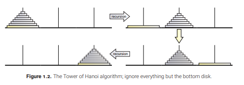
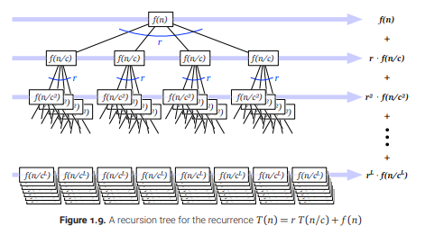
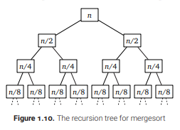
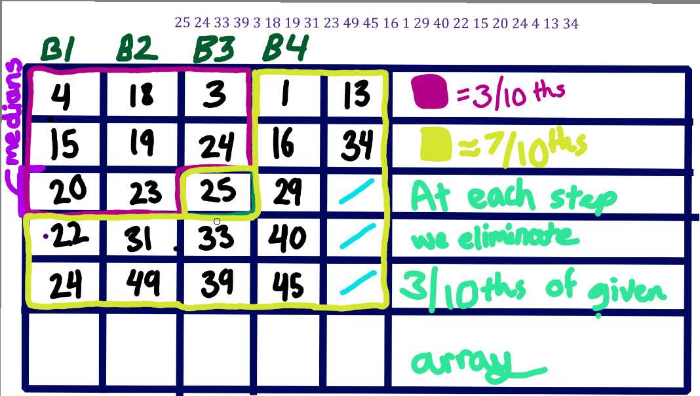
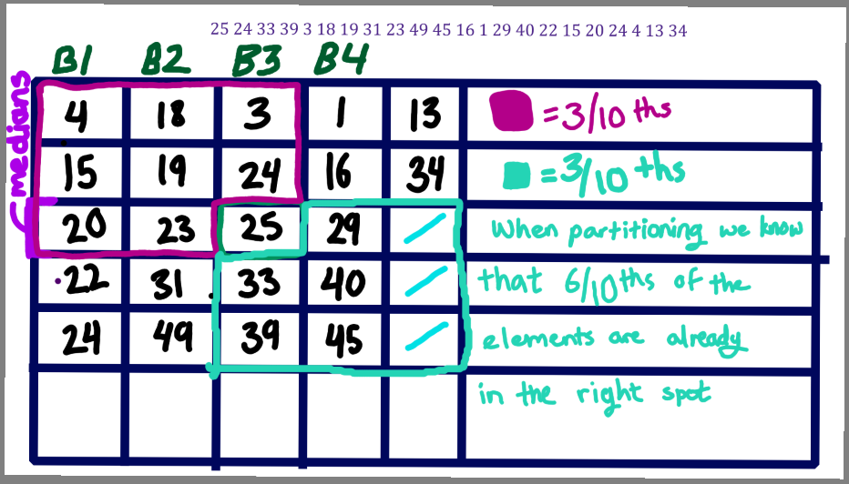
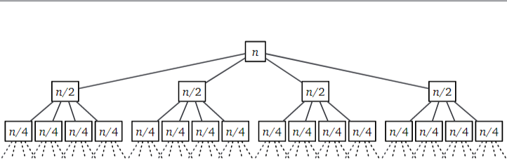
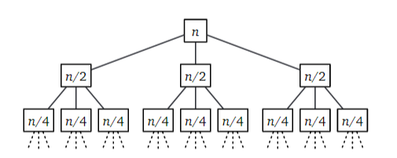

\
$\newcommand{\myceil}[1]{\left \lceil #1 \right \rceil}$

# Recursion

## Reductions

**Reduction is a technique which involves reducing one problem, lets say A, into another problem B. Then we can use the algorithm for B as a "black box" algorithm in various ways to solve A.**

- We may not fully understand the algorithm behind B, that is okay! It is a black box, meaning we don't care how it works, we just assume that it works.

- The correctness of the resulting algorithm, for problem A, should have no dependencies on the black box algorithm for B.

Ex. Suppose we want to multiply two numbers together. The "datatype" of these numbers are integers. The multiplication process can be broken down into addition, mediation, and parity checking. The datatype must support these operations. **However, we could also be using currency, tally marks, finger positions, binary, or something other, and the underlying black box algorithm still works!**

- The correctness of the multiplication algorithm is unaffected by how the underlying black box algorithms work. This allows us to use anything to multiply, as long as our representation is capable of these black box algorithms (addition, mediation, and parity checking).

- **To draw parallels to Data Structures: the abstract data type, suppose a priority queue, is a black box. We don't care how its implemented, it still works for its intented applications (ex. Computer Process Queues, appointments systems, e.t.c. )**

---

## Simplify and Delegate

Recursion is a particular subset of reduction:
- **Base Case: If you can solve a problem directly, then do so.**
- **Recursive Case: Otherwise, reduce it to a combination of simpler instances of the problem.**

How does the recursion work?: **Induction Hypothesis**

- The induction hypothesis is a formal name for the mathematical counterpart of the base-case, recursive case approach you should be familiar with.
- One condition must be satisfied: **There should be no infinite series of reductions to simpler instances!**

We ensure this by making sure that recursion always heads towards and eventually hits a base case that cuts of the recursion.

---

### Ex. Peasant multiplication

**Base Case**
$$ x \cdot y =  0 $$

**Recursive Cases**

If x is even

$$ x \cdot y =  \left \lfloor x/2 \right \rfloor \cdot (y + y)$$

If x is odd

$$ x \cdot y =  \left \lfloor x/2 \right \rfloor \cdot (y + y) + y$$

---

The work of calculating the new value of x (x / 2) and computing a new value for y (y + y or y + y + y), is done in the code visibly. The recursive calls calculate the smaller product of multiplication which eventually pops off the stack one by one to give us a final answer. You don't care about how the recursive call does what it does, you care about the algorithm that uses it.

---

## 1.3: Tower of Hanoi

The Tower of Hanoi is a classic example of a problem which can be solved elegantly using recursion.

**Scenario:** There are three pegs which can hold plates. The plates are initially placed on a single peg and in order based on their width. The largest plate, by width is placed on the bottom, and the second largest is on top of that, and so forth.

**Objective: Move the entire tower (in the same order as it started out in) to another peg. Note that every plate must be placed either directly on a peg or on a plate that is wider than itself. This rule cannot be violated.**

- To solve the puzzle recursively we should start by thinking about how to handle the largest plate first.

1) To get the largest plate on the correct peg, we first have to move n-1 disks, in their current order, to the auxillary peg. (This will involve recursion)

2) Then we move the largest plate from the starting peg to the destination peg.

3) Then we move the set of n-1 plates from the auxillary peg to the destination peg (this will be our recursive case)!

Illustration:

Our job is done after this, because what we have done is reduced the n-plate problem into two instances of the n-1 plate problem (n-1 plates have to be moved to the aux peg, then eventually n-1 plates have to be moved to the dest peg).

Pseudocode:

    TOH(nPlates, srcPeg, destPeg, auxPeg):
        if n > 0:
            // First we move n-1 disks to the aux peg and use
            // the dest peg as our auxPeg for this operation.
            TOH(n-1, srcPeg, auxPeg, destPeg)
            // This frees up the nth disk to be moved to dest peg
            move nth disk from src to dest
            // Then we move n-1 disks from the aux peg to the dest peg and use the src peg as our auxPeg for this operation.
            TOH(n01, auxPeg, dstPeg, srcPeg)

The magic of recursion is that you could break down and analyze it, but it ultimately magically does it's intended work.

What is the running time of this recursive algorithm?

For 0 disks, no moves are need. For 1 disk, we need one move, for two disks we need 3 moves, for 3 disks we need 7 moves.

We can choose to graph this, or we can clearly see the relationship as: 

$T(n) = 2^n-1$

---

## 1.4: Mergesort

The general algorithm for mergesort follows this logic:

**Mergesort:**
1) Divide the initial array into two roughly equally sized subarrays.
2) Call mergesort on each subarray.
3) Merge the sorted subarrays into a single array.
(If the array is one element, we halt recursion since a single element cannot be split into 2 arrays).

The magic recursion occurs when we call mergeSort from within itself (on the two split arrays).

- The bulk of the work (the sorting) is done in the last step where we merge the sorted subarrays. Merging two sorted subarrays into one sorted array is not a trivial task.

Pseudocode for Mergesort:

    // At the initial call, left and right are 0 and the arr.length-1 respectively.
    mergesort(arr, left, right):
        
        if(left < right):
            mid = (left + right) / 2 
            // This is integer division so the result is truncated (intentionally)
            mergesort(arr, left, mid)
            mergesort(arr, mid+1, right)
            merge(arr, left, mid, right)

    merge(arr, l, m, r):
        
        // First we have to create two temp arrays to hold
        // the values of the left and right portions.
        n1 = m - l + 1 // size of first subarray
        n2 = r - m // size of second subarray

        left[] = new int[n1]
        right[] = new int[n2]

        // Then we fill up the temp arrays
        for(i = 0 to n1):
            left[i] = arr[l + i]
        for(i = 0 to n2):
            right[i] = arr[m + 1 + i]
    
        // Then we merge the temp arrays into the given array
        i = 0, j = 0
        int k = l
        while( i < n1 && j < n2):
            if(left[i] <= right[j]):
                arr[k] = left[i]
                i++
            else:
                arr[k] = right[j]
                j++
            k++
        
        // Copy over remaining elements.
        while(i < n1):
            arr[k] = left[i]
            i++
            k++
        while(i < n2):
            arr[k] = right[j]
            j++
            k++

- The mergesort algorithm is pretty difficult to code on the spot but it is one of the most efficient algorithms for sorting purposes.

We can prove the time complexity of the mergesort algorithm by applying induction to both the MergeSort method and the underlying merge method:

Proof:

1) Let A be any array and m be any integer such that A[0, m] and A[m+1, n] are sorted subarrays. We will proved that for all k from 0 to n, the last n-k-1 iterations of the main loop correctly merge A[i, m] and A [j, n] into a destination array B[k, n]

2) If k (which is initialized to left) is greater than n, then n-k-1 will be a negative value and no iterations will be made. This is the base case.

For each iteration (value of k between 0 and n)

- If j > n, then the right subarray (A[j, n]) is empty and $$min(A[i, m] \cup A[j,n]) = A[i]$$ 

- If i > m, then the left subarray (A[i, m]) is empty and $$min(A[i, m] \cup A[j,n]) = A[j]$$

- If A[i] < A[j] then: $$min(A[i, m] \cup A[j,n]) = A[i]$$

- Otherwise, A[i] >= and: $$min(A[i, m] \cup A[j,n]) = A[j]$$

In each of the 4 cases, for any kth iteration, B[k] (the target array) is correctly assigned.

Now we need to prove the mergeSort method, which calls the merge method twice.

1) If n <= 1, i.e. the length of the array is 1, then the initial call (left = 0, right = arr.length-1), will result in the mergeSort method doing nothing. Why? Since left = 0, right = 0, and as a result the condition for recursion (left < right) is not met.
**(Proving the base case)**

2) Otherwise the induction hypothesis implies that the algorithm correctly sorts the smaller subarrays and correctly combines them using the merge method!

---

### Analysis

We can define the a recursive algorithm as a reccurence relation.

$T(n) = T(n/2) + T(n/2) + O(n)$

The merging portion of the algorithm is clearly O(n) complexity because it is a simple series of for loops that keep going until k = right. 

Since the algorithm makes 2 recursive calls to itself from within itself, and since each recursive call processes half of the initial array, we get: $T(n/2) + T(n/2)$. Keep in mind that it would be more accurate to say: $T(\lfloor n\rfloor) +T(\lceil n\rceil)$, since when n is an odd number, the left and right subarrays don't get exactly the same number of elements (ex. if init array is 5 elements, one call processes 3 elements and the second call processes 2 elements).

- Since each level of recursion calls an equally split subset of the previous call, we can say... 

**$T(n) = O(n log n)$**

---

## 1.5 Quicksort

The general approach for quicksort follows this logic:

1) Choose a pivot index
2) Partition the array into three subarrays which contain: elements smaller than the value at the pivot, elements greater than the value at the pivot, and the value at the pivot itself.
3) Apply quicksort to the subarrays which contain the lesser and greater elements. (recursive step)

Pseudocode:
    
    quicksort(arr, left, right)
        if(n > 1):
            choose a pivot
            z = partition(arr, left, right, pivot)
            quicksort(arr, left, z-1)
            quicksort(arr, z+1, right)

    partition(arr, left, right, pivot):
        swap arr[p] and arr[right]
        counter = 0
        for(i = 1 to right-1):
            if(arr[i] < arr[right]):
                counter = counter + 1
                swap arr[counter] and arr[i]
        swap arr[r] and arr[counter+1]
        return counter+1

Proving the correctness of the quicksort algorithm is tedious but is very similar to proving the mergesort algorithm. We need to prove correctness for both methods.

1) To prove the partition method, we need to prove that at the end of each iteration of the main loop (in partition) everything in the subarray arr[l, counter] is less than arr[r], and everything in the subarray[counter+1, i] is greater than or equal to arr[r].

2) Proving this is tedious but it not impossible, but the book expects you to gather these details for yourself.

---

### Analysis

The partition method runs in O(n) time, which is made evident since it is a simple for loop which goes from i = 1 to i = right-2. What is less simple is the reccurence relation we need to create to describe the recursion.

We get a reccurence based on the rank (r) of the chosen element. The rank being the position the pivot is located at for any given array.

If the two subproblems were split based on the first or last index then the *heuristic* would create the following reccurence relation.

$T(n) = T(r - 1) + T(n-r) + O(n)$

If the arrays were equally sized, this recurrence relation would become identical to that of mergesort's. But since the arrays have the potential to be lopsided, our reccrence relation reflects that!

Locating the partition here takes O(n) time, but there is a more complicated way top locate the median element of an unsorted array in linear time!

**In the worst case the algorithm chooses a pivot that makes the two subproblems completely unbalanced. If that is the case then: r = 1 or r = n.**

In this case:

when r = 1:
$T(n) \le T(n - 1) + O(n)$

or

when r = n:
$T(n) \le T(n - 1) + O(n)$

Both cases simplify to 
$O(n^2)$

**Another way to choose the pivot (another heuristic) is called the "median of three" approach.** This approach makes a relatively balanced array split even if the initial array is already nearly sorted.

With this heuristic the reccurence is:

**$T(n) \le T(1) + T(n-2) + O(n)$**

But the worst case, i.e. the solution to the reccurence is still:

**$T(n) = O(n^2)$**

**When we use the median of three approach, the pivot "usually" ends up being in the middle of the array, which suggests and average case running time of O(n log(n)). This is true and can be formulized but it assumes that all permuations of the input data are equally likely.**

Real world data is random but not uniform. Therefore the average case prediction isn't really helpful nor is the best case.

---

## 1.6: The Pattern

**Divide, Delegate, Conquer**

1) Divide the given problem into smaller versions of the original problem.
2) Delegate each smaller subproblem to recursion (repeat step 1 until you hit that base case)
3) Combine the solutions of the smaller problems for your final answer.

- **Proving a divide and conquer algorithm usually requires induction.**

- The base case is when the instance falls below a certain threshhold and we abandon recursion to solve the problem directly (either based on a given definition or via brute force).

---

## 1.7 Recursion Trees

A recursion tree is a tree where each node originating from a root represents a subproblem of the root's problem.

**The value in each node is the amount of time spent for each recursive subproblem (excluding recursive calls).**

- **The sum of the values in all nodes gives us the total amount of time spent for the algorithm.**

Suppose a divide and conquer algorithm with the following relation:

$T(n) = rT(n/c) + f(n)$

In this relation, n/c is the size of the problem and r is the number of subproblems (children) each problem will have until hitting some base case.

Any recursion tree is a complete r-ary tree where each node at depth d contains the value $f(n/c^d)$

- **As the depth increases, the size of the problem (compared to the original problem) decreases logarithmically!**

Illustration:

The leaves of this recursion tree represent the work done at the base cases of the recursion. We can assume that at some point 

$T(n) = 1$ for all $n < n_0$ where $n_0$ is some positive constant.

What this means is that the some n (problem size) the work done to accomplish the problem becomes trivial (constant time).

Suppose our previous tree. The work done to solve the algorithm is the sum of all the nodes in the tree which go from depth = 0 to depth = L.

Hence:

$$ \sum  r^i \cdot f(n/c^i) $$

Lets choose a convenient value for $n_0$: 1

This implies that for some L:

$n/c^L = 1$

$c^L = n$

$\log_{c}n = L$

**Based of this derivation we can say that the number of leaves (base cases) in the recursive tree is:**

$r^L = r^{\log_{c}n} = n^{\log_{c}r}$

If we take a look at our sum, and replace $r^i$ with $n^{\log_{c}r}$ and $f(n/c^i)$ with f(1) (based on the fact that T(n)=1   for all $n < n_0$)

Then we get this as representing the last level by level sum portion in the summation:

$n^{\log_{c}r} \cdot f(1)$

**Since we know f(1) occurs in constant time, we can say that the complexity of the entire relation is:**

$O(n^{\log_{c}r})$

How and when is the summation / series easy to evaluate?:

1) If the series decays exponentially, then every term is a factor smaller than the previous term, therefore the sum is **dominated** by the value at the root.

2) If all terms in the series are equal:

$T(n)=O(f(n)*L) = O(f(n)\log(n))$

3) If the series grows exponentially, then every term is a factor larger than the previous term, then

$T(n) = O(n^{\log_{c}r})$

The sum is dominated by the leaves of the recursive tree, as in the example we discussed!

To prove these shortcuts lets use the recursion tree for mergesort:

We can immeadiately see that every level of recursion is working with the equal amounts of data. So in the worst case, each level is working with n-sized data.

0th level: n

1st level: n/2 + n/2

2nd level: n+4 + n/4 + n/4 + n/4

...

Because of this we can immeadiately say that the merge sort reccurence:

$T(n) = 2T(n/2) + O(n)$

Keep in mind that f(n) = O(n)

can be simplified such that:

$T(n) = O(f(n) \cdot \log(n)) = O(n \log(n))$

The depth of this tree can be calculated:

$\log_{c}n = L$

where c = 2: $\log_{2}n = L$
And the result for L is the max depth!

**How do we know c = 2?**

- We know that each subproblem gets :$n / c^d$ data.

At depth 0: $n$

At depth 1: $n / c^1$

- Based on the diagram:

- $n / c^1$ = $n / 2$

- Therefore c = 2.

What if we modified quicksort such that the pivot always landed on the middle third (2/3rds index) of the array?

In this case the worst case running time would have reccurence relation of:

$$ T(n) \le T(n/3) + T(2n/3) + O(n)$$

**When we draw the recursion tree for this relation we see that the sum of values at any level is AT MOST n.**

At most, either recursive call gets 2/3rd of the data (n) to work with. As a result:

0th level: n

1st level: 2n/3 + n/3

2nd level: n/9 + 4n/9 + 4n/9

The subproblems at each level can be expressed as either:

$n/(3/2)^D$ or $(2n/3)/(3/2)^D$

Now we need to set either subproblem equal to an arbitrary positive integer, lets try 1.

$n/(3/2)^D = 1$

$n = (3/2)^D$

$\log_{3/2}(n) = D$

and lets try the other subproblem:

$(2n/3)/(3/2)^D = 1$

$2n/3 = (3/2)^D$

$\log_{3/2}(2n/3) = D$

$\log_{3/2}(2/3) + \log_{3/2}(n) = D$

We can ignore the constant portion and we get the same depth from either subproblem!

Once again we can can say that 

$T(n) = O(f(n) \cdot \log(n)) = O(n \log(n))$

---

### Ignoring Floors and Ceilings is Okay, Honestly!

What if the input size for mergesort is an odd number?

The actual reccurence for mergesort handles this oddity by introducing floors and ceilings.

$T(n) = T(\lceil n/2 \rceil) + T (\lfloor n/2 \rfloor) + O(n)$

We could then check what we know about mergesort complexity using induction, but that would be tedious!

Instead we employ domain transformation to get rid of floors and ceilings.

**Read on only if you are curious otherwise you can skip past this!**

1) Since we are trying to get an upperbound for n (the largest problem size) we can safely *overestimate* n/2 in both halves. This eliminates the need to use floors.

- $T(n) \le T(\lceil n/2 \rceil) + T(\lceil n/2 \rceil) + n$

- $T(n) \le 2T(\lceil n/2 \rceil) + n$

We can also easily see that:

$$2T(\lceil n/2 \rceil) + n \le 2T(n/2 + 1) + n $$

2) Define a new function $S(n) = T(n+a)$ and choose a constant a, such that

- $S(n) \le 2S(n/2) + O(n)$

- Simply replace n with n+a in the original reccurence formula to get:

- $2T(n/2 + a/2 + 1) + n + a$

- Then we can say:

$S(n) \le 2T(n/2 + a/2 + 1) + n  + a$

which means S(n) can be set to:

$S(n) = 2S(n/2 - a/2 + 1) + n + a$

**(note the difference between the two)**

**by plugging in a = 2 we can get:**

$S(n) \le 2S(n/2 - 2/2 + 1) + n + 2$

$S(n) \le 2S(n/2) + n + 2$

**When we draw the recursion tree for the relation on the right hand side, it shows that**

$S(n) = O(n \log(n))$

We can also further conclude that:

$T(n) = S(n-2) = O((n-2)\log(n-2)) = O(n\log(n))$

Domain tranformation is how we are able to brush away floors, ceilings, and even lower order terms but they occurs under the hood.

- **We covered them once so we won't bother with them more, we'll just know that they are the reason why we're able to ignore floors and ceilings.**

---

## Linear Time Selection

There is a linear complexity way to get the median of an unsorted array! This comes in handy for quicksort!

**The algorithm to get the median was originally devised to answer the general prompt: get the kth smallest element in the n-element array.**

The algorithm uses a variant of quickselect, so lets discuss that first!

### Quickselect

1) Choose a pivot element
2) Partition the array (same routine as in quicksort)
3) Recursively search only one of the two subarrays, specifically the subarray that contains the kth smallest element.

Pseudocode (like textbook but made it more readable):

    Quickselect(arr, lo, hi, k):

        if high = 0:
            return arr(0)
        else:
            choose pivot element arr(p)
            r = partition(arr, lo, hi, p)

            if(k < r):
                return Quickselect(arr, lo, r-1, k)
            else if(k > r):
                return Quickselect(arr, r+1, hi, k-r)
            else:
                return A[r]

My Pseudocode (QOL changes, same core code):

    Quickselect(arr, lo, hi, k):

        if(lo < hi):

            pivot_index = partition(arr, lo, hi)

            if(k < pivot_index):
                return quickselect(arr, lo, pivot_index-1, k)
            
            elif(k > pivot_index):
                return quickselect(arr, pivot_index+1, hi, k)
            
            else:
                return arr[pivot_index]
            
        return arr[hi]

*You can find the actual algorithm in the code folder!*

**The correctness of quickselect does not depend on how the pivot is chosen!**

- To select the median, we have to choose the n/2th smallest element where n is the size of the array.

- Since we do not care about how the pivot is selected, the pivot may leave us with unbalanced arrays (similar to quicksort). In the worst case the pivot element is either the smallest or largest element in the array. 

Suppose r is the pivot index, the value of r could be any index from 0 to n-1. The book shifts up this range to be from 1 to n (where the first element is at position 1) only to shift it back later. We won't do that!

- **If the first element is at position 0, the index of r can range from 0 to n-1 inclusive.**

- **If the chosen pivot is the smallest or largest element, then n-1 elements are in the larger subarray (remember that the pivot is not in either subarray).**

Therefore:

$T(n) \le max_{0 \le l \le n-1}T(l) + O(n)$

where l is the length of the length of the subproblem.

Like I said before the length of the recursive problem is always at most n-1 compared to the length of given problem.

Therefore

$T(n) = T(n-1) + O(n)$

This implies that:
$T(n) = O(n^2)$

Why?:

$T(n) = T(n-2) + O(n-1) + O(n)$
$T(n) = T(n-3) + O(n-2) + O(n-1) + O(n)$
...

N + N-1 + N-2 + N-3...

This is a summation that will keep expanding until N - a = 0, at which point we can simplify the pattern as being:

$(n^2 + n) / 2$

which is simply $O(n^2)$!

---

### Good pivots

We could avoid the quadratic worstcase if we could magically choose a good pivot!

- For some length l, and for some constant a < 1: $l \le an$

Then we could simplify:

$T(n) \le max_{0 \le l \le n-1}T(l) + O(n)$

to

$T(n) \le T(an) + O(n)$

The recursive tree for this reccurrence is a decreasing geometric series (check section 1.7) meaning that T(n) = O(n).

- The recursive tree is a simple path, not a branching path, meaning: 

- If we could find an element that's even close to the median in linear time, then we could find the exact median in linear time!

Presenting (MOMSelect):

Pseudocode:

    MoMselect(arr, lo, hi, k)
        if high <= 25:
            brute force approach
        else:
            m = Math.ceil(hi / 5)
            for(int i = 0; i < m; i++):
                M[i] = MedianOfFive(arr, 5*i-4, 5*i)
            mom = MoMselect(arr, lo, hi, m/2)

            r = partition(arr, lo, hi, mom)

            if k < r:
                return MoMselect(arr, lo, r-1, k)
            else if k > r:
                return MoMselect(arr, r+1, hi, k-r)
            else:
                return mom

The Median of Medians approach utilizes recursion twice.
- First it chooses pivot using partition()
- Then it uses recursion to search through entries on either side of the pivot.

The median of medians is almost always a good pivot.

Visualizing this algorithm:

Suppose we want to find the 16th (pass in k = 15) smallest element of the following array

[25, 24, 33, 39, 3, 18, 19, 31, 23, 49, 45, 16, 1, 29, 40, 22, 15, 20, 24, 4, 13, 34]

First we split the array into groups of 5:

B1: [25, 24, 33, 39, 3]

B2: [18, 19, 31, 23, 49]

B3: [45, 16, 1, 29, 40]

B4: [22, 15, 20, 24, 4]

B5: [13, 34]

how many buckets can we have at most? : $\lceil \frac{n}{5} \rceil$

Now we need to find the median of each of the subarrays.

1st array becomes: [ 3, 24, 25, 33, 39 ] => 25
2nd array becomes: [ 18, 19, 23, 31, 49 ] => 23
3rd array becomes: [ 1, 16, 29, 40, 45] => 29
4th array becomes: [ 4, 15, 20, 22, 24 ] => 20
5th array becomes: [13, 34] => 34

[ 25, 23, 29, 20, 34 ]

(Recursion) Now we need the median of these medians:

So the array sorts into: [ 20, 23, 25, 29, 34 ] => 25

Now to find the kth smallest value:

Now this time we split the array based on the median we found (25)!

We call the partition function based on this found median of 25!

index of 25 = 0

Any value less than 25 shifts to left of the median,
otherwise any value greater than 25 stays in place!

Resulting array:
[ 24, 3, 18, 19, 23, 16, 1, 22, 15, 20, 24, 4, 13, **25**, 33, 39, 31, 49, 45, 29, 40, 34 ]

After one call of the partition method, we re-evaulate the position of
our pivot. The position of 25 is now at index 13, therefore the partition
method returns 13!

 (Recursion) Is our value of k (15) less than or greater than 13? It is greater than 13, 
therefore we recursively call MoMSelect on the right subarray, and
**importantly, we pass 15-13, = 2 because the 15th smallest element of the
whole array is 2nd smallest element of the right subarray**

R: [ 33, 39, 31, 49, 45, 29, 40 ]

Now to break it into groups of 5:

B1: [ 33, 39, 31, 49, 45 ]
B2: [ 29, 40 ]

Medians of each bucket: B1 => 39, B2 => 40
Median of medians: 40, which has an index of 6 in this array.

Now we call the partition method on this array based on the pivot index of 6.

Resulting array: [ 33, 39, 31, 29, 40, 49, 45 ]
Re-evaluate the position of the pivot element, it is at index 4!

(Recursion) Is the passed k value ( 2 ) greater than or less than the index of the pivot?
Since the k value, 2, is less than the index of the pivot, 4, we call MoMSelect
recursively on the elements to the left of the pivot. We pass k = 2, **since the
second smallest value of the array, is the second smallest value of the left subarray!**

L: [ 33, 39, 31, 29 ]
MoMSelect(L, 2)

Now to break it into groups of 5:

B1: [ 33 , 39, 31, 29 ]

At this point our group size is smaller than 5, i.e. we are working
with a group that we can directly apply brute force to!

The second smallest element in this group is 31!

**Therefore the 16th smallest element in the array is 31.**

--

### Analysis

At each recursive step we eliminate at least 3/10ths of the original array,
and the remaining array contains at most 7/10ths of the original array.

- When we recursively call MoMSelect, we do so to call the median of medians
of the given array. 
- This step works on an array of at most n/5 values, since
there are at most n/5 medians. 
- Next we use the median of medians to call MoMSelect on either the left or 
  right side of the initial median, in the worst case the half that we choose 
  has 7n/10 elements.
- The work done by the partition method to then partition the array based on a new
  pivot is then O(n).

Therefore the overall worst case complexity can be expressed as:

$T(n) \leq T(n/5) + T(7n/10) + O(n)$

- **T(n/5)** comes from the work done at each recursive call to find
the median of medians.
- T(7n/10) comes from the work done at each recursive call (each recursive
    call hands of at most 7n/10ths of the array given to it, where n is the
    size of the array at said call).
- O(n) is the complexity of the partition() algorithm which is called at
  each level to sort elements relative to the pivot.

The key insight here is that:

$T(n) \leq T(n/5) + T(7n/10) + O(n)$

can also be stated as:

$T(n) \leq T(9n/10) + O(n)$

$ 9/10 + $

**This tells us that the sum of work that needs to be done at each level,
decays EXPONENTIALLY. If the sum of work decays at a constant factor,
then the dominating term is O(n), which makes the complexity of the whole
algorithm O(n) (linear complexity!!!).**

---

### Sanity Checking

Why did we choose a block size of 3?

If we wanted to find the median of each block, it makes sense
to use a odd number as the block size, because the median of an even
lengthed list is often not a value in the list! We want the median
to be at a particular index, therefore we need each block to be odd-lengthed!

- Why not use a block size of 3?

Well if we did, then the running time would be as follows:

$T(n) \leq T(n/3) + T(2n/3) + O(n)$

When we take a closer look at the recursion we can simplify it to:

$T(n) \leq T(n) + O(n)$

We have seen this recurrence before! At each level of recursion we are
doing the same amount of work, meaning that by the time with hit the
leaf nodes we will still be doing n operations.

- When we draw the recursion tree we see that it will have log(n) levels that
 each do n operations. As a result the complexity with a block size is O(n*log(n)).

**With a block size of 3, the complexity of MoM sort is no better than sorting
the array via something like merge sort, so this is not helpful!**

**Remember that the goal of applying the median of medians approach is to
determine the medians faster than sorting would take. Otherwise we could just
sort and easily get the median in constant time after the fact!**

We can do some finer analysis on a block size of 5:

- Selecting the median of 5 elements (the max size of a block), requires at
most 6 comparisons. So setting up the array of medians requires 6*(n/5) comparisons.

- Furthermore take a look at how we can organize the buckets

Obviously the buckets do not get completely sorted as shown, but rather,
the buckets have been ordered to show the positionality clearly.

- You can see that 6/10ths of the elements are in order already relative to
the chosen pivot. This is because when we place the elements like so,
its clear to see that a certain number of elements are GUARANTEED to be smaller
or larger than the pivot.

- As a result when we call the partition method, we can make it so that it
  most only has to make (1-6/10)n comparisons (since 6/10 elements are already
  in relatively the correct position). This comes out to 2n/5 comparisons.

We can combine the 6n/5 combinations needed to find the median of medians,
with the 2n/5 comparisons needed to smartly partition the array to get:

$T(n) \leq T(n/5) + T(7n/10) + 8n/5$

We can further simplify this recurrence into a summation multiplied by a constant.

We know that 1 + (9/10) + (9/10)^2 + (9/10)^3 +... = 10

Therefore:

$T(n) \leq 8n/5*10 = 16n$

The true complexity of the algorithm is again linear, but we can see
the constant associated with the complexity here. This tells us that for
relatively small arrays, this algorithm is not much quicker, or maybe even
slower than quicksort or quickselect. However, in the long run, with bigger
arrays we get a quicker algorithm!

---

## 1.9: Fast Multiplication

There is infact a divide and conquer approach to multiply to n-digit numbers!

- The grade school lattice algorithm and the Egyptian peasant algorithm both operate in $O(n^2)$ time complexity. Our approach will try to be slightly better

- This algorithm is known as the split multiplication method.

We can use a special mathematical identity in order to make multiplication into a task that involves more addition.

Suppose the identity:

$$(10^ma + b) (10^mc + d) = 10^{2m} ac + 10^m(bc + ad) + bd$$

- The subproducts are computed recursively as well, meaning each of the following: ac, bc, ad, and bd, are computed recursively.

Pseudocode:

    # x and y are the multiplicands
    # n is the number of digits that
    # each multiplicand has.
    
    def split_multiply(x: int, y: int, n: int):
        if(n == 1):
            return x * y
        else:
            m = math.ceil(n / 2)
            ten_raised = math.pow(10, m)
            a = x // ten_raised
            b = x % ten_raised
            c = y // ten_raised
            d = y % ten_raised
            e = split_multiply(a, c, m)
            f = split_multiply(b, d, m)
            g = split_multiply(b, c, m)
            h = split_multiply(a, d, m)
            
            return (
            
            math.pow(10, 2 * m) * e + ten_raised * (g + h) + f 
            
            )
    
**Check out the code in the fastmultiply.py file.**

If we want to figure out the reccurence relation
of this algorithm, we first need to determine
the number of recursive calls that happen from within the algorithm, which is 4. In each call, the passed
value of n is divided by two. The resulting value
is then rounded up and passed to each recursive call.

- This means that each recursive call gets at most
  n/2 the original call's work.

  The work done by each call is of O(n) complexity.

  This gives us the reccurence relation of:

  $$ T(n) \le 4T(\lceil n/2 \rceil) + O(n)$$

  Using the master theorem we can determine that the
  running time of the algorithm comes up to:

  $$ O(n^{\log_{2} 4}) = O(n^{2})$$

The recursion tree for the split multiplication algorithm looks as follows:

**Is this algorithm linear complexity?: NO**

**Is it better than tradition lattice multiplication?: NO**

Well shit, maybe there isn't a faster method after all...

jk

The key insight here is that there are 4 recursive calls which makes the complexity $O(n^2)$
- How can we reduce the number of recursive calls?

The creator of this algorithm, Kolmogorov had a student in his seminars that disproved his conjecture that performing multiplication in sub-quadratic time was impossible.

- It was in fact possible, if we recognize that the middle coefficent of the algorithm, $bc + ad$ can
be computed from the other coefficients using on more recursive call. 

Here's how:
$$ bc + ad = ac - bd - (a - b)(c - d)$$

- In total this would mean that 4 recursive calls can get reduced to 3. 1 recursive call to get $ac$, another to get $bd$, and then one final recursive call to get $bc + ad$

Pseudocode for fast_multiply (Karatsuba algorithm):

    def fast_multiply(x: int, y: int, n: int):
        if(n == 1):
            return x * y
        else:
            m = math.ceil(n / 2)
            ten_raised = math.pow(10, m)
            a = x // ten_raised
            b = x % ten_raised
            c = y // ten_raised
            d = y % ten_raised
            e = fast_multiply(a, c, m)
            f = fast_multiply(b, d, m)
            g = fast_multiply(a - b, c - d, m)
            return ( 
                
            math.pow(10, 2 * m) * e + ten_raised * (e + f - g) + f
            
            )

**Check out the code in the fastmultiply.py file.**

Note that nearly everything about this algorithm is the same as the prior algorithm, **except that there is one less recursive call.**

However this simple change transforms the reccurence relation to:

$$ T(n) \le 3T(\lceil n/2 \rceil) + O(n)$$

If we apply the master theorem here, we see that:

$$ O(n^{\log_{2} 3}) = O(n^{1.58496}) $$

The recursion tree for the Karatsuba algorithm looks like:

You can tell through the tree, that although
the geometric sum still grows at an exponential rate,
the rate is not quadratic (it is sub-quadratic)

Karatsuba's novel insight of splitting and simplifying numbers has led to more complicated and faster fast multiplication algorithms.

- Toom found a family of algorithms that splits any integer into k parts (each part has n / k digits)
and then computes the product with 2k-1 recursive calls.
- Cook simplified this algorithm further.

The Toom-Cook algorithm runs in

$$O(n^{1+1/log(k)})$$, the hidden constant in the $O(*)$ complexity depends on k.

- This evolution led to the eventual discovery of FFT (Fast Fourier Transform)

- The first FFT multiplication algorithm, found in 1971, runs in $O(n \log n \log \log n) time$

- Martin Furer discovered many technical improvements to this initial algorithm which eventually cumulated in an algorithm for multiplication that runs in O(n \log n) time. (Search up David Harvey and Joris van der Hoven)

- **Funnily enough, the fastest algorithms for fast multiplication would only be useful for integers with more digits than there are particles in the universe.**

- The fastest practical algorithm is Schonhage-Strassen (for multiplying integers with more than 70k digits each).

---

## Exponentiation

- Goal: Given a and n, calculate $a^n$

The iterative approach is simple:

    slow_exponentiation(a, n):
        x = a
        for i = 2 to n
            x = x * a
        return x
    
But clearly this algorithm requires n multiplications

- The value of a does not neccessarily need to be an int, but n does need to be an int.

- We cannot know what kind of object we are multiplying (int or float), therefore we cannot be certain of how long each multiplication takes.

- We are forced to analyze in terms of number of multiplications, which is ill-advised.

Surpise, there is a divide and conquer solution proposed by a smartass indian.

The Pringala exponentiation technique employs understanding if a number is odd or even to dertermine how the recursive case should be dealt with.

Pseudocode for Pringala Exponentiation:

    # a is the value
    # n is the power

    PringalaPower(a, n):
        
        if( n == 1):
            return a
        else:
            x = PringalaPower(a, floor(n / 2))
            if (n % 2 == 0):
                return x * x
            else:
                return x * x * a

Note that this algorithm makes a single recursive call and the number of multiplication performed at
each level is either 1 or 2.

- This means that the number of multiplications made by a subproblem is around half the multiplications by the parent problem.

This gives us the reccurence relation:

$$ T(n) \le T(n/2) + 2 $$

Using out brain (or in my case my two brain cells)
we can determine that:

$$ T(n) = O(\log n) $$

Using the Egyptian peasant multipication algorithm from the previous chapter we can also create a peasant exponentiation algorithm.

- We simply replace the addition with multiplication,
  and the duplation with squaring.

Pseudocode for Peasant Exponentiation algorithm:

    PeasantPower(a, n):
        if n == 1:
            return a
        else if n % 2 == 0:
            return PeasantPower(a^2, n/2)
        else:
            return PeasantPower(a^2, n // 2) * a
        
This algorithm performs at an $O(\log n)$ complexity where n represents the number of multiplications.

Both of the algorithms: PeasantPower and Pingala power are asymptotically optimal.

- This means that to compute $a^n$ the minimum number of operations to do is $\Omega$(\log n).

- Each multiplication at most doubles the largest power computed
  so far.

Suppose we want to caculate $a^15$ using the various exponentiation methods.

Using the Pingala method:
- $a -> a^2 -> a^3 -> a^6 -> a^7 -> a^{14} -> a^{15}$

Using the Peasant method:
- $a ->  a^2 -> a^4 -> a^8 -> a^{12} -> a^{14}-> a^{15}$

However the optimal method to get the final result looks as follows:
- $a -> a^2 -> a^3 -> a^5 -> a^{10} -> a^{15}$

The peasant power and pingala methods both involve 6 multiplications, whereas the optimal method solves the issue in 5 multiplications. 

