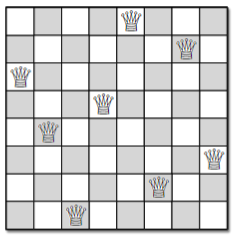
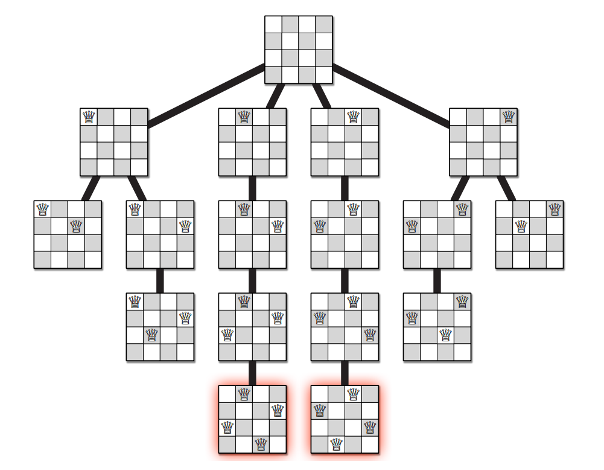
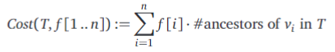
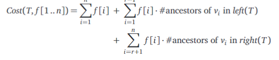

# Chapter 2: Backtracking

What is the core difference between recursion and backtracking?

- With recursion, **you take path based on the data that is given, the path may make a call to the function from within the function** but with different parameters.

- Eventually these parameters must converge on to a base case, in which the method's recursion stops.

- Backtracking is also a recursive strategy, meaning that it also involves calling a method from within itself. However, the goal is to construct the final solution incrementally.

- Backtracking involves evaluating every path or option before choosing a correct path. We may choose to make recursive calls for every "correct" option, or a single recursive call for the first correct option that we find.

- The algorithm compares the each alternative recursively, meaning that if two correct choices are available, either or both paths are taken and then further evaluated in the context of previous decisions.

## N Queens

- Proposed by chess enthusiast Max Bexxel in 1848,
  the n queens algorithm asks the following question:

**Figure out the state for a n by n board which allows n queens to exist on the board, such that no two queens are in a position to attack on another.**

More technically this means that no two queens should be in the same row, column, or diagonal.

- This is reminiscent of Sodoku to me.

An example of such a state on a 8 by 8 board is:

The example above is represented as an array: [5, 7, 1, 4, 2, 8, 6, 3]

This array represents the position of each queen on each row top to bottom.

Lets think logically here, if each row's queen is denoted in the array, each value in the array can be from 1 to 8, representing the column that the queen sits in.

- **By the nature of the representation, there are never two queens in the same row.**

- **Since two queens cannot share the same column, no two values in the array can be the same.**

- **If two queens cannot be in the same diagonal, then how can be check this? If the queen in the first row sits at column 5, then the queen of the next row cannot be in columns 4 or 6.**

In our pseudocode our approach is to go row by row and find a legal position to put our queen in. We can do this under the presumption that the previous rows have already placed the queen. **So to find the legal place for this new queen we use the context of the previous decisions.**

Here is the pseudocode

Pseudocode (python code) for PlaceQueens:

    PlaceQueens(board, row):
        # Base Case: if we have processed the whole board
        if(row >= len(board)):
            print(board)
        # Recursive Case: Process for the row.
        else:
            # j represents all the possible values of the queen's position
            # The range of j therefore is from 0 to len(board) - 1
            # Here, we go through each possible positions
            # for the Queen.
            for j in range(0, len(board)):
                # We first assume the position is valid
                valid = True
            
                # i or rather the position i in the board array
                # represents all the positions of the previous queens
                # Here we compare the previous filled slots of the array and see if they 
                # conflict with our placeholder location for the queen.
                for i in range(0, row):
                    # If the queen in row i has the same
                    # column as the placeholder position 
                    # (board[i] == j)
                    # OR
                    # If the queen in row i has a left diagonal
                    # position in comparison to the placeholder
                    # position.
                    # board[i] == j - row + i
                    # OR
                    # If the queen in   
                
                if (board[i] == j or
                    board[i] == j - row + i or
                    board[i] == j + row - i):
                    valid = False
            if valid:
                board[row] = j
                place_queens(board, row+1)

How can we approach this algorithm, and are there multiple or no solutions to a particular board size?

- Well this algorithm prints out a list of queens
  anytime the base case, of processing the entire board correctly
  has been hit. With the nature of backtracking and recursion,
  this base case may be hit multiple times. Each printed array then is one possible solution to the n queens problem.

- **As the board size gets larger, the number of solutions to the n queens problem increases exponentially.**

| **Board Size** | **Number of Solutions** |
| -------- | ----------- |
| 2 x 2 | 0  |
| 3 x 3 | 0  |
| 4 x 4 | 2  |
| 5 x 5 | 10 |
| 6 x 6 | 4  |
| 7 x 7 | 40 |
| 8 x 8 | 92 |

At first the pattern seems erattic but this is expected!

- Overall, understanding the pattern as a whole, it seems to grow exponentially (without having to do the math).

A potential recursion tree for the n queens problem looks as follows.

Note that each level of the tree represents a correct orientation of the n queens in context of the previous situation.

- **With an empty board, the first queen can be placed on any of the 4 columns of the first row.**

- **After the first queen is placed, the second queen can be placed in one of two positions.**

- After the first two queens have been placed then depending on how they were placed, **there may or may not be a valid position for the subsequent queen, if there are no valid positions for that third queen then the recursion stops and we try the next boards with two queens**.

---

## 2.2 Game Trees

Note: I skipped the bulk of this section to really hone in on what's important. The details regarding the two player game example have been skipped.

Consider any 2 player game with a winning and losing condition for its players.

- **The state of a game consists of the locations of all the pieces and the identity of the current player.**

- **In a more general sense the game state is the current condition of the game and also includes who has the opportunity to change the current state.**

Each state leads to the next and as such the play of any game can be modeled as a sequence of stages, much like the N Queens scenario. 

- All possible states of the game can be modeled by a tree.

- *As navigate the next possible states or moves, each state can be defined as good or bad.*

**A game state is good if either the current player has already won, or if the current player can move such that it becomes a bad state for the opposing player.**

**A game state is bad of either the current player has already lost, or if all moves that the current player makes leads to a good state for the opposing player.**

In terms of the tree this means:

- a non-leaf node in the game tree is good if it has at least one bad child (*bad for the opponent*).
- a non-leaf node in the game tree is bad if it has all good childs (*good for the opponent*).

**Any player that finds the game in a good state on their turn can ultimately win the game, even if their opponent plays perfectly.**

**Any player that finds the game in a bad state on their turn can only win if their opponent plays imperfectly (they make a mistake).**

This definition suggests that given a changed state we can evaluate it as good or bad by recursively calling an algorithm based on the decisions an opponent can or may make. (When visualizing this in the game tree, you realize that this is a simple recursive DFS)

The psuedocode for such an algorithm is as follows:

    PlayAnyGame(state, player):
        if player has won in the given state:
            return GOOD
        if player has lost in the given state:
            return BAD
        for all legal "GOOD" moves X -> Y:
            if PlayAnyGame(Y, otherPlayer)

- Obviously this simple strategy is not implemeneted so clearly.
- **The process that goes into understanding whether a state is GOOD or BAD, or at least better or worse than other states, involves heuristics**

- **Heuristics ignore states that are obviously good or bad. They are algorithms based on statistical analysis and a result they don't always give an accurate answer but rather often a best estimate based on prior information.**

---

## 2.3 Subset Sum

Problem: Given a set of numbers, X, and a target number T, is it possible to create a subset that perfectly sums up to the target element T.

X = {8, 6, 7, 5, 3, 10, 9}
T = 15

When approaching this problem, break it into its recursive and base cases. The base case(s) for this scenario occur when the target element is 0 or when the given subset is empty.

- **If the given subset is empty, and the target element is not 0, then there is no solution. RETURN FALSE**

- **If the target element is 0, then it does not matter what subset we are given, since the empty set is a subset of every set. RETURN TRUE**

These are the base cases, but how to we split up our recursive cases?

*For every element, x, in the set X either:*
- **There is a subset of X that includes x and whose sum is T.**
- **There is a subset of X that excludes x and whose sum is T.**

With this in mind, the pseudocode looks like the following:

    SubsetSum(X, T):
        if T == 0:
            return True
        else if T < 0 or X is an empty set:
            return False
        else:
            x = some element in X
            with = SubsetSum(X \ {x}, T - x)
            without = SubsetSum(X \ {x}, T)
            return (with OR without)
    
    What do these implementation choices reflect? Well primarily that there are 2 recursive calls which each subtract 1 from the overall problem size. The work done by the function, apart from the calls, is a simple conditional which is a running time of O(1).

    - The reccurence relation is the following:

$T(n) \le 2T(N-1) + O(1)$

- **Each instance of the function makes two recursive calls which each have an n-1 problem size compared to the originally passed problem.**

A variant of this solution actually constructs and returns the subsets that solve the problem (instead of returning true or false).

Pseudocode for algorithm that constructs and returns valid subsets:

    ConstructSubset(X, i, T):
        # If the target is 0, then we return an empty set.
        if T = 0:
            return EMPTYSET
        # If target is less than 0 or if the passed set is empty,
        # then we return the default value of None.
        if T < 0 or X.length == 0:
            return None
        
        # This recursive call assumes that the element at i 
        # is not part of the solution and then attempts
        # to construct the subset by excluding the ith element.
        Y = ConstructSubset(X, i-1, T)
        
        # If this recursive call eventually returns a
        # non default value, then it was a valid subset
        # therefore we return Y
        if Y != None:
            return Y

        # This recursive call assumes that the element at
        # is part of the solution and then attempts to
        # construct the subset by subtracting the value
        # at i from the overall sum, and recursively
        # constructs the subset (but this time by explicitly
        # excluding the value at index i)
        Y = ConstructSubset(X, i-1, T-X[i])
        
        # If this recursive call eventually returns a 
        # non default value, then it was a valid subset
        # and therefore we return Y.
        if Y != None:
            return Y UNION X{X[i]}

        # If a solution was not found by excluding or including
        # the ith element, then we return None.
        return None

---

## 2.4 The General Pattern

- Backtracking is useful when tracking a sequence of decisions.

- In the N Queens problem, the algorithm goes row by row and **decides** where to place the queen for that row based on the placement of previous queens.

- In the game tree problem, the goal is to make a sequence of legal moves such that each move is the optimal move for the player making it. The algorithm **decides** the best move to take at a given state.

- The subset sum problem involves summing a subset of integers from a given set such that the sum of the subset is equal to some target element T. For each element of the original set, the algorithm **decides** whether or not to include it in the output solution sequence.

For the last example in particular we deliberately used an array for the set of elements, but we could have chosen to represent it as another structure to exploit the recursive algorithm.

- *In each recursive call we make **exactly one decision** and the decision must be consistent with all previous decisions.*

- **Each recursive call require the contextual summary of previous decisions in addition to the portion of the input data left to be processed.**

The emphasis should be on *minimizing* the information carried through as context with each call.

- **Our summary of past decisions needs to as compact as possible!**

- In the n-queens algothim we passed an array which contained all previously places queens and empty rows. We did not optimize the algorithm (or maybe it isn't possible to optimize) and as a result we have carray over past decisions in complete detail.

- In the game tree, we only care about the current state and the identity of the current player. **We do no need to remember anything about decisions before the current state.** Who wins the game is not decided by what moves led up to the current state but rather is based on the moves one can take from the current state.

- For the subset sum problem we need to pass in the remaining elements and changed target value (the sum of the previously chosen elements subtracted from the original target value). **What elements were chosen previously is not important** (unless we choose to construct the subset as we go along).

- If we seem to need a lot of information about the past decisions in our backtracking solution or algorithm may be solving a more general case problem than previously expected (MoMSelect works by figuring out the kth smallest element in linear time, but this can be used to get the median).

**Backtracking is brute force recursion! We try every possibility that is consistent with the constraints placed by previous decisions. (Ex. walking through a maze, you can take any path except the one you came from, unless you hit a dead end, and eventually you will get to the end).**

---

## 2.5 Text Segmentation (Interpunctio Verborum)

Problem: You are given a string of letters representing text in some language but without any spaces of punctuation. You want to break this string into individual words.

Ex:

*BOTHEARTHANDSATURNSPIN*

This example can be broken into a few different combinations of words, including:

BOTH EARTH AND SATURN SPIN
BOT HEART HANDS AT URNS PIN
e.t.c

An algorith that can decompose words like this would have to know how to identify a string as a valid word (in the language of your choice).

- The algorithm takes in the string as a sequence of letters and processes them 1 by 1 in a buffer.

- The sequence of letters is fed in left to right until we hit the end of the string.

We could attempt to make our algorithm "smart" in detecting words, but we can use recursion to get every possible combination.

Pseudocode for the algorithm:'

Splittable(arr, lo, hi):
    if hi = 0:
        return True
    for i = 0 to n
        if IsWord(arr, lo, i):
            if Splittable(arr, i+1, hi):
                return True
    return False

**This algorithm's isWord method is unimplemented but it is a sort of black box that returns true if the analyzed portion of a string is a word.**

- If the first item we read is a word, then then we continue to split up the rest of the string and do the same process for the next batch 0f letters.

- **This process will return True as long as one chain of recursive calls returns all trues (all words) one after another.**

---

## 2.6 Longest Increasing Subsequence

**For any sequence, a subsequence of S is another sequence obtained from S by deleting 0 or more elements, without changing the order of the remaining elements.**

For example:

S = {1, 3, 5, 7, 9}

A few valid subsequences are:

{}
{5}
{9}
{1, 9}
{1, 5, 7}
{1, 3, 7, 9}
{1, 3, 5, 7, 9}

Here are a few arrangements that are *not* subsequences:

{9, 7}
{3, 1, 5}
{5, 9, 1, 3}
{9, 7, 1, 3, 5}

Problem: Get the longest increasing subsequence from the sequence S (using backtracking and recursion).

If we treat this problem as analayzing a sequence of numbers or characters linearly (left to right), then we can split the underlying array of values into a processed and unprocessed portion.

Ex.

3, **1**, **4**, 1, **5**, 9, 2, **6**, 5, 3, 5, || 8, 9, 7, 9, 2, 3, 8, 4, 6, 2, 6 

The numbers that we have decided to include in our subsequence so far have been bolded!

- Should we include the value after the split (the 8)?
- Do not make a single decision. **Since 8 is greater than the last read in value, have one recursive call include the 8 and another recursive call that excludes the value of 8.**

- Whichever decision leads to a longer increasing subsequence will be our correct answer.

How much information (context) do we need to make an informed decision in every call?

- Since we are hunting for the longest increasing subsuqence, suppose our current subseqence has n elements. We can inductively assume that since each call is looking to maintain an increasing subsequence, the current sequence is also in increasing order. **Since the current sequence is in increasing order, all we care about is comparing our current element to the last read, nth element, which is the so far the greatest element of the (increasing) subsequence**. *We will only grow the subsequence when we encounter greater elements.*

So the problem of the longest increasing subsequence in techincally more specific terms is:

*Given an integer prev and an array, A, find the longest increasing subsequence of A in which every element is larger than prev.*

How do we know when to stop the recursion? We have a vaccous base case: The longest increasing subsequence of an empty array had a length of 0. 

Pseudocode:

    LISBigger(prev, arr, lo, hi):
        if hi - lo == 0:
            return 0
        else if A[1] <= prev:
            return LISBigger(prev, arr, lo+1, hi)
        else:
            skip = LISBigger(prev, arr, lo+1, high)
            take = LISBigger(arr[lo], arr, lo+1, high)+1
            return max[skip, take]
    
**see this coded in lisubsequence.py!**

- This algorithm only returns the length of the longest increasing subsequence but fails to build it and then return it.

- There is an implementation which actually constructs the subsequence as well and I have put it in the code file.

What is the reccurence relation that models this method?:\

- **There are 2 recursive calls being made, each call decreases the problem size by 1**

- **The actual work being done in the algorithm is always constant since all we are doing is a simple comparison between the previous element and the current element.**

Therefore:

$$T(n) \le 2T(n-1) + O(1)$$

This looks very similar if not identical to the Hanoi reccurence.

Via the master theorem we can tell that the running time of this algorithm is $2^n$

---

## Longest Increasing Subsequence, Take 2

There is another way to attack the longest increasing subsequence problem.

---

## Optimal Binary Search Trees

RThe worst-case search time of traversing a binary tree is proportional to the depth of a tree. The depth of the tree is in the worst case $\log_{2}(n)$ where n is the number of nodes in the tree (round up the result to get a more accurate picture).

- **The ideal BST is perfectly balanced and therefore has minimal depth.**
- *For most applications we care about minimizing the total cost of several searches opposed to the cost of a single search.*
- **A perfectly balance tree is not the best choice is there is a clear bias to search for some elements more than others.**

Could we somehow the map the access frequencies of different nodes across the binary tree and then change the tree dynamically to make the more frequently accessed elements quicker to search for?

The following will be an exercise in thinking, not coding!

Suppose we have an array of keys and array of corresponding access frequencies:

A[1..n] is the array of keys

f[1..n] is the array of frequencies

Minimize total search time with the assumption that there will be exactly f[i] searches for each key A[i].

Ignoring other constant factors the total cost of storing each of the keys also needs to be taken into account.

The total cost of performing all the binary searches is given as follows:

The cost of performing all binary searches involves multiplying the frequency of the $v_i$ node by the actual cost (based on its # of ancestors, i.e. depth).

Since by definition the root is an ancestor of all other nodes except itself, then we can factor out the root from the equation.

Here we have broken apart the summation into 3 summations.

- Since the root is an ancestor of all other nodes, it is included in all other paths as simply $1 * f[i]$ where f[i] is the frequency of each ith node $v_i$.

- The frequency of a trip to each vertex is then multiplied based on its ancestors in the left or right path. So for each vertex $v_i$ we split up the ancestry into two halves (f[i] should be identical in either case for any ith vertex).

**Note that the left and right subtree summations look identical to the original summation, but have different bounds. This allows us to use some clever
recursion!**

- *The base case occurs when n = 0 (on an empty tree)*

---
