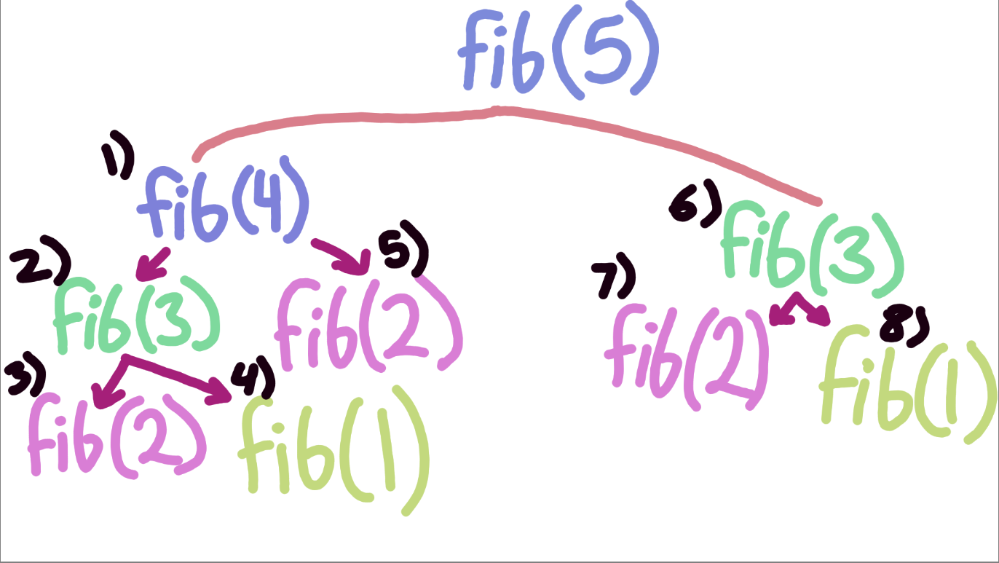

# Chapter 3: Dynamic Programming

## Matravrtta

Pingala was a scholar in ancient India who documented a pattern in Indian poetry. 

The matravrtta was a metered form of poetry where each line consists of a fixed number of beats or syllables (think haiku).

- The light syllable lasted a single beat, a heavy syllable lasted two beats.

If each line could only have up to 4 beats, how many possible combinations of syllables were possible?

Suppose **H** represents a heavy syllable, and a **L** represents a light syllable.

Then all the possible combinations for a 4 beat line are:

- {H, H}, {H, L, L}, {L, H, L}, {L, L, H}, {L, L, L, L}

Another scholar, Virahanka, built off this observation and his notes implied the existence of the following recurrence:

$$M(n) = M(n-2) + M(n-1)$$

where M(n) is the total number of combinations for n-beat meter and the base cases are: $M(0) =  0, M(1) = 1$.

This should remind you of the a particularly popular algorithm...

Fibonacci numbers!

The fibonacci number algorithm, which you may have already seen (admittedly a little too often) is a prime example of a recursive algorithm!

$$ F(n) = F_{n-1} + F_{n-2}$$
$$ F(1) = 1 $$
$$ F(0) = 0 $$

What is the problem with recursion though?

Well we deduce the recurrence relation for the fibonacci algorithm fairly easily.

- Each call makes two recursive calls, the first call has the problem size reduced by 1, whereas the second call has the problem size reduced by 2.

- The amount of work done in the algorithm is constant.

$$T(n) = T(n-1) + T(n-2) + 1$$

The closed form solution of this reccurence relation is:

$$ T(n) = 2F_{n+1} - 1 $$

We can used to some fairy dust, i.e. some complicated maths, to determine that $F_n = \Theta(\alpha^n)$ where $\alpha$ is 1.61803 (the golden ratio).

- **This is to say that the recursive fibonacci method has an exponential running time!**

This is incredibly slow, but a key insight is that a lot of the recursion that takes place involves recalculating a previously calculated solution. 

For example:
suppose the only base cases we know are fib(1) and fib(2)

fib(5) breaks down into fib(4) and fib(3)
fib(4) breaks down into fib(3) and fib(2)
fib(3) breaks down into fib(2) and fib(1) (Both base cases)

At this point the algorithm calculates fib(3), but later on it will recalculate fib(3) again because fib(5)'s right side call was fib(3)

- **Is there some technique to avoid recalculating fibonacci numbers we have already solved for or encountered?**

- **In other words, can our base cases be dynamic and grow as more subproblems are solved, can we ask the program to remember?**
  
---

### Memo(r)ization: Remember Everything

- **Memoization (not memorization)** is a technique coined from Donald Michie in 1967.

- **The technique involves memorizing or noting down the answers to previously encountered subproblems such that if we enounter the same subproblem later on, we can instantly solve it by retrieving it from our notes rather than recalculating it.**

- Why call it memoization and not memorization?: A memo is a message that you leave for yourself such that you don't forget something, hence *memo*ization.

For the fibonacci numbers, the application of memoization becomes quite obvious when you analyze the various recursive calls.

- **A lot of the calls made in the recursion tree of the fibonacci algorithm involve recalculating a previously calculated subproblem.**

- **So instead of simply having base cases, we can use some data structure that holds the results of previously encountered values.**

- **Next time a call is made, we check if the subproblem has been solved, and if it has been we simply retrieve it from our stored results.**

Pseudocode:

    MemFibo(n):
        if(n == 0):
            return 0
        else if(n == 1):
            return 1
        else:
            if(F[n] == null):
                F[n] = MemFibo(n-1) + MemFibo(n-2)
            return F[n]

    # Note that F is a global array which can be accessed
    # at any point in the code.

    # Also note that in reality, a lot of implementations
    # pass the array of stored results (in this case F)
    # into the function, this structure also often already
    # has base cases put into it before the initial call.

Check out my interpretation of the code in fastfib.py

- When we run this program for some small values such as 5, 10, 15, or 20, the difference in speed between the traditional recursive algorithm and this algorithm is very minimal.

- **However, the recursive implementation of the algorithm will take hours if not days on weeks to calculate fib(900), whereas the memoization using algorithm will take mere seconds at most.**

When running the memoized version, you can debug and notice that the array, F, is filled bottom up: F[0] and F[1] are left empty as the values there are actually corresponding with the base case.

- The next values to get filled are F[3] and F[4] and so on!

- This is because the recursion on something like fib(5) first "digs" all the way down then the calls get resolved up from the bottom to the top.

Here is an image that illustrates what is happening when we call fib(5).

- *The black numbers indicate the order in which each call is made*.

- Recursion is depth first, meaning that the first encountered recursive path is taken all the way down to the base case before heading down the alternate path.

- Since fib(1) and fib(2) are base cases, the first result that gets put into the array occurs when steps 3 and 4 are resolved and the result gets pushed up to resolve step 2. As a result, the result of fib(3) is put into the array, F.

- Then after fib(3) is resolved (after steps 4 and 5), we can make use of the array to quickly retrieve fib(3) at step 6 (As opposed to seeing the recursive calls through to the end and wasting precious time)!

**So in reality, with memoization we eliminate the work involved with any 2nd or more instance of a particular subproblem (and all the recursion it entails)**

*With fib(5) the amount of work eliminated gives us an incremental advantage, but you can imagine just how much of an improvement this technique creates for larger problems such as fib(100)!*

- Here is how the recursion tree gets trimmed using memoization for fib(9)

Pretty significant!

Well, if all we need to do is to fill up an array, why do we need recursion, why cannot we simply use a for loop to go through all the values?

Good question: lets try it!

Pseudocode:

IterFibo(n):
    F[0] = 0
    F[1] = 1
    for i = 2 to n:
        F[i] = F[i-1] + F[i-2]
    return F[n]

**Guess what? This is just as fast if not faster than the recursive memoization version!**

- The array stores $O(n)$ integers and performs $O(n)$ additions.

- Why didn't we just use the iterative version like this before heading into recursion?

- The problem, mathematically seems to inevitably lead into recursion. **However, all we need to do is keep track of the last two elements to get the current element!**

- *If we only need to keep track of the last 2 elements, do we need an array filled with all the subproblems, or can we just keep track of the last two values?*

Pseudocode:
    
    IterFibo2(n):
        prev = 1
        curr = 0
        next = -1

        for i = 1 to n:
            next = curr + prev
            prev = curr
            curr = next
        
        return curr

---

## Aside: Even Faster Fibonacci Numbers

While the iterative verison of this algorithm seems like the biggest improvement and most optimal version of the fibonacci algorithm, it is not!

- **We can exploit matrix reformulation to derieve a faster version of the algorithm**.

$[ 0, 1, 1, 1] * [ x, y ] = [ y, x+y ]$

**Multiplying the 2d vector (x, y) with the matrix [0, 1, 1, 1] has the same effect as applying one iteration of the inner loop from IterFib2.**

If multiplying by the matrix once results in one iteration, multiplying the matrix by $[0, 1, 1, 1]^n$ results in iterating the loop n times.

Iterating n times:

$$[0, 1, 1, 1]^n * [1, 0] = [F_{n-1]}, F_n]$$

Computing the nth power of something require $O(\log(n))$ multiplications!

- This means for our multiplications we have to $O(\log(n))$ 2x2 matrix multiplications which reduces to a constant number of integer multiplications and additions.

**Overall complexity of matrix multiplication method is therefore: $O(\log (n))$**

More is discussed in this section, but since it is an aside, I'll leave it to you to explore it!

---

## Interpunctio Verborum Redux

Dynamic Programming in essence is smart recursion!

- If we go back to chapter 2, there was a problem concerning text segmentation: breaking up a long string into a sequence of words in a particular language.

- We are given some string S and the subroutine isWord which determines if a given string segment is a valid word. **We are NOT concerned with the implementation of isWord.**

Here is how we defined the recurrence before:

$Splittable(i) = True$ if $i > n$

$Splittable(i) =$ UNION from $j=i$ to $n$ $(IsWord(i, j)$ AND $Splittable(j + 1))$

- isWord(i, j) is simply shorthand for isWord(S[i, j]), in other words, we are checking if a portion of the string (from index i to j) is a word.

- How many ways can we call the Splittable function for a string of length n? Doing some simple mathematical analysis, the algorithm has $O(n^2)$ possible combinations.

- If our algorithm does O(n^2) combinations, why does it run in $O(2^n)$ (exponential) time? 

- **This is because a lot of our recursive subcalls to Splittable are duplicates.**

We can employ memoization to take note of these recursive subproblems to avoid recomputing them later.

- In effect this should make the number of calls grow in polynomial time as opposed to exponential time.

Pseudocode:

FastSplittable(arr, lo, hi):
    SplitTable[hi+1] = True
    for i = n down to 1:
        SplitTable[i] = False
        for j = i to n:
            if isWord(i, j) and SplitTable[j+1]:
                SplitTable[i] = True
    return SplitTable[0]

Note that this algorithm leverages the fact that Splittable(i) depends on the results of the subproblems of Splittable(j) for all j > i.

- If we start from the end of the array, then there is no such j greater than i, which makes it a kind of base case if you will.

- Therefore we start from the last index and then work our way through the array in decreasing order.

The algorithm here will make $O(n^2)$ calls to isWord resulting in an exponential improvement in running time compared to the backtracking algorithm.

---

## The Pattern: Smart Recursion

**Dynamic programming algorithms store the solutions of intermeadiate subproblems, often in some kind of table or array.**

- Storing the subproblems helps us avoid the nuisance of recalculating subproblems that appear more than once, which saves a great amount of time!

- **Focus on finding the current recurrence for the solution rather than using tables. Finding the recurrence is more difficult but once you get it, writing some table or diagram is a trivial task.**

- If the recurrence is incorrect then the whole solution is incorrect, so start from there.

*Dynamic programming is **not** about filling in tables. It is about **smart recursion***

Develop the algorithm in two stages::

1) Formulate the problem recursively. Write down a recursive formula or algorithm for the whole problem in terms of its subproblems. 

a) **Specification**: Describe the problem that you want to solve precisely and coherently, *not how to solve it, but rather what it is*. 

b) **Solution**: Give a clear recursive formula or algorithm for the whole problem in terms of the answers to smaller instances of exactly the same problem.

2) Build solutions to the recurrence in a bottom up manner.

a) **Identify the subproblems**: What are all the different ways your recursive algo can call itself after the initial input (i.e. what are the base cases and recursive cases?).

b) **Choose a memoization data structure**: Find a data structure that stores the solution to every type of subproblem you identified (typically a n-dimensional array).

c) **Identify dependencies**: Except for base cases, every subproblem depends on some other subproblems so identify which ones! Draw a picture, pick some elements, and draw arrows to indicate dependencies.

d) **Find a good evaluation order**: Order subproblems so that the subproblems with no dependencies are evaluated first, and such that for any subproblem, evaluate the subproblems that it depends on before evaluating the problem itself. The subproblems should build up to the original problem.

e) **Analyze space and running time**: The running time now is the combined running time of all possible distinct subproblems. You could do this right after identifying the subproblems if needed.

f) **Write down the algorithm**: Replace recursion with loops where possible. Translate the recurrence relation to a non-recursive algorithm that simply takes advantage of the array or other data structure that is keeping track of previous subproblems. In simpler terms replace recursion with array lookups.

---

## Warning: Greed is Stupid

**A greedy algorithm is an alrgorithm that avails the use of tables and reccurences and creates a NON recursive solution based on a series on direct decisions (similar to backtracking).**

- The key here that recursion is not used, and so this solution may seem appealing and natural to the untrained eye.

- The objective of a greedy algorithm is to get the biggest, smallest, or some '-est' from a problem.

Ex. A greedy algorithm for the text segmentation problem may try to find the longest or shortest prefix in the string that is a word then take that as the first word and then recursively segment the rest of the string.

- The greedy approach rarely, if ever works in practice. And even when it does it is often slow or needlessly complicated.

**GREEDY ALGORITHMS NEVER WORK, USE DYNAMIC PROGRAMMING INSTEAD!**

*99% of the time*

- Even for problems that can be correctlly solved by greedy algorithms, it is more productive to make an algorithm with the backtracking or dynamic programming approaches first!

*First make it work, then make it quick*

- Greedy algorithms, if ever used, should be proved rigorously to understand the underlying methodology. If you do not understand them then forget using them.

---

## Longest Increasing Subsequence

Both algorithms for the LIS problems that we discussed in the previous chapter ran in exponential $O(2^n)$ time.

- We can improve both attempts to drastically using dynamic programming.

### First Recurrence: Is This Next

Our first backtracking algorithm evaluated the function LISBigger(i, j) which returned the length of the longest increasing subsequence.

- If the value at j, the index we are about to read, is less than the greatest value of the current subsequence (which is at index i), then we simply skip over the value at index j and recursively call the method on the next element.

- If the value at A[i] is less than value at A[j], meaning if the new value to read is greater than the current largest value in the subsequence, then we employ 2 recursive calls: one that includes the value in the greatest subsequence (in which case j becomes the prev element for the next call) (1 + LISbigger(j , j+1)), and another that skips the value (LISBigger(i, j+1)).

- **Since each recursive subproblem of an array is identified by two indices, i and j, there are $O(n^2)$ distinct subproblems to consider.**

If we avoid recursive calls altogether and build up the calls from the base calls all the way to the initial call, then we can say that calculating each call takes constant time.

- **If each subproblem can be solved in constant time, dynamic programming reduces the complexity of the whole problem to $O(n^2)$**

The way the memoized algorithm is solved is not immeadiately apparent. 

- LISBigger(i, j) should be filled in *after* entries LISBigger(i, j+1) and LISBigger(j, j+1), since we need those subproblems to get back and correctly return a value for LISBigger(i, j).

Pseudocode:

    FastLIS(arr, lo, hi):

        A[0] = -infinity
        for i = 0 to n:
            LISBigger(i, hi+1) = 0
        for j = n down to 1:
            for i = 0 to j - 1:
                keep = 1 + LISBigger(j, j+1)
                skip = LISBigger(i, j+1)
                if A[i] >= A[j]:
                    LISBigger(i, j) = skip
                else:
                    LISBigger(i, j) = max(keep, skip)
        return LISBigger(0, 1)

### Second Recurrence: What's Next?

Our first recursive algorithm asnwers the question: What is the length of the longest increasing subsequence of A[j, n] in which every element is larger than A[i].

- **The second recursive algorithm asks: Use LISfirst(i) to define the length of the longest increasing subsequence of A[i, n] that begins with A[i]**

The derieved recurrence for this function was:

LISfirst(i) $= 1 + max \{LISfirst(j) | j > i$ and $A[j] > A[i]\}$

- If the max of the empty subset is 0 then base cases such as LISfirst(n) = 1 are excluded from the recurrence.

- Recall that for the dynamic programming approach to work correctly, we need to add an extremely big negative number at the front end of the array (preferably A[0] = -infinity)

- **Recursive subproblems are placed at each index i in the LISfirst array. Each entry in the array depends on entries that come after it (A[i] depends on all entries A[j] where j > i).**

- *Array is filled in decreasing index order*

- We don't need to fill indexes that correspond with j in some order, as long as they are filled we can solve for A[i].

Pseudocode:

FastLIS2(arr, lo, hi):
    A[0] = -infinity
    for i = hi down to lo:
        LISfirst[i] = 1
        for j = i + 1 to hi:
            if A[j] > A[i] and 1 + LISfirst[j] > LISforst[i]:
                LISfirst[i] = 1 + LISfirst[j]

    return LISfirst[0] - 1 # Why the -1? So we don't count the sentinel in the longest increaisng sequence!

---

## Edit Distance

**The edit distance between two strings is the minimum number of letter insertions, deletions, and substitutions (combined) to transform one string to another.**

The edit distance between food and money is 4.

Ex: FOOD -> MOOD -> MOND -> MONED -> MONEY
FOOD
1) Substitute F with M
2) Substitute the second O with N
3) Insert an E between the N and D
4) Substitute the D with a Y

- Vladimir Levenshtein, Taras Vintsyuk, and Stanislaw Ulam in 1965, 1966, and 1972 all independently proposed this edit distance concept.

Sometimes the edit distance is caed the *Levenshtein distance or the Ulam distance.*

We can visualize the edit distance by aligning the strings one above the other with a gap in the first word for each insertion and a gap in the second word for deletion.

| L1 | L2 | L3 | L4 | L5 |
| - | - | - | - | - |
| F | O | O |   | D |
| M | O | N | E | Y |

Here we can easily tell that 3 letters need to be changed and one letter needs to be inserted, i.e. 4 changes and an edit distance of 4.

- **It is difficult to tell when if the sequence of edits that we made is shortest edit distance we could have possibly attained!**

Suppose:

| L1 | L2 | L3 | L4 | L5 | L6 | L7 | L8 | L9 | L10 | L11 | 
| -- | -- | -- | -- | -- | -- | -- | -- | -- | --- | --- |
| A  | L  | G  | O  | R  |    | I  |    | T  | H   | M   |
| A  | L  |    | T  | R  | U  | I  | S  | T  | I   | C   |

This diagram suggests an edit distance of 6.
1) Delete a G
2) Change O to a T
3) Insert a U between R and I
4) Insert a S between I and T
5) Change H to an I
6) Change M to a C

*However, is this truly the shortest possible edit distance?*

### Recursive Structure

- First lets develop a recurrence relation to model this problem.

**Look at our prior representations. If we remove the last column, the remaining columns must represent the shortest edit sequence for the remaining prefixes.**

Ex:

| L1 | L2 | L3 | L4 | L5 | L6 | L7 | L8 | L9 | L10 | L11 | 
| -- | -- | -- | -- | -- | -- | -- | -- | -- | --- | --- |
| A  | L  | G  | O  | R  |    | I  |    | T  | H   | M   |
| A  | L  |    | T  | R  | U  | I  | S  | T  | I   | C   |

- If I remove column L11, then...

| L1 | L2 | L3 | L4 | L5 | L6 | L7 | L8 | L9 | L10 | 
| -- | -- | -- | -- | -- | -- | -- | -- | -- | --- | 
| A  | L  | G  | O  | R  |    | I  |    | T  | H   | 
| A  | L  |    | T  | R  | U  | I  | S  | T  | I   |

*The remaining columns still illustrate the shortest edit distance for the remaining prefixes.*

- What we are looking for represents a sequence of editing decisions ordered from right to left (for no real reason besides convenience).

- Each decision is made upon each column in the output allignment.

**WE ONLY ALIGN MISMATCHED COLUMNS**

### Recurrence

When i and j are both positive there are 3 possibilities (techincally 4) when comparing the columns i and j.

Goal: Optimal alignment of A[1..i] and B[1..j] 

- **Insertion**: The ith entry in the top row is empty, in which case the edit distance can be qualified as:

*Edit[i, j-1] + 1*

This is to say that the edit distance is equal to what it was before comparing i with the jth column (which is in Edit[i, j-1]) plus 1 for the distance incurred by this insertion. 

- **Deletion**: The jth entry in the bottom row is empty, in which case the edit distance can be qualified as:

*Edit[i-1, j] + 1*

This is to say that the edit distance is equal to what it was before comparing j with the ith column (which is Edit[i-1, j]) plus 1 for the distance incurred by this deletion.

- **Substitution**: Both rows have valid (non-empty) characters in the ith and jth columns, in which case the characters may be different. If the characters are different than the edit distance can be qualified as:

*Edit[i-1, j-1] + 1*

This is to say that the edit distance is equal to what it was before comparing the ith and jth columns (Edit[i-1, j-1]) plus 1 for the distance incurred by this substitution.

- **Nothing**: Same as the prior case (substitution) but the characters in column i and j are the same. The edit distance can be qualified as:

*Edit[i-1, j-1]*

In this case all we do is maintain the previous edit distance (Edit[i-1, j-1]) without incrementing.

### Dynamic Programming

Here are some key points as to how we'll approach this problem using DP:

1) Memoization Structure: Use a 2D array to memoize all possible edit combinations between the two strings. The size of this array is m * n where **m is the length of the origin string + 1** and **n is the length of the destination string + 1**.

2) Dependencies: Each entry depends on previous entries (to the top left), so filling the structure in row-major order makes perfect sense.

3) Space And Time: The memoization structure has $O(m \cdot n)$ space, therefore there is at most $O(m \cdot n)$ operations.

*The pseudocode in the book is a bit confusing to say the least, so I reccomend looking at the code directly in editdistance.py.*

When filled in (ALGORITHM to ALTRUISTIC) the memoization structure looks like the following:

- The bold numbers indicate indexes where the characters of the two strings are identical.

- **Horizontal arrows indicate deletion, vertical arrows indicate insertion, diagonal arrows indicate substitution.**

---

## Subset Sum

Problem: Does a subset of a given array of positive integers sum upto some target element T?

Just like other dynamic programming algorithms we need to first understand the structure of the underlying problem. 

- In the case of Subset Sum (which I'll abbreviate to SS from now on), we go though the set as an array.

The recurrence relation can be reformulated as follows:

$SS(i, t) = True$ if and only if some subset of $X[i..n]$ sums to T

The recurrence relation can be said as follows:

$$SS(i, t) = True $$ 
if t = 0

$$SS(i, t) = False $$ 
if $t < 0$ or $i > n$

$SS(i + 1, t)$ OR $SS(i+1, t-X[i])$

We can further break down this recurrence to avoid cases where t < 0.

Once again here are some key points on how to approach this problem using DP:

1) Data Structure: We use a 2D array to memoize our recurrence. For the array S, S[i, t] stores the values of SS(i, t)

2) Evaluation Order: Each entry S[i, t] might rely on upto 2 other values in the next row. In this situation, it makes **sense to fill up the array bottom to top (as opposed to top to bottom) so that values lower in the array are prepared for values higher up to be evaluated.**

3) Space and Time: The 2D array has n * T space where n is the size of the set and T is the target. If the whole array were to filled up, which it will be, then the **algorithm must run in $O(n \cdot T)$ time.**

Psuedocode:

    FastSubsetSum(arr, T):
        
        S[n+1, 0] = True
        for t = 1 to T:
            S[n+1, t] = False
        
        for i = n down to 1:
            S[i, 0] = True
            for t = 1 to X[i] - 1:
                S[i, t] = S[i + 1, t]
            for t = X[i] to T:
                S[i, t] = S[i + 1, t ] OR S[i + 1, t - X[i]]
        
        return S[1, T]

Honestly the pseudocode is bs, check out the actual code in fastsubsetsum.py =)

- I took a slightly different approach based (pretty much 1 for 1) on the code I found on Geek For Geeks

A quick aside:
- **Thank you GFG, Reddit, StackOverflow and other CS forums, I would have never gotten into CS without them!**
- *If you feel as though you are in a position to support them, donate your time or money to help fund the maintainence and moderation on these sites (I felt that this was important saying in light of recent strikes on StackOverflow and changes to the Reddit API)*

---

## Optimal Binary Search Trees

While we discussed Optimal Binary Search Trees in the last chapter, we mainly covered the conceptual recurrence relation that would allow us to balance these trees properly.

Problem:
- Input: Sorted array A[1..n] of search keys, array F[1..n] of the frequencies of each key where each value is the number of times we will search for the corresponding key.

- Our goal is to optimize and create a BST for the set that minimizes the total cost of all searches (all frequencies considered).

Recall:

The derieved recurrence for the Optimal search cost is:

- Within the bounds of the original array ( i through k), the summation indicates the total frequency count for all the keys in the interval.

$$F(i, k) := \Sigma_{j = i}^{k} f[j]$$

**Here, F(i,k) represents the total frequency count for all keys!**

- We can break down the summation as follows:

Take a second to understand what is happening here

- **Since the summation sums all values from the ith upto the kth value, if the ith value in the last  (kth) value, then the sum is simply that value.**

- **If the given i value is less than the given k, then we still have to sum up starting from the value at the kth index all the way town to the ith index (this is done recursively since a smaller value of k is passed each time until i = k).**

We can write some simple pseudocode based of this recurrence relation!

Pseudocode:

InitF(f):

    # Filling up F based on the frequency array.
    for i = 1 to n:
        F[i, i-1] = 0
        for k = i to n:
            F[i, k] = F[i, k-1] + f[k]

The code above will be used to initialize the array F (as seen in the OptCost recurrence relation).

Some key points before looking at the implementation of the algorithm.

1) Subproblems: Each recursive subproblem is passed 2 integers (i and k).

2) Memoization: All possible values of the OptCost problem will be stored in a 2D array: OptCost[1..n+1, 0..n]. Only the entries such that $j \ge (i-1)$ will be actually used.

3) Dependencies: OptCost[i, k] depends on entries OptCost[i, j-1] and OptCost[j + 1, k]. Each table entry relies on table entries below and to the left of them.

- If we assume that all dependent entries have been fulfiled, the pseudocode below fills the entry OptCost[i, k].

Psuedocode:

    ComputeOptCost(i, k):

        # If we initialize OptCost[i, k] to infinity,
        # then the algorithm MUST improve it (lower the cost)
        OptCost[i, k] = infinity
        
        # For values from i to k we will evaluate new optimal
        # costs.
        for r = i to k:

            # The optimal cost is initially based on the adjacent
            # cell (OptCost[i, r-1]) and the cell beneath
            # (OptCost[r+1, k])
            temp = OptCost[i, r-1] + OptCost[r+1, k]
            
            # If the current cost at the goal cell is greater
            # than our calculated cost, then make our
            # newly calculated cost (temp) the actual value
            # of the cell (OptCost[i, k])
            if OptCost[i, k] > temp
                OptCost[i, k] = temp
            
            # Otherwise we do nothing, in other words we leave
            # the OptCost of the the [i, k]th cell unchanged.
        
        # After optimizing the contents of the [i, k]th cell
        # We use the frequency table (which was filled
        # prior to this method) to further increment the cost
        # based on the number of calls that will be made on
        # the [i, k]th value.
        OptCost[i, k] = OptCost[i, k] + F[i, k]

The code before assumed that all needed values for OptCost[] had already been computed, but what process can we do to fill in the array before executing the code above?

- We can fill in the array in various ways (granted we keep in mind that each cell depends on the cell to its left and the cell beneath itself).

1) Fill in each diagonal at a time, starting with the base cases and working toward the final answer: OptCost[1, n].

OptimalBST(f):

    InitF(f)
    for i = 1 to n+1:
        OptCost[i, i-1] == 0
    for d = 0 to n-1:
        for i = 1 to n-d:
            ComputeOptCost(i, i + d)
    return OptCost[1, n]

2) Fill in each row at a time.

OptimalBST2(f):

    InitF(f)
    for i = n+1 down to 1:
        OptCost[i, i-1]
        for j = i to n:
            ComputeOptCost(i, j)
    return OptCost[1, n]

3) Fill in each column at a time

OptimalBST3(f):

    InitF(f)
    for j = 0 to n+1:
        OptCost[j + 1, j] = 0
        for i = j down to 1:
            ComputeOptCost(i, j)
    return OptCost[1, n]

Here are each of the 3 methods illustrated:

- *The double lined arrows indicate the direction of the outer-loop.*
- *The single lined arrows indicate the inner loop.*
- *In the diagonal example, the double ended arrows indicates that the evaluation order of the inner loop is inconsequential.*

---

## Dynamic Programming on Trees

What if we choose a tree as the memoization structure instead of a multidimensional array? In what situation would a tree be more efficient and logical than a N-dimensional array?

- **An independent set in a graph is a subset of vertices with no edges between them.**

- Finding the largest independent set of vertices in any given graph is very difficult!

- However, for certain types of graphs we can find the independent sets of said graph much faster!

**If the input graph is a tree, with n vertices we can compute the largest independent set in O(n) time.**

For any node v in some tree T, let $MIS(v)$ denote the size of the largest independent set in the subtree rooted at v.

**Any independent set in this subtree that excludes v itself is the union of the independent sets in the subtrees rooted at the children v.**

Visually:

Notice that if we exclude v, the root of the tree, the largest independent set of the entire tree is union of the largest independent sets in each of the subtrees.

The length of the largest independent subset in the left tree is 2, the length for the middle tree is 1, and the length of the right tree's is 3. Therefore the length of the largest independent set of the entire tree is the sum (2 + 1 + 3) = 6. 

*Why not include the root of each subtree such that the calculation looks like: (3 + 2 + 4) = 9?*:

- **If we include the roots keep in mind that the roots can access the leaves, therefore there cannot be an independent set that contains both the root of a subtree and its leaves (or the subtree's subtrees)**

**Therefore when determining the largest independent set we have to choose whether to use choose the root, exclude the direct subtrees and then directly recurse on its grandchildren (which may be subtrees), or exclude the root and recursively call the direct subtrees.**

The choice can be represented mathematically as:

$$MIS(v) = max\{\Sigma_{w \downarrow v} MIS(v), \space \space \space 1 + \Sigma_{w \downarrow v} \Sigma_{x \downarrow w} MIS(x)\}$$

where $w \downarrow v$ means "w is a child of v"

**Visually this simply means:**

We can also use the tree to memoize the tree! Wowsers!

- Introduce a new field called MIS for each node v, such that we can set v.MIS

- **Every subproblem depends on either a node's children or grandchildren nodes. Therefore, our best bet is to work and process v.MIS for the deepest nodes and work our way back up to the root!**

- *What type of tree traversal gives us the deepest nodes first (in one continuous layer), and the second deepest layer, and so forth, up to the root?*: **DFS or postorder traversal!**

- **Just because we are utilizing DP does not mean recursion disappears. DFS is most naturally implemented via recursion, so we use it for that purpose!**

What about the running time?: Well each node may have varying numbers of children, but each node only has one parent and one grandparent.

- **Since each node has a constant number of parents and grandparents, and because the work passed up from each node to the grandparents and parent node occurs in constant time, the overall time complexity is $O(c*n) \rarr O(n)$, where n is the number of vertices and c is some constant amount of work!**

Here is the pseudocode for the first dynamic programming approach:

    TreeMIS(v):
        skipv = 0
        for each child of v, w:
            skip v = skipv + TreeMIS(w)
        keepv = 1
        for each grandchild of v, x:
            keepv = keepv + x.MIS
        
        v.MIS = max{keepv, skipv}
        return v.MIS

**Check out this code in longest_independent_set.py**

Instead of defining two constants that represent the two options for the vertex v, we could make skipv and keepv inate functions or properties of each vertex.

$$v.MISyes = 1 + \Sigma_{w \downarrow v}w.MISno$$
$$v.MISno = \Sigma_{w \downarrow v} max\{MISyes(w), \space \space \space MISno(w)\}$$

v.MISyes denotes the size of the largest independent set of the subtree rooted at v that ***includes v***.

v.MISno denotes the size of the largest independent set of the subtree rooted at v that ***excludes v***.

If we have these properties for every node, we are memoizing the recursion into the tree itself (into its nodes).The memoization memoizes the values for each node and for both functions in $O(n)$ time.

Here is the pseudocode for the second dynamic programming approach:

    TreeMIS2(v):
        
        v.MISno = 0
        v.MISyes = 1
        for each child of v, w:
            v.MISno = v.MISnp + TreeMIS2(w)
            v.MISyes = v.MISyes + w.MISno
        return max{v.MISyes, v.MISno}

**Check out this code in longest_independent_set2.py**

---

