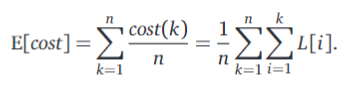

# Chapter 4: Greedy Algorithms

---

## Storing Files on Tape

Reading a file from tape is not an instantenous process, to read a file from a tape we first have to skip past all other files that come before the file we are interested in reading.

Let L[1..n] be an array we the lengths of each file, with each index representing the length of an individual file.

The cost of accessing the kth file in the list of files L, is:

$$cost(k) = \Sigma_{i=1}^k L[i]$$

- Before we read file k we must first scan past all previous files on the tape.

If each file is equally likely to be accessed, then the expected search cost for searching a random file is as follows.

If we change the order of some files, the cost of accessing them will inevitably change as well. 

Work to be done :D

---

## Scheduling Classes

---

## General Pattern

---

## Huffman Codes

---

## Stable Matching

---
