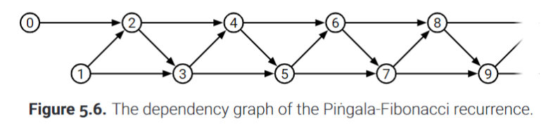

# Basic Graph Algorithms

---

## Introduction and History

At its core, **a graph is a collection of pairs**

Nodes / Vertices: The objects being paired often represented as dots or points.

Edges / Arcs: The pairs themselves

Examples of graphs: road networks, genealogies (family trees), social networks, digital electronic circuits, and the Web.

*(You can take a deeper look at this chapter, but as someone who wants to learn about graphs and not history, I will move on!)*

---

## Basic Definitions

A simple graph can be defined via a combination of two sets:

- **A set of vertices: V**
- **A set of edges: E**

The set of vertices, V, is a non-empty but finite set which contains nodes / vertices. 

The set of edges, E, contains pairs of vertices, each of which represent a single edge or arc between two vertices.

- *In an undirected graph, the edges are unordered pairs and also sets*, they are written as **{u, v} or uv**. 

- *In a directed graph, the edges are ordered pairs* which are written as **u -> v or (u, v)**. 

**V and E are also used to denote the number of vertices and edges in a graph respectively.**

**In any undirected graph, the number of edges is bounded as $0 \le E \le \frac{V}{2}$**

**In any directed graph, the number of edges is bounded as $0 \le E \le V(V-1)$**

The endpoints of any edge are two vertices at either end of the edge. 

- For directed graphs, an edge $(u, v)$ has a tail and a head. In the case of $(u, v)$ u would be considered the tail endpoint and v would be considered the head endpoint.

A graph is a pair of *sets*, therefore there cannot be multiple undirected edges with the same endpoints (no redundant edges).

**Since an undirected edge is a *set* of vertices there cannot be an undirected edge from a vertex to itself.**

**Simple graphs are graphs that have no loops or parallel edges (redundant edges).**

- For an edge $\{u, v\}$ in an undirected graph u is a neighbor of v and v is a neighbor of u. *Since they are neighbors, we say they are **adjacent***

**Degree of a vertex: number of neighbors it has**

In an directed graph, neighbors are further specialized as predecessors and successors.

- In a directed graph for an edge $(u, v)$, *u is considered a **predecessor** of v*.
- Similarly, *v is considered a **successor** of v*.

- For any vertex in a directed graph, **the in-degree is the number of predeccesors the vertex has!**
- For any vertex in a directed graph, **the out-degree is the number of successors the vertex has!**

**A subgraph of another graph is simply a graph whose vertices and edges are both subsets of the original graph's vertices and edges.**

Mathematically:

$G' = (V', E')$ is a subgraph of $G = (V, E)$ if $V' \subseteq V$ and $E' \subseteq E$

- Similar to a proper subset, a **proper subgraph of G is any subgraph other than G itself.**

---

### Some KEY definitions (for undirected graphs)

**Walk**: A sequence of vertices in a graph where each *adjacent* pair of vertices are adjacent in G. Informally, we can say that a walk is sequence of edges.

- Ex: If we know $E = [\{A, B\}, \{B, C\}]$ we can say that $[A, B, C]$ is a valid walk which can informally be expressed as a sequence of edges $[\{A, B\}, \{B, C\}]$!

**Path**: A type of walk which visits each vertex as most once.

- Ex: Following the previous example, $[A, B, C]$ would be considered both a walk and a path. But $[A, B, A, B, C]$ while a valid walk, would not be considered a path. 

- For any pair of vertices u and v, we say that **v is *reachable* from u if G contains a path (or walk) from u to v**

- **An undirected graph is *connected* if every vertex is *reachable* from every other vertex**.

Every graph has one or more **components** (Which are connected by definition). **Components are maximally connected subgraphs, meaning that they are distinct subgraphs within a graph**

- If a graph has more than one component, it may be called a *disconnected graph*.

- Ex. Suppose the graph below:

The graph has 2 *maximally connected subgraphs*, in other words it has 2 **components**.

- Notice that there A, B, and C are all reachable from one another, D and E are unreachable from any of these vertices.

- Therefore **A, B, and C form one component.**

- Since **D and E are reachable from one another, they form another component.**

**Closed Walk**: A walk that is closed is a walk that begins and ends with the same vertex.

**Cycle**: A closed walk that enters and leaves each vertex at most once.

**Acyclic Graph (AKA a Forest)**: An undirected graph in which no subgraph is a cycle. 

**Tree**: A connected acyclic graph (a graph where each vertex is reachable from every other vertex and where no cycles occur). *A tree is a component of a forest.*

Ex. Forest vs Tree:

**The image is one graph which qualifies as a forest!**

- **Each differently colored subgraph is a tree in the forest.**

**Spanning Tree**: A portion (subgraph) of an undirected graph which is a tree that contains every vertex of the original graph.

**Spanning Forest**: A collection of spanning trees, one for each component of G.

### Some KEY definitions (for directed graphs)

**Directed Walk**: A sequence of vertices in which the order of the vertices matters. A sequence such that $v_0 \rarr v_1 \rarr v_2 \rarr v_3 \rarr ... \rarr v_i$ and $v_{i-1} \rarr v_i$ is a directed edge for every index i.

- For any vertices u and v, **v is only *reachable* from u in a directed graph if a directed path (or walk) exists from u to v.**

- **A directed graph is *strongly connected* if every vertex is *reachable* from every other vertex.**

- A directed graph is acyclic if it does not contain a cycle. **Directed acyclic graphs are oftens referred to as *dags*.**

---

## Representations and Examples

We tend to represent graphs via drawings!

There are two different types of graph drawings:

1) **Planar**: A graph drawing where no two edges overlap or cross.

2) **Embedding** (non-planar): A graph representation similar to a planar drawing but the edges may cross.

Any particular graph (which is simply a set of edges and a set of vertices) can have many different drawings which may be embeddings or planar. **So no particular graph has a "correct" drawing and may be represented in different ways.**

Here is an example of the same graph represented as a planar drawing and as an embedding.

Besides drawings we can use an *intersection graph* to represent our graphs.

**Intersection Graph**: A graph in which node is a geometric object and each edge represente an intersection or overlap between some attribute or regions of the respective objects.

Examples of Intersection Graphs:

Another type of graph is the dependency graph. These are useful to illustrate recursive algorithms. 

**Dependency graphs are directed acyclic graphs... why?**

**Why directed?**: One recursive call depends on another, therefore *there is apparent directionality* to the relationship.

**Why acyclic?**: Each recursive call *never calls back to one of its dependencies*, meaning that there is no path that begins and ends at the same node.

Here is an example of the dependency graph for the Pingala Fibonacci algorithm:

More complex dependency graphs exist for more complex recurrence relations. Take for example the edit distance:

The edit array gives us a hint as to how to structure our dependency graph.

- Each cell's recursive call may depend on the cell above it, the cell to its left, or the cell on its upper left diagonal.

Here is the resulting dependency graph for the naive recursive Edit Distance algorithm:

Another type of graph is the **configuration graph**. A configuration graph typically models a game, puzzle, or mechanism (ex. tic-tac-toe, checkers, Rubik's Cube, Towe of Hanoi, or Turing machine). 

- **The vertices represent valid *configuration or states* of the mechanism.**
- **An edge represents a *"move"* that can be taken to directly get from one state to another.**

Even for simple mechanisms (like tic-tac-toe) the configuration graph can be extremely complex. 

Here is the configuration graph for the 4 disk Tower of Hanoi algorithm:

- Although it does not make sense from the surface it is shows how many states can occur even for a seemingly simple 4 disc algorithm.

**Finite State Automata**:

This is far too complex in my opinion, but if you feel free to dig in, please read the book (bottom of pg. 194-195)

---

## Data Structures

Graphs are usually represented as either **adjacency lists** and **adjacency matrices**.

Both structures are indexed based on matrices, meaning that each vertex is given a unique integer which represents its index in the array or matrix. **The integer indexes are the vertices**

### Adjacency Lists

A single adjacency list is actually an array of lists, each of which contains the neighbors of each vertice.

Ex:

Suppose a priorly used undirected graph example:

The two sets that represent this graph could look as follows:

$$V = [A, B, C, D, E]$$
$$E = [AB, AC, BC, DE]$$

**In an undirected graph, each edge gets stored twice. For any edge uv, the edge gets stored in u's list as well as v's list.**

- If we assign each vertex an index $A = 0, B = 1, ..., E = 4$ we can store the neighbors of each vertex in a 2D array as follows:

**Adj List: [[1, 2], [0, 2], [0, 1], [4], [3]]**

- *The list at the 0th index indicates that the neighbors of A are B (which is indexed as 1) and C (which is indexed as 2).*

- Similarly the list at the 1st index indicates the neighbors of B, and so forth. **Note that since B is a neighbor of A, we also have to record that A is a neighbor of B (each relationship or edge is recorded twice).**

Ex.

Suppose the directed graph below:

The two sets that represent this graph look as follows:

$$V = [A, B, C, D, E]$$
$$E = [\{A, B\},\{B, D\},\{C, E\},\{D, A\},\{D, C\},\{D, E\}, \{E, D\}]$$

Now with directed graphs, each edge is a "one way street" meaning that it only gets recorded once. Each edge is recorded in the neighbor list of the tail end. 

- **In other words, for any directed edge $\{u, v\}$ the edge is stored in the adj list of u.**

With this mind, lets take a look at the example graph's adjacency list.

The graph vertices can be indexes once again in any arbitrary order, but the convention is that $A = 0, B = 1, ..., E = 4$.

**Adj List: [[1], [3], [4], [0, 2, 4], [3]]**

**Regardless of the type of graph the space complexity of an adjacency matrix is O(V + E), where V is the number of vertices and E is the number of edges.**

To fully understand why, take a look at the most common representation of adjacency lists: *singly linked lists*!

With singly linked list representation, **each singly linked list represents one vertex and its adjacency list**. *The head of the list contains the node to which all other elements (the adj list) are adjacent to*. Each SLL is then orderly stored in some contigious structure, usually an array.

Here is an example from the textbook:

**This SLL structure is the most optimal way to create and store information as a list, because no excess space is wasted! Each node contains neccessary information and no spaces are left unfilled or unused.**

- **When looking at this representation, *O(V + E) as the space complexity should make sense*, as each vertex requires one *slot*, and then each edge coming out of the vertex requires an additional spot, therefore the number of vertices summed with the number of edges is the overall *slots* that we have to allot for the structure.**

Why use a SLL representation?:

- For directed graphs, **if we want to list the outwards neighbors of a node v, it takes $O(1 + deg(v))$ time**, where deg is the outdegree of the node. *Why?* **It takes constant time to get to the adjacency list of node v (selecting the SLL), and then we have to iterate through all out-neighbors of v, which is to say we have to do deg(v) iterations.**

- Using the same process above, **for directed graphs, we can search for some edge $v \rarr x$ in $O(1 + deg(v))$ time complexity!** This time instead of iterating and list, we are iterating until we find the edge, and if we don't we have iterated at most deg(v) times.

- For undirected graphs the searching process becomes even easier if we simultaneous search both "sides" of an edge until we find it. If we are looking for some edge $uv$ in an undirected graph the time complexity of the operation is $O(1 + min\{deg(u), deg(v)\})$. *Why?* **It takes constant time to get to the adjacency lists of u and v, and then we search both lists simultaneously because the edge $uv$ can be found in both lists. We stop our search when we find the edge in either list. This means that if one list has a length of 2, and the other has a length of 100, we will have to do at most 2 iterations since by definition it is gauranteed that both lists have the edge!**

Are there other structrures that we can use?

- **As long as the structure supports searching, insertion, deletion, and listing, we can use it!**

- Not all structures are equally viable for various options.

- If our goal is to determine if some edge uv exists, then we could use a balanced BST to reduce the search time for the edge to $O(1+log(deg(u)))$ (where deg is the degree of the vertex).

- We could also use a hash table to store the neighbors of u, in which case the *expected* time complexity would be $O(1)$ (constant!). Be careful with hash tables though as most hashing techniques never guarantee a constant time complexity, rather we can *expect* a constant time complexity with a properly constructed table.

### Adjacency Matrix

An adjacency matrix is essentially a table / grid as opposed to a growing array.

- **This implies that creating the matrix requires creating a lot of space that may go unused!**

An adjacency matrix is a $V \cdot V$ matrix of 0s and 1s, in which 0 indicate the the absence of an edge from one vertex to another and 1 indicates a valid edge from one vertex to another.

- **Since the matrix has dimensions of V by V, its space complexity is $O(V^2)$.**

Here is an example of what an adjacency matrix would look like for a relatively complex graph:

**Note that the graph is symettric along the diagonal!**

*Why?*:

- **This is an undirected graph, meaning that each edge is recorded twice. The edge $\{a, b\}$ is recorded as both $\{a, b\}$ and as $\{b, a\}$, since order doesn't matter and a single undirected edge is a *"two way street"*.**

- The same can be said about all other edges in this undirected graph, because these edges are all *bidirectional*, meaning that if you can *traverse* from a to b you must also be able to *traverse* from b to a.

**Note that the graph's diagonal entries are all 0!**

*Why?*:

- By definition an undirected graph **has edges which are *sets* of two elements**. There cannot be repeated elements in a set, and therefore for any vertex v, the edge $\{v, v\}$ is impossible. **The implication is that, for undirected graphs, a vertex cannot have an edge with itself.**

- Each cell on the diagonal represents an edge from a vertex to itself, since this edge is impossible, the values on the diagonal must be 0 to indicate the absence of an edge.

**Note that a lot of the matrix is filled with 0s, meaning that there are a lot more edges that could have been made, but ultimately were not**. We call such a graph a ***sparse graph***.

- When we use an adjacency matrix representation to record a sparse graph we tend to leave a lot of space unused, which is why **it is recommended to only use this representation for relatively dense graphs to make use of the space and the costly space complexity associated with this representation, since the space complexity for n vertices is constant regardless of how dense or sparsely populated the graph is.** (Dense graphs are simply graphs that are filled with a lot of edges, in ratio to their # of vertices, much more so than sparse graphs).

**For directed graphs**, *the symmetry of the matrix is not expected nor neccesary and since self-loops are allowed, the diagonal values may not be 0*. 

- Instead **the vertices or the indexes of the vertices along each row represent the origin vertex of an edge (the tail end), and the vertices or indexes of the vertices along each column represent the destination vertex of an edge (the head end)**.

### Comparison

**Hashtables are clearly much better than the other two representations for basic operations and for checking edges.**

*Why do we even bother with anything other than hash tables?*:

- Hash tables support the same speed as adjacency matrices and even take up less space ($O(V + E)$ vs $O(V^2)$)!

- **For more dense graphs, matrices are actually more efficient because there is less time spent reformulating some hash table and recomputing the hash function that allows for the hash table to be efficient.**

- That being said, if you don't plan on changing your graph very often, hash tables are the way to go, but when new changes (insertion or deletion) occur in a very dense graph, recomputing the hash function and everything involved may be very costly (**this is why we say that the *amortized* time complexity of insertion and deletion in a hash table is constant**). 

- Amortized time complexity is a whole can of worms but in practice it simply means that the time complexity is typically the complexity you expect (O(1) in this case) *but in rare and sometimes predictable occurrences the complexity can spike to something ludicrously more slow*.

*If searching for the existence of a particular edge is slow in a matrix or list, why not use balanced BSTs as mentioned before?:*

- Simply because traditionally we are used to lists and matrices and also because graph algorithms almost never ask whether a certain edge is present or not or try to delete or insert edges.

**Mainly because graphs are intuitively represented by adjacency lists and matrices.**

- We can apply any graph algorithm to an intersection graph by pretending that the input graph is stored as an adjacency matrix.

- Any data structure that uses nodes and pointers can be treated as a directed graph, we can apply graph algorithms to any of these structures by pretending that the graph is stored in a standard adj list.

**UNLESS STATED OTHERWISE ALL SUBSEQUENT TIME BOUNDS FOR GRAPH ALGORITHMS ASSUME A STANDARD (SLL) ADJACENCY LIST IMPLEMENTATION.**

---

## Whatever-First Search

Finally something other than definitions and examples!

Fundamental question: 
- **Given some graph G and some vertex u in the graph, for which vertices v, is there a path from u to v?**

One answer is to use a DFS (depth-first search) algorithm.

Pseudocode:

    # Marks all nodes which are reachable from v!
    RecursiveDFS(v):
        if v is unmarked:
            mark v
            for each neighbor, w, v has:
                RecursiveDFS(w)
    
    # Iterative version of previous algorithm
    # Stack is explicitly made and used.
    IterativeDFS(s):
        stk = new Stack()
        stk.Push(s)

        while stk is not Empty:
            v = stk.Pop()
            if v is unmarked:
                mark v
                for each neighbor, w, v has:
                    stk.Push(w)

Check out the actual code in dfs.py!

**In the first method, the recursion is taken care of via the system stack, whereas the second method uses the explicit stack data structure to emulate the same functionality of the first method but iteratively.**

"*whatever-first search*" is an informal name (the author uses) that defines a general group of graph traversal algorithms.

A general formula for such algorithms is:

    WhateverFirstSearch(s):
        put s into the bag
        while the bag is not empty:
            take v from the bag
            if v is unmarked:
                mark v
                for each edge vw:
                    put w into the bag
    
**This search marks every node that is reachable from node s.**

- Each vertex in G gets marked at most once, since the algorithm only marks any vertex x if it is unmarked and part of an edge.

*Instead of storing vertices, what if the algorithm stored edges in the bag?*

- This change allows us to recall which previously visited neighbor vertex put v into the bag.

- This previously visited vertex is considered to be the parent of v.

Pseudocode:
    
    WhateverFirstSearch(s):
        put (empty, s) in the bag
        while the bag is not empty:
            take some edge (p, v) from the bag # Step 1
            if v is unmarked:
                mark v
                parent(v) = p
                for each outgoing edge from v, vw: # Step 2
                    put (v, w) in the bag # Step 3

**Lemme**: *WhateverFirstSearch(s) marks every vertex reachable from s and only those vertices. The set of all pairs (v, parent(v)) where parent(v) is not the empty set, defines a spanning tree of the component containing s*

**Proof**: 

First we try to prove that the algorithm marks every vertex v, that is reachable from s.

1) Let v be any other reachable vertex from s, and let $s \rarr ... \rarr u \rarr v$ be any path from s to v with minimal number of edges. 

2) **The prefix path $s \rarr u$ is shorter than the shortest path from s to v, therefore the inductive hypothesis implies that u must be marked.**

3) After the vertex u is marked, the pair $(u, v)$ is put into the bag, so it must eventually take out $(u, v)$ at which point the vertex v will be marked.

We will try to prove that every pair $(v, parent(v))$ is an actual edge in the graph, with the exception of the pairs where parent(v) is null (the empty set). For any marked vertex, v, the path of the parent edges: $v \rarr parent(v) \rarr parent(parent(v)) \rarr ...$ eventually leads back to s.

1) Trivially, s is reachable from s. Let v be any other marked vertex.

2) The parent of v must be marked before v is marked.

3) The inductive hypothesis implies that the parent path leads to s: $v \rarr parent(v) \rarr parent(parent(v)) \rarr ... \rarr s$. **We can add one more parent edge to the chain to establish the claim:** $s \rarr parent(s)$

4) **Step 3 implies that the parent path forms a connected graph and that every vertex marked by the algorithm is reachable from s. The number of parent edges is exactly one less than the number of marked vertices. Therefore the parent edges form a tree.**

### Analysis

If we use an adjacecny list for the "bag" structure in the algorithm we can deduce the time it takes to insert or delete a single item into the bag as follows:

The loop (Step 2 in the pseudocode) is executed exactly once for each marked vertex and therefore if at most V vertexes are marked then the loop has V iterations.

Each edge $\{u, v\}$ is put in the bag twice, once as $\{v, u\}$ so step 3 (in the pseudocode) is executed twice for each edge. So if somehow all edges are part of the path, the worst case is that Step 3 is executed 2E times.

Step 1 takes out all the edges from the bag, so therefore it is executed at most $2E + 1$ times. 

If T is the time required to insert or delete a single edge into the adjacency list, then the time complexity is as follows:

$$O(V + 2E(T) + (2E + 1)T)$$

which simplifies to

$$O(V + ET)$$

*If for some reason we used an adjacency matrix as opposed to an adjacency list, then the only thing that would change is how often the loop is executed. (It would run V times for each marked vertex)*

- *Therefore for an adjacency matrix the time complexity would be* $O(V^2 + ET)$

---

## Important Variants

### Stack: Depth First

If we implement the bag using a stack we get our familiar *DFS* algorithm.

- Stacks support **quick $O(1)$ complexity insertion and deletion operations called push and pop** respectively.

If the time for insertion and deletion, T, is constant then we can further simplify the complexity of the WhateverSearch algorithm:

$$O(V+ET) \rArr O(V+E(1)) \rArr O(V + E)$$

- **The spanning tree formed by the parent edges is called a depth-first spanning tree. The exact shape of the tree depends on the start vertex and on the order that neighbors are visited inside the for loop.**

*In general DFS spanning trees are long and skinny*

### Queue: Breadth First

If we implement the bag using a queue we get a *BFS (breadth-first search)* algorithm.

- Similar to stacks, queues support **quick $O(1)$ complexity insertion and deletion operations called enqueue and dequeue** respectively.

If the time for insertion and deletion, T, is constant then we can further simplify the complexity of the WhateverSearch algorithm:

$$O(V+ET) \rArr O(V+E(1)) \rArr O(V + E)$$

- **The spanning tree formed by the breadth-first search algorithm contains the *shortest paths* from the start vertex s to every other vertex in its subgraph.**

*In general BFS spanning trees are short and dense*

Here is a picture illustrating a depth first traversal vs a breadth first traversal on the same tree.

- **If you want some concrete code the illustrates breadth-first search and the difference between it and depth-first search, look at basictraversalcomparison.py**

### Priority Queue: Best First

If we implement the bag using a priority queue we get a *best-first search* algorithm.

- A priority queue stores at most one copy of each edge. Inserting an edge or extracting the min priority edge requires $O(\log (E))$ time.

- Best-first search runs in $O(V + E \log E)$ time.

*Why is Best-First Search considered a family of algorithms as opposed to a single algorithm?*:

**There are different ways to assign priorities to the edges and they lead to varying behavior of the algorithm itself.**

*We'll cover 3 variants!*

- **For all three variants we assume that we are working with a graph in which every edge $u \rarr v$ has a non-negative weight.**

For an **undirected graph if we use the weight of each edge as its priority, best-first-search constructs the minimum spanning tree** of the component of s.

- As long as all edge weights are distinct, the resulting tree does NOT depend on the start vertex or on the order that neighbors are visited (**in other words you can start from any vertex in the component and you will get the same minimum spanning tree**).

- *The minimum spanning tree is unique.* This type of best-first search is commonly mischaracterized as Prim's algorithm (wait for chapter 7 folks).

Best-first search can also be used to determine the shortest paths in a weighted graph.

- Every marked vertex will store a distance.

- The origin of our search, vertex s, will have a distance of 0. $dist(s) = 0$

- For every other vertex v, we say that the distance is: $dist(v) = dist(parent(v)) + weight(parent(v) \rarr v)$

- **In less mathematical terms, this means the distance at any vertex is a cumulative sum of the weight of the edge that led us to it plus the distance which was stored in the origin (parent) node.**

- KEY HERE is that the **distance accumulates as we get further away** from the origin node, s.

- When we insert edge $v \rarr w$ into the priority queue, we use the priority (minimum result of) $dist(v) + weight(v \rarr w)$. If we always do this, for edges that even came before v, leading back to the origin s, then we must say that $dist(v)$ is the length of the shortest path from s to v.

- This type of best-first search is often mischaracterized as Dijkstra's algorithm (we'll see more in chapter 8).

Lastly, we can make a slight adjustment to the previous algorithm. **We can define the width of a path as the minimum weight of any edge in the path.** If we prioritize maximum width, we get the widest path algorithm.

- First we set the width of our starting vertex, s, to be $+\infin$. Or more rigorously: $width(s) = \infin$.

- For every other vertex v, we say that our width is: $width(v) = min(width(parent(v)), weight(parent(v) \rarr v))$

- **In less mathematical terms, this means that the width at any vertex is the minimum of the width of the parent vertex and the weight of the edge from the parent vertex to v.**

- KEY HERE is that the width shrinks if the weight along the edges that lead to v get smaller and smaller. If the edges get bigger, the width stays the same, because the lowest width edge decided the width at every subsequent node.

- When we insert edge $v \rarr w$ into the priority queue we use the priority (in this case the maximum result of since we want *widest*) $min\{width(v), weight(v \rarr w)\}$.

 I learned a bit about where this is useful already so I'll share an analogy which will make A LOT of sense by chapter 10.

 Imagine each edge as a pipe, with the weight of the edge representing the radius of the pipe.

 - More weight means bigger pipe means more stuff can flow through it. Less weight means smaller pipe meaning less stuff can flow through it.

If the pipes grow, then (***the source is on the right side***):

Just because the pipes grow doesn't mean that more water will magically start flowing through the subsequent pipes.

- **The flow, or simply the max width, is limited by the smallest pipe, i.e. the lowest width edge**

Conversely, if the pipes shrink then (***The source in on the right side***):

- **The flow, and therefore the max width, is initially large but then shrinks as the pipes get smaller (as the weight decreases). By the end, at the leftmost side, the max width has shrunk.**

- Based on the analogy it should comes as no surprise that the widest path algorithm is useful for computing maxmimum flows (which will be covered in chapter 10).

### Disconnected Graphs

Recall that our WhateverFirstSearch method only visits vertices in the same connected subgraph as our starting vertex, s.

- If we want to visit other disconnected subgraphs within the graph, we must start the search within each of the disconnected graphs.

- **We have to deploy the WhateverFirstSearch algorithms in each subgraph at least once to cover the entire graph!**

In order to do this we can create a *wrapper* function that runs the WhateverFirstSearch one at a time on every unmarked node.

Pseudocode:

    WFSAll(G):
        # First lets clean up all the
        # marks from any previous runs
        for all vertices v:
            unmark v

        for all vertices v:
            if v is unmarked:
                WhateverFirstSearch(v)

- **Check out this code in action in graphwide_search.py**!
        
**Why not *just* go through the entire vertex array and mark each vertex??? That would literally accomplish the same goal no?**

In other words just:

    MarkEverything(G):
        for all vertices v:
            mark v

We could do this, but this misses the nuance of a graph. **This is not searching but simply going over everything with a wide stroke, it does not give you any idea regarding the shape or structure of the graph.**

- **Our goal is to *systematically* mark the nodes in the graph.** 

- **Our original WFSAll() function marks the graph *component by component***, which means we can modify the function to actually count the number of components as well!

Visually, we want to accomplish the following:

- **Traversing the graph edge by edge as opposed to naively marking every vertex gives us a more nuanced picture of what the graph actual looks like!**

*How could we modify the WFSAll() function to count the number of components?*:

    CountComponents(G):

        count = 0
        for all vertices v:
            unmark v
        
        for all vertices v:
            if v is unmarked
                count++
                WhateverFirstSearch(v)
        
        return count

*Why does the function above work?*:

When we want to check if v is unmarked, we are essentially looking for a vertex upon which to start our search.

- Since all vertices are initially unmarked, the first iteration of the for loop immeadiately gives us an unmarked node.

- The search then activates on this node and marks all nodes in the subcomponent associated with that initial node v.

- This means that the first call of WhateverFirst search marked 1 entire component of the disconnected graph.

- The second run of the for loop may not hit a unmarked vertex, **but we can guarantee that the next time it hits an unmarked vertex, that vertex will be part of a whole different, yet to be marked component.**

- **As a result each run of the for loop that finds an unmarked vertex also finds an untraversed component, therefore we iterate the count of components each time we deploy a new traversal.**

We can also add a bit more functionality that allows us to record which component contains each vertex.

Pseudocode:

    CountAndLabel(G):
        count = 0
        for all vertices v:
            unmark v
        for all vertices v:
            if v is unmarked:
                count++
                LabelOne(v, count)
        
        return count
    
    LabelOne(v, count):
        while bag is not empty
            take v from the bag
            if v is unmarked:
                mark v
                comp(v) = count
                for each edge vw from v:
                    put w into the bag

The biggest change here is the introduction of the LabelOne method, so let me explain that!

The LabelOne method is simply the WhateverFirstSearch method *but with a single extra line: comp(v) = count.*

- **The LabelOne method defines the component of v as being the passed count variable, meaning that the ith component is directly associated with each vertex that is put into the bag (which are all the vertices in the component subgraph).**

What is the complexity of the prior methods?

- All prior methods unmark and then mark each vertice at most once, and put each edge into the bag once (this occurs in the WhateverFirstSearch method or in the most recent example in the LabelOne method).

The overall running time is still:

$$O(2V + ET) \rArr O(V + ET)$$

*Note that the 2V comes from first unmarking at most V vertices and then marking at most V of them.*

Ultimately the complexity for the more intricate algorithm stay the same because we can count up the components without any extra cost.

- Furthermore, WhateverFirstSearch computes a spanning tree of a single component, and therefore we can use WFSAll to compute a spanning forest of the entire graph.

- The best-first search that priorities edge weights computes the *minimum weight spanning forest* in $O(V + E \log(E))$ time.

### Directed Graphs

***So far we have only discussed WhateverFirstSearch in the context of undirected graphs!***

- For directed graphs, if we are using an adjacency list or adjacency matrix implementation we do not have to change our code (for the WhateverFirstSearch) at all.

Pseudocode:

    WhateverFirstSearch(s):
        put s into the bag:
        while the bag is not empty:
            take v from the bag
            if v is unmarked:
                mark v
                for each edge from v, vw:
                    put w into the bag
    
- **Even is the graph is connected we are no longer guaranteed a spanning tree *of the graph* or component because reachability is not symettric (i.e. just because I can go from a to b does not mean I can go from b to a, at least not in a directed graph).**

- **However, the search still defines *a spanning tree of vertices reachable from s*.**

- Depending on how we instantiate the search **we can get a DFS, BFS, a minimum-weight directed spanning tree, a shortest-path tree, or a widest-path tree, for the reachable vertices from s**.

---

## Graph Reductions: Flood Fill

A pixel map is a 2D array in which each each inner array represents some color. Each individual entry in the array is called a *pixel* (abbreviation of picture element).

- **A connected region in a pixel map is a subset of pixels that shar the same color**

- Two pixels are considered *adjacent* if they are **vertical or horizontal neighbors**

If you have used any drawing software, you should know of the paint bucket tool that you can use to fill in an area of pixels.

- The bucket enacts a ***flood fill*** operation over a connected region of pixels!

- Every pixel in the connected region is changed to the new target color.

Example from the textbook of the flood fill operation:

*How is this a problem we can tackle with graphs?*:

**We can rephrase the flood fill problem as a reachability problem!**

- We can define each pixel as a vertex

- We can define each edge as a connection between adjacent pixels

- **Each connected region of the pixel map is a component, this means that when we attempt to flood fill on a pixel, we are trying to color in the entire component, and synonymously we are attempting recolor all reachable pixels from our initial pixel.**

- We use WhateverFirstSearch in the graph G starting at pixel (i ,j). Whenever we mark a pixel, *we immediately change its color*.

- The graph G is a grid where each vertex is a single pixel. So **assuming the grid (pixel map) has dimensions of n by n there are $n^2$ vertices and at most $2n^2$ edges.**

- WhateverFirstSearch runs in $O(V+E)$ time which we can further simplify knowing $V = n^2$ and $E = 2n^2$.

$$O(V + E) \rArr O(n^2 + 2n^2) \rArr O(3n^2) \rArr O(n^2)$$

The flood fill problem is a great example of a *reduction*

- We use an algorithm we know, WhateverFirstSearch, as a subroutine for the overarching problem. (As opposed to solving the problem from scratch).

- **Do we care about how WhateverFirstSearch works? NO**

-**We only care about what it does and how that fits into the context of the problem. In other words we only care about the *specification***.

Given a graph G and a starting vertex s, mark every vertex in G that is reachable from s. We have to describe how to construct the input and how to use its output.**In other words, the algorithm may be a black box but we still need to give it the correct input to get the correct output.**

- We have to analyze our resulting algorithm *in terms of the input parameters, not in terms of vertices, edges, and graphs, but rather pixels and the map*.

This algorithm works, so now lets apply some optimizations:

1) Instead of building an entirely new graph structure based on the traversal, we can use the pixel map directly as if it were an adjacency list, We can list the same colored neighbors of any pixel in constant time (because each pixel has at most 4 neighbors: 2 horizontal and 2 vertical). **We do not need to mark vertices, instead we can simply mark by changing the color.**

2) In theory the running time could be much smaller than $O(n^2)$ because we are coloring a component of the graph, meaning a subregion of the pixel map. **Rarely is a subregion of the graph (the pixel map) the entire graph itself, so the number of vertices in the component of our target pixel (i, j) is likely much smaller than n^2.**

---

And we are finished, please check out the python code in the following files to brush up on the actual implementation and get a better understanding of how the time complexities are derived!

