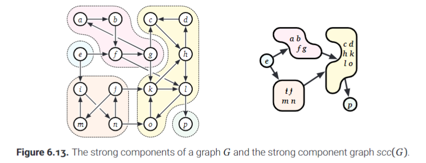

# Depth First Search

- Focus on depth-first search and its behavior in directed graphs.

- The algorithm is typically implemented recursively.

Pseudocode:

    DFS(v):
        if v is unmarked:
            mark v
            for each edge v -> w:
                DFS(w)

Instead of checking if v is marked, after we enter a call, we can choose to check if w is marked before making the recursive call. In practice this saves us from having to make a few calls.

Psuedocode:

    DFS(v):
        mark v
        for each edge vw:
            if w is unmarked:
                parent(w) = v
                DFS(w)

In the method above we prevent unneccessary recursion by first checking if the vertex we are about to recurse on is marked first.

If the vertex is unmarked, we also establish that the parent of $w$ in the edge $v \rarr w$ is $v$. Then we deploy recursion!

- **The node w is reachable from v in a directed graph if and only if there is some directed path from v to w.**

- **If we initialize DFS on some vertex v, then the resulting marked vertices, including v itself, are the set of vertices that are reachable from v.**

- Recall that for undirected graphs, reachability implies that vertices are in the same component.

- However, *with a directed graph*, reachability is not symmetric. *Just because you can go from a to b does not mean you can go from b to a.*

- As a result, even if a graph is in theory connected, a depth first search on a directed graph is not guaranteed to hit every single node in a component. **In other words, a depth first traversal, even if it always defines all reachable vertices, is not guaranteed to result in a spanning tree of the graph.**

Take for example a DFS deployed on the same graph twice but at different start points:

If we truly want to traverse the whole graph, we can just employ a wrapper function that deploys the search on each unmarked node, one at a time. (Identical to what we did in the previous chapter).

- We will also add a little subroutine called Preprocess() that will come into play later.

Pseudocode:

    DFSAll(G):
        Preprocess(G)

        for all vertices v:
            unmark v
        
        for all vertices v:
            if v is unmarked:
                DFS(v)

Alternatively and equivalently, if we can modify the graph, we could add a new vertex, s, to it and then create edges between each vertex and s. Then we could call DFS on s to get a depth first traversal of the entire graph (since all vertices are connexted to s).

Paeudocode:

    DFSAll(G):
        Preprocess(G)

        add vertex s
        for all vertices v:
            add edge s->v
            unmark v
        
        DFS(s)

- *Do not try the latter approach with Breadth-first search, it does not work equivalently to the traditional DFSAll() method for breadth first traversal. In fact, the ability to add a new vertex and then get an equivalent traversely from the fully connected vertex is something unique to DFS.*

---

## Preorder and Postorder

Now it gets confusing... please carefully go over this stuff and try working out the algorithm on paper.

We will introduce implementations for 3 subroutines that all modify a global clock variable.

The 3 routines:

    Preprocess(G):
        clock = 0
    
    PreVisit(v):
        clock = clock + 1
        v.pre = clock
    
    PostVisit(v):
        clock = clock + 1
        v.post = clock

**v.pre and v.post are time markers that will tell us when a particular vertex began being processed and when it finished being processed respectively.**

Here is how the subroutines are implemented into the DFS algorithm:

    DFSAll(G):
        clock = 0
        for all vertices v:
            unmark v
        for all vertices v:
            if v is unmarked:
                clock = DFS(v, clock)
    
    DFS(v, clock):

        mark v
        clock = clock + 1
        v.pre = clock
        
        for each edge v -> w:
            if w is unmarked:
                w.parent = v
                clock = DFS(w, clock)
        
        clock = clock + 1
        v.post = clock
        return clock

**Check out graphpreandpost.py to see this algorithm in action!**

DFS is a *recursive* algorithm so it is very easy to get lost in where the clock goes and what it means and whatnot!

if v is unmarked: clock = DFS(v, clock)

- Now first thing to observe is that the DFS method returns the value of the clock from each call.

- **Recursion occurs on a stack, with the deepest calls being resolved first, so we won't get a return value here until all recursive calls of the vertex v are resolved!**

What does this mean?: *The value of the clock that we get back on this line will be the time at which all reachable vertexes from v have been marked.*

Suppose a simple directed edge $u \rarr ... \rarr v$, there are 4 cases for the type of edge it is!

**1**) If u is a parent of v, or in other words if u is a proper ancestor of v, then:

 $u.pre < v.pre < v.post < u.post$. 

- **In other words, the interval in which v was processed is nested in the interval in which u was processed.**

- *If for this edge, DFS(u) directly calls DFS(v), then we know v.parent = u and that the edge is $u \rarr v$. This type of edge is called a **tree edge***

- *Otherwise, if u is not a direct parent of v, then we call $u \rarr v$ a **forward edge**.* **A forward edge is not actually part of the traversed tree, but it is an edge that exists.**

**2**) If v is active when DFS(u) begins, then this means that v already began processing. This implies, impossibly,

$v.pre < u.pre < u.post < v.post$. 

*This also implies that there is a directed path from v to u. This type of edge is called a **back edge**.* 

- **A back edge is not actually part of the traversed tree, but it is an edge that exists in the graph.**

**3**) If v is finished processing when DFS(u) begins, then this means 
 
$v.post < u. pre$. 

*These types of edges are called **cross edges** (I like to think of them as sibling edges, because they connect two child vertices that share the same parent vertices).*

- **A cross edge is not actually part of the traversed tree, but it is an edge that exists in the graph.**

**4**) *The fourth edge would imply that u.post < v.pre, if $u \rarr v$ then **this is plainly impossible because by definition u is only finished processing after its children are finished processing.***

- **This type of edge is plainly not part of the graph therefore it cannot be part of the traversal tree.**

Here is a textbook illustration of how the edges pan out on a graph:

***Forward, backward, and cross edges are all actually part of the graph, but they are not part of way the graph is traversed (e.g. they are not in the tree of traversal).***

When observing the pre and post properties after the traversal it is KEY to remember the following:

- **The labels v.pre for any vertex v define a *preordering* (preorder traversal) of the dag!**

- **The labels v.post for a vertex v define a *postordering* (postorder traversal) of the dag!**

Lemma 6.1: The following statements are all equivalent for vertices u and v in a graph, G.

a) u is an ancestor of v in the depth-first forest.
b) $u.pre \le v.pre \le v.post \le u.post$.
c) Just after DFS(v) is called u is active.
d) Just before DFS(u) is called, there is a path from u to v in which every vertex (including u and v) is new.

Proof: 

1) Assume u is an ancestor v in the depth-first forest. Then there must be some path P of tree edges from u to v.
2) Via induction on the path length we know:
$$u.pre \le w.pre \le w.post \le u.post$$ 
for all vertices w in the path from u to v.

- Every vertex in P is new before DFS(u) is called.

3) We know that $u.pre \le v.pre \le v.post \le u.post$ which means u is active when DFS(v) is being processed.

4) Because parent pointers correspond to recursive calls, step 3 implies that u is an ancestor of v. 

5) If u is active just after DFS(v) is called, then still:

$$u.pre \le v.pre \le v.post \le u.post$$

this implies that there is a path of zero or more tree edges from u, through the intermeadiate nodes on the recursion stack, to v. 

6) Suppose u is not an ancestor of v. Create an arbitrary path P from u to v. Let x be the first vertex in P in that is not a descendant of u and let w be the predecessor of x in P. We know that the edge $w \rarr x$ ensures $x.pre \le w.post$, $x.pre \rarr x.post$ and $x.post \le w.post$ (because w is a descendant of x). Furthermore, because w is a descendant of u, we know $x.pre \le u.post$. 

7) We stated that x is not a descendant of u, therefore x must have begun processing before u began processing. Meaning $x.pre \le u.pre$ otherwise x would be a descendant of u.

8) Recall that active intervals are properly nested or disjoint. In thise case since x is not a descendant of u, we have two possibilities:

- If $u.post \le x.post$ then x is active when DFS(u) is called. (nested interval)
- If $x.post \le u.pre$ then x is finished processing by the time u is called. (disjoint interval)

***Conclusion: Every path from u to v contains a vertex that is not new when DFS(v) is called.***

TLDR: Proofs are **hard** to wrap your head around. Sometimes it is almost like proofs are written in some mystical language that barely connects ideas. My tip to grasping some understanding of these proofs are:

1) Familiarize yourself with the language of proofs (what the symbols mean and the basics of each type of proof).

2) For any proof reread it at least once. On the second and following attempts try drawing it out when possible.

3) If you still don't get it, don't fake it and pretend to understand (being honest I don't get 95% of the proofs I come across even after a reread, but I do understand the point they are trying to get across). Instead, watch a video on the proof, and brainstorm for an additional few minutes.

---

## Detecting Cycles

Recall a special graph called a dag: *directed acyclic graph*

A dag is a directed graph which has no directed cycles

**Source**: A vertex in a dag that has no incoming vertices.

**Sink**: A vertex in a dag that has no outgoing edges.

*Can a vertex be both a source and a sink?*: **YES**
- However, such a vertex (one with no incoming or outgoing edges) is completely disconnected from the rest of the graph.

**Every dag has at least one source and one sink, even in a graph consisting of a single isolated vertex, that vertex acts as both the source and the sink.**

Here is an example of a directed acyclic graph (with its sources and sinks identified):

If you are comfortable with this graph and understanding it, we are good to go!

In the prior section we proved that if:

$$u.post \le v.post$$ 

for some directed edge $u \rarr v$, then there is a directed path from v to u and a directed path from u to v (through the apparent edge $u \rarr v$).

- **If we can get from u to v and then from v to u, this indicates the presence of a directed cycle, which would immeadiately disqualify a directed graph from being a directed acyclic graph.**

***We just found a way to determine if some directed graph is also a directed acyclic graph (dag)!***

- What would be the time complexity if we checked every single vertex by first getting a postordering of the vertices and then checked each edge for the presence of a cycle?

- Well we have to first select a vertex and then check its edges, and we do this for each vertex. **Therefore the time complexity for this algorithm is $O(V + E)$!**

A not so quick aside...(do not read if you understand why the complexity is what it is)

---

Why is the time complexity not $O(VE)$?:

- Remember the adjacency list representation. We traverse the list by going to the Vth vertex and then we go through to the Eth edge of the vertex.

- In the worst case we have V (in reality V-1 but we just round up) steps to get to the last vertex and E (in reality E-1 but we round up) steps to get to the last edge of the last vertex. (Where V is the number of vertices and E is the number of edges).

- Therefore the *worst-case complexity* of finding an edge is O(V+E)

- We are following a similar traversal for the postordering! We choose some ith vertex by taking at most V steps and the choose some jth edge by taking at most E steps.

- Last thing, $O(VE)$ is the complexity of creating or changing *every* value in the matrix representation.

---

*We can also detect a cycle if we discover an edge that points back to an already active vertex (a vertex that is already on the recursion stack).*

- **This would require us to maintain the status of each vertex.**

- **The algorithm would only return true after all vertices have been processed and checked for cycles.**

- **Otherwise if any vertice was found to have a cycle we will immeadiately return false.**

Here is the pseudocode on how we could do that:

    IsAcyclic(G):
        
        # Mark all vertices as new!
        for all vertices v:  
            v.status = new
        
        # Process through all vertices...
        for all vertices v:

            # If the vertice is new, we start
            # our checking process by...
            if v.status = new:

                # Calling the recursive function
                # isAcyclicDFS(v), which will process
                # v and all edges that it can reach!
                if isAcyclicDFS(v) = False:
                    # If the function returns false,
                    # that means a cycle was found
                    # in some traversal originating 
                    # from v.
                    return False

        # If we process all new vertices to completion
        # without finding a single cycle then we have
        # a directed acyclic graph,
        # and we return TRUE.
        return True

    IsAcyclicDFS(v):

        # Since we will now process v and its
        # reachable vertices, we set v
        # to active.

        # This is important because if
        # any edge points back to v,
        # an edge that is already part
        # of the traversal,
        # we have detected a cycle!
        v.status = active
        
        for each directed edge from v, v -> w:
            
            # If the destination vertex of the
            # edge is already active,
            # this means we are processing
            # an edge that points back
            # to an already traversed vertex.
            # In other words, we have found
            # a cycle, and return FALSE!
            if w.status = active
                return False

            # If the destination vertex has
            # a new status, then we have yet
            # to process it.
            else if w.status = new
                if isAcyclicDFS(w) = False
                    return False
        
        # If the vertex (and all its reachable 
        # vertices, which we processed recursively)
        # all finish without a detected cycle,
        # then we mark v as finished
        v.status = Finished

        # and return true.
        return True

**Check out is_acyclic_dfs.py to see these methods in action!**

You might be asking, what about this algorithm even suggests its complexity is $O(V + E)$?

- With so many damn for loops and recursion how is it even possible for the complexity to be linear as opposed to something slower!?

- The key is to understand that the for loop of the calling function processes all new vertices v. This means that if some vertices were marked in advance (as active) then they are SKIPPED being processed.

- In the called function (IsAcyclicDFS) our DFS traversal never processes the same edge twice and also never processes already active (already marked) vertices.

- **We never process the same vertice or edge twice**

***Therefore we go through all edges once and all vertices once! Complexity: $O(V+ E)$***

---

## Topological Sort

Informally a ***topological ordering arranges the vertices of a directed graph G, such that they all lie on a horizontal line and all edges point from left to right.***

- The key here is that each edge goes from left to right.

- **If the graph has a cycle, then one of the nodes would point to node on its left and create a cycle in the ordering itself! We do not want this.**

Recall that if $u.post < v.post$ for some directed edge $u \rarr v$ then there must be a directed path from v to u and also one from u to v. Hence this implies a directed cycle!

If G is acyclic then, $v.post < u.post$ for any and all edges $u \rarr v$. **Conversely if $v.post < u.post$ for all edges in some directed graph, that directed graph is acyclic!**

**Every dag has a topological ordering, no exceptions!**

Suppose the simple dag:

Lets first create a *postordering* of the graph!

- *You can use graphpreandpost.py and run that to get the preordering of any directed acyclic graph.*
- *Or do it by hand if you want the challenge.*

**Postordering: D, E, C, A, B, F**
- There is more than 1 correct answer here because depending on how you order you adjacency lists, your results may vary.

Try drawing the topological sort based on the postordering...

**For any postordering of a dag, when you draw it you'll realize that none of the arrows go from left to right, in fact, all the arrows go from right to left!**

**The *reverse postordering* of any dag always results in a topological sort.**

Here is the reverse of the previous postorder!:

*Why is this useful?*:

If we ever need to store the topological ordering in a separate data structure we **simply write the vertices into the structure in reverse postorder, which takes $O(V+E)$ time.**

### Implicit Topological Order

Why record the topological order into a separate structure?: Please don't.

- Usually it is unneccesary.

-**Our goal is to perform some work on each vertex in topological (reverse postorder) or reverse topological (postorder) order.**

- **If we want to simply perform work in that order, we do not need to record the order itself.**

For some reason if you still wanted to explicitly record the topological sort, here is one way you could do it:

Pseudocode:

    TopologicalSort(G):

        for all vertices v:
            v.status = new
        
        clock = V
    
        for all vertices v:
            if v.status = new:
                clock = TopSortDFS(v, clock)
        
        return S[1..V]

    TopSortDFS(v, clock):
        
        v.status = active

        for each directed edge from v, v -> w:
            if w.status = new:
                clock = TopSortDFS(v, clock)
            else if w.status = active:
                fail gracefully (lol)
        
        v.status = finished
    
        S[clock] = v
        clock = clock - 1
        return clock

To see the code in action check out topo_sort_into_structure.py

**If we want to process the actual graph in reverse topological order (which is basically postorder), then we simply call our process, p, in each DFS call on the vth vertex after processing the deeper calls.**

- This means that the p will first execute on the deepest vertex in the first spanning tree, and then goes pops back to its parent, and then to the parent of the parent and so on (in postorder!) until we execute p on the starting vertex of the original DFS traversal.

- *If more than one traversal is deployed, the process above happens for each traversal and still appropriately allows us to process the nodes in reverse topological (post) order*!

Pseudocode:

    PostProcess(G):
        for all vertices v:
            v.status = new
        for all vertices v:
            if v is unmarked:
                PostProcessDFS(v)

    PostProcessDFS(v):

        v.status = active

        for each directed edge from v, v -> w:
            if w.status = new:
                PostProcessDFS(w)
            else if w.status = active:
                fail gracefully
            
        v.status = finished

        someProcess(v)

**See the code in action in topo_sort_processing.py**

The purpose of checking the status of each vertex during the traversal is to ensure that we don't end up performing a traversal on a cyclic graph.

- *What if we know ahead of the time that the graph is acyclic?*

In this case **we can simply use marks to avoid encountering previously processed nodes. This removes the needs for statuses altogether.**

- So its honestly your choice depending on the purpose but using marks vs statuses works equally well.

- **Only use the marks method, which is below, if you are certain that the graph is acyclic. Otherwise stick to the status approach.**

*How can we process a dag in **forward or regular topological order**?*

1) We could record the order, and then process on each node in the order sequentially via a for loop.

2) We can apply DFS to the reversal of G, $rev(G)$, which we can obtain by replacing each edge $v \rarr w$ with $w \rarr v$

If we take the second approach here is what happens:

- *Every source in G becomes a sink in rev(G)*
- *Every sink in G becomes a source in rev(G)*

**A topological ordering of rev(G) is the reversal of a topological ordering of G. That being said, if we process in reverse of this ordering, of rev(G) we are processing in topological order with respect to G.**

- *This reversed, reversed topological order, may not be the reverse postordering of the original graph.* **Remember that the reverse postordering of the original graph is only one of the perhaps many topological orderings of a dag.**

**The reversal of any graph takes $O(V + E)$ time.**

If you want to see the implementation of this second approach then go check out topo_sort_processing.py

Sidenote:
- *I am great at concisely naming things :)*

---

## Memoization and Dynamic Programming

**Recall that we can model recurrence relations and recursive calls themselves as a part of a *dependency graph***

Here is a dependency graph that we touched on for the fibonacci algorithm:

**Note that every dependency graph is acyclic, because if it was cyclic that would imply an infinite recursive loop!**

- Every dependency graph is *acyclic and directed* which means that **we can generate a topological sort for any dependency graph**!

*What would happen if we tried to perform a DFS on one of these dependency graphs and stopped when we found some vertex v?*:

- Since **every vertex in a dependency graph represents a unique subproblem, when we mark the vertex we are saying "we have already computed this subproblem"**.

- As we hunt for some target vertex v, **as long as we mark each encountered subproblem we will never solve the same subproblem twice**!

**This means, very importantly, performing a DFS of a dependency graph of any recurrence is the EXACT SAME process as solving the recurrence using memoization.**

- **Evaluating a recurrence using dynamic programming is the same as evaluating all subproblems in the dependency graph in reverse topological order (postorder to be specific).**

We intuitively know this to be true, since with recursion we use a stack in which the top of the stack represents the deepest recursive call (which is analgous to a sink in a graph), this call (which is a sink since it makes no other subcalls) is evaluated first, then the rest of stack is "popped" off in order of "deepness". This is quintessentially DFS.

- *Every subproblem is evaluated only after the subproblems it depends on. This should remind you of the clock-based DFS algorithm.*

- The dependency graph in most dynamic programming algorithms is implicit, it can only be seen by carefully analyzing the order in which the system stack is manipulated.

- Despite this if we can enumerate the recursive subproblems in constant time each, we can traverse the dependency graph as if it was an adjacency list.

- Most dynamic programming algorithms have highly structured dependency graphs, their structure allows us to hard code an evaluation order (a reverse topological order) directly into the algorithm, without having to topologically sort the dependency graph at runtime.

### Dynamic Programming in DAGs

*Well what if the dependency graph for the algorithm is less structured?*:

    - In that case we can apply DFS to concoct a dynamic programming solution!

Consider the longest path problem:

Problem: What is the path which has the maximum total weight from node s to node t in a weighted, directed graph G?

- This problem is NP-hard (god knows what that means, so wait till Chapter 12)

For any target vertex t and for node v, $LLP(v)$ will denote the length of the longest path from v to t.

If the graph is a dag, then the following recurrence applies:

$LLP(v) = 0$ if $v = t$

$LLP(v) = max\{l(v \rarr w) + LLP(w) | v \rarr w \in E \}$ otherwise

- $l(v \rarr w)$ is the weight ("length") of the edge $v \rarr w$
- If v is a sink but is not t, then $LLP(v) = -\infin$

In common english:

- The base case occurs when v = t, in this case we have reached our goal vertex t and there is no need to add anything else. Therefore the base case returns 0.

- Otherwise for all outgoing edges from v, v->w, we first consider the path length from v to w and sum it with the recursive sum of the rest of the path, the sum of the rest of the path (which will also be the longest path length from the child of v to w).

We can write the *recursive* algorithm as follows:

Pseudocode:

    LongestPath(v, t):
        if v = t:
            return 0
        if LLP is undefined:
            v.LLP = -infinity
            for each edge v -> w:
                v.LLP = max(v.LLP, l(v->w) + LongestPath(w, t))
            return v.LLP

To see this code in action check out longest_path_recursive.py

Or we can use dynamic programming to **replace the recursion with a for loop that goes over each node in the postorder** (reverse topological) order.

Pseudocode:

    LongestPath(s, t):

        for each node v in postordering:
            if v = t:
                v.LLP = 0
            else:
                v.LLP = -infinity
                for each edge v -> w:
                    v.LLP = max(v.LLP, l(v -> w) + w.LLP)

        return s.LLP

To see this code in action check out longest_path_dp.py

Choosing either formulations is purely a manner of convenience because both methods have the same time complexity $O(V + E)$.

- The first method puts the calls on a recursive stack, and the second method replaces the work done in the calls with a for loop that does the *same amount of work*.

---

## Strong Connectivity

A vertex u can reach some other vertex v in a directed graph if there is a directed path from u to v.

- **Let reach(u) be the set of all vertices that u can reach.**

Two vertices are *strongly connected* **if u can reach v and v can reach u.** **A strong connection also implies some cycle exists between u and v.**

**A directed graph is strongly connected if and only if every pair of vertices is strongly connected.**

- If we want to be super specific then *strong connectivity is an equivalence relation over the set of vertices* in a directed graph. **The classes of this relation are connected components or strong components of G.**

- A directed (cyclic) graph is strongly connected if and only if it has one strong component.

- A directed acyclic graph is strongly connected if and only if every strong component of G consists of a single vertex.

**Condensation graph / Meta graph / strong component graph**: A directed graph obtained from some graph G by shrinking each component down to a single vertex and collapsing parallel edges. **This graph is always a directed acyclic graph.**

Here is a graph with 5 strong components and its corresponding condensation graph:

- **A strong components graph of a directed graph is always a directed acyclic graph.**

- **Each strong component is cyclic or a single node.** 

This is isn't an exact proof but here is the reasoning:

Suppose I want to reach node b from a, if the component is strongly connected there must be the edge $a \rarr b$ and now if I want to go from b to a, there must be an edge $b \rarr a$. Clearly in a strong component I can make a round trip from point a to b and b to a, implying the existence of a cycle.

*How can we compute the strong component of a single vertex?*:

1) We determine the set of reachable vertices from some vertex v in the graph, $G$. We call this set $reach(v)$.
2) Then we calculate the reversed graph from G (the head and tail of each edge are flipped)
3) We determine the set of reachable vertices from the same vertex v in the reversed graph, $G^{-1}$. We call this set $reach^{-1}(v)$

4) **The interesection of the two sets: $$reach(v)  \cap reach^{-1}(v)$$ is the vertices that form the strong component.**

However for V vertices, there are at most V strong components.

- If we want to count up the number of strong components in a graph, we have no choice but to check each and every single vertex for the strong component that it may be part of.

- **The algorithm to find the strong component of a single vertex runs in $O(V + E)$ time.**
- Therefore the algorithm to find the strong component of the whole graph runs in: $O(V*(V+E)) \rarr O(V^2 + VE) \rarr O(VE)$ time. The reason we eliminate $V^2$ and not $VE$ in the last step is because E is secretly at worst $V^2$, which means we could write $VE$ as $V^3$ which is in fact more dominant than the $V^2$ term. 

**There at most V (# of vertices) components which each require E (# of edges) time to discover**

Can we detect strong components in linear time?

---

## Strong Components in Linear Time

We have many options if we choose to compute the number of strong components in "linear" $O(V+E)$ time.

This is the key behind all of them.

Lemma 6.2: Fix a DFS traversal of any directed graph G. Each strong component C, of the graph G, contains exactly one node that has no parent in C. (The node may have its parent in another component or truly no parent at all).

Proof:

1) Let C be some strong component of G. Consider some path from some vertex $v$ to another vertex $w$ (in the component C). Every vertex on the path can reach $w$ directly and can also reach any other vertex in the component C.

2) Symmetrically, every node on the path can be reached by every other vertex in C. We can say that every vertex in the path $v$ to $w$ is alse a in C.

3) Let v be the earliest started vertex in C. If $v$ has some parent, $parent(v)$ then this parent starts before v and therefore cannot be part of the component C.

4) Let $w$ be some other vertex in C, just before $DFS(v)$ (where v is the earliest started vertex) is called, w and all other nodes in C are new, so there is a path yet to be traversed from $v$ to $w$.

7) Based on Lemma 6.1, we can now say that w is a descendant of v in the depth-first forest. 

8) Every vertex on the path of tree edges from v to w lies in C and the parent of w must be in the component C as well.

**Each strong component of a directed graph H, is also a connected subtree of any depth-first forest of G.**

**For any strong component C, the vertex in C with the earliest starting time is the lowest common ancestor of all vertices C. This vertex is the *root* of the component C.**

In the strong component graph, if some component node acts as a sink, we call the entire component a *sink component*

A set of vertices C create a sink component if the reach of any vertex v, $reach(v)$ is exactly the same set as C. **No vertices in C are connect out from C to some other component.**

We can find all the strong components of G by...

1) Repeatedly finding a vertex v in some sink component (god knows how for now)

2) Finding the vertices reachable from v,

3) Then removing the sink component from the graph altogether.

We repeat steps 1 to 3 until no components remain. Recall that a directed acyclic graph (which is precisely what the strong component graph is), always has a sink. Repeating steps 1 to 3 will identify all the sink components.

The only question now is how to find a vertex in a sink component...

Here is the code as we know it, upto what we know now

Pseudocode:

    StrongComponents(G):

        count = 0

        while G is non-empty:
            C = empty set
            count = count + 1
            
            v = any vertex in a sink component of G # We don't know how to do this yet...
            
            for all vertices in reach(v):
                w.label = count
                add w to C

        remove C and its incoming edges from any other component in G

### Kosuraju and Sharir's Algorithm

**Lemma 6.3: The last vertex in any postordering of G lies in a source component of G**

Proof:

1) Perform a depth first traversal of graph G, and let v be the last vertex in its postordering.

2) DFS(v) must be the last recursive call made by the wrapper function DFSAll().

3) Since v comes last in the postordering it must be the root for one of the trees in the depth-first forest.

4) Any node that finished processing after v, x, such that $x.post \ge v.pre$, is a descendant of v.

5) Finally we can say, v is the root of the strong component C.

6) Suppose there is some edge $a \rarr b$ such that $a \notin C$ and $b \in C$. In this scenario, a can reach b and b is in C. Therefore a can reach any vertices in the set of C, including v.

7) If $reach(a)$ includes v, and v is the root of C, we also know that b is a descendant of v, and mathematically $v.pre < b.pre$. 

8) The edge $a \rarr b$ ensures that $b.pre < a.post$. If we also know $v.pre < b.pre$, then we know $v.pre < a.post$.

9) If this is the case, then a must be a descendant of v (since a finishes processing after v starts processing). If a is a descendant of v, then v can reach a and therefore $a \in C$. This contradicts our premise of a being outside of the component C. 

**rev(scc(G)) = scc(rev(G))** for any directed graph G.

- **The last vertex in a postordering of rev(G) also lies in a sink component of the original graph G**

The Kosaraaju-Sharir algorithm combines the points made in the prior discurssion to create an algorithm that is capable of counting and labelling strong components in any directed graph G.

The algorithm has two stages:

1) Perform a DFS of the reversal of graph G and push each processed vertex ito a stack when finished. 

2) Perform a whatever-first traversal of the original graph but consider vertices in the order in which they appear of the stack (this stack contains the postordering of rev(G), and the top of the stack represents the last processed vertex which is guaranteed to be in a sink component). 

**I will skip the pseudocode explanation as this covers that, but I highly reccomend checking out the code in kosarajusharir.py as opposed to trying to understand this mess.**

## Tarjan's Algorithm

**The entire computation for Tarjan's algorithm takes place during a single depth-first search**

- The algorithm finds one source component of G (a source component in a strong component that has no incoming edges from other strong components) and deletes it.

- **Since a metagraph of any directed graph, G, always turns out to be a dag, we can say that every metagraph must contain at least one source component.**

- **In any dag (including the metagraph) deleting source node always results in another dag. Therefore we can keep deleting source nodes and in each step we will still be left with a dag until the graph is completely wiped.**

- We take advantage of this property in Tarjan's algorithm!

Suppose some dfs of a graph G, for each vertex v, let $low(v)$ **represent the smallest starting time amongst the vertices reachable from v by a path that consists of at most one non-tree edge** (this means an edge that actually exists but isn't part of the tree).

- If we analyze the definition of $low(v)$ carefully, **if some vertex reachable through v does start earlier than v itself, that must mean that it was part of an earlier dfs traversal**.

- **Otherwise if the reachable vertex started after v, it was either part of this traversal (v was a parent of that vertex) or some future traversal.**

*Can $low(v)$ be greater than the starting time of v?:*

**No, because we can reach v from v through 0 edges, this means that low(v) is AT MOST the starting time of v!**

Mathematically this means: $$low(v) \le v.pre$$

What if every reachable, proper descendant, vertex from v has a greater starting time than v and $low(v) = v.pre$? Then every reachable vertex from v creates a strong component, which is also a sink component!

Lemma 6.4: A vertex v is the root of a sink component of G if and only if $low(v) = v.pre$ and $low(w) \le w.pre$ for every proper descendant w of v.

Let's confirm this on an example!

Suppose the graph below:

The color of the nodes should help you identify each distinct component.

Suppose we started the traversal at A, and then we traversed this way:

Pay attention to this next part, in my opinion going over an example like this is much better than reading a tedious proof!

---

Suppose v = A:

**What vertices are reachable from A with at most 1 non-tree edge?:** Every other edge!

**In the traversal, confirm that for every other edge (every descendant of A), low(w) < w.pre**:

- Test this on B, low(B) = A.pre, because we can use 1 non-tree edge to get to A. A.pre is indeed less than B.pre so we're good to go.

- Lets try this with F, low(F) = ... well wait a minute, I can only take outgoing edges from F to some edge that comes later in the traversal. Therefore $low(F) = F.pre$, and low(F) is NOT less than F.pre. Therefore A cannot be the root of a sink component!

Here is the pictoral explanation:

---

Let's try using v = G instead, and see where that takes us.

**What vertices are reachable from G with at most 1 non-tree edge?:** only its proper descendants, which all begin processing after G. No non-traversal (back or cross) edges from G exist

low(G) = ... Well in the traversal, G only has outgoing edges. **This means G starts being processed before F, H, and I**, and the smallest starting time amongst them is G's starting time.

- Therefore we can confidently say that 
$low(G) = G.pre$.

- G has 3 proper descendants (3 elements within its reach). All of these 3 elements are processed after G.pre, which also means that for any proper descendant, w, in the DF traversal, $low(G) < w.pre$ 

Here is the pictoral explanation:

---

If neither the pictures nor the words in the previous example made sense to you, you can take a look at the following proof (copied word for word):

**Lemma 6.4: A vertex v is the root of a sink component of G if and only if $low(v) = v.pre$ and $low(w) \le w.pre$ for every proper descendant w of v.**

**Proof**:

1) Let v be a vertex such that low(v) = v.pre.

2) There can be no edge $w \rarr x$ where w is a descendant of v and $x.pre \le v.pre$

3) The vertex v cannot reach any vertex y such that $v.post \lt y.pre$

4) The vertex v can only reach its descendants and the descendants can only reach other descendants of v (including themselves).

5) v cannot reach its parent (if it has one), thereofr combining the previous statements we can confirm that v and its descendants form a strong component.

6) Furthermore, suppose $low(w) \lt w.pre$ for every descendant w of v.

7) Each vertex w can reach some other descendant of v, x such that $x.pre \lt w.pre$

8) By induction, every descendant of v must be able to reach v.

9) We can conclude that v is the root of the strong components formed by v and its descendants. And since v cannot access vertices outside its component, none of the other vertices can reach any vertex outside thier component. The last statement indicates that this component must be a sink!

10) Suppose that v is the root of the sink component C, then v can only reach some other vertex w, if $w \in C$. We know v can reach all its descendants, and every other vertex in C other than v is a descendant of v. If $low(w) = w.pre$ for any other vertex the v in C this would imply the existence of a second root of C, which is impossible.

Algorithm steps:

1) **Tarjan's algorithm requires $O(V + E)$ time to find the root of every sink component in a directed graph using a global whatever first search.**

2) **We mark an delete each sink components in an additional $O(V+E)$ time cost. Then we recursively start at step 1 for the resulting graph.**

- The resulting algorithm **may require V recursive calls if each component consists of a single vertex, which would give us a total running time of**:

$$O(V(V + E)) \rarr O(V^2+VE)$$

- Note that E is actually $V^2$, therefore VE is the dominating term and:

$$O(VE)$$

is the resulting complexity.

This complexity is worse than that of the Kosaraju-Sharir algorithm: $O(V + E)$, how do we fix that?

We create a separe stack of vertices apart from the recursive stack. When we start processing a new vertex, we push it onto the stack.

- Suppose the vertex we pushed onto the stack is v.

- When we finish processing that vertex (and this implies we have finished processing all its descendants), we compare v.low and v.pre.

- **If $v.low = v.pre$** we can say:

1) **Vertex v is the root of the sink component C.**

2) **All vertices in C appear consecutively at the top of the stack.**

3) **The deepest vertex in C on the auxillary stack is v (since v was the root of the component, it started processing first and is at the bottom of the stack)**

*We can identify the vertices that form the component C by popping off vertices from the stack until we reach v. All vertices popped upto v and v itself are all part of the sink component!*

After this we could choose to actually remove all these vertices from the graph but that would take more time. **Instead we label all the vertices in the component and identify their root as v. Marked vertices (vertices with a root) are ignored when moving forward in the DF search.**

Here is the pseudocode for Tarjan's algorithm:

    Tarjan(G):

        clock = 0
        S = new Stack()
        
        for all vertices v:
            unmark v
            v.root = none
        
        for all vertices v:
            if v is unmarked:
                TarjanDFS(v)

    TarjanDFS(v):

        mark v

        clock = clock + 1
        v.pre = clock
        v.low = v.pre

        Push(S, v)

        for each edge v -> w:
            if w is unmarked:
                TarjanDFS(w)
                v.low = min{v.low, w.low}
            else if w.root = None:
                v.low = min{v.low, w.pre}

        
        if v.low = v.pre:
            until w = v:
                w = pop(S)
                w.root = v

***To see this code in action (with the appropriate comments) checkout tarjanalgo.py***

---

