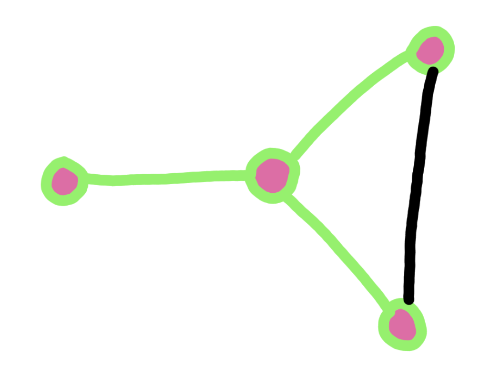
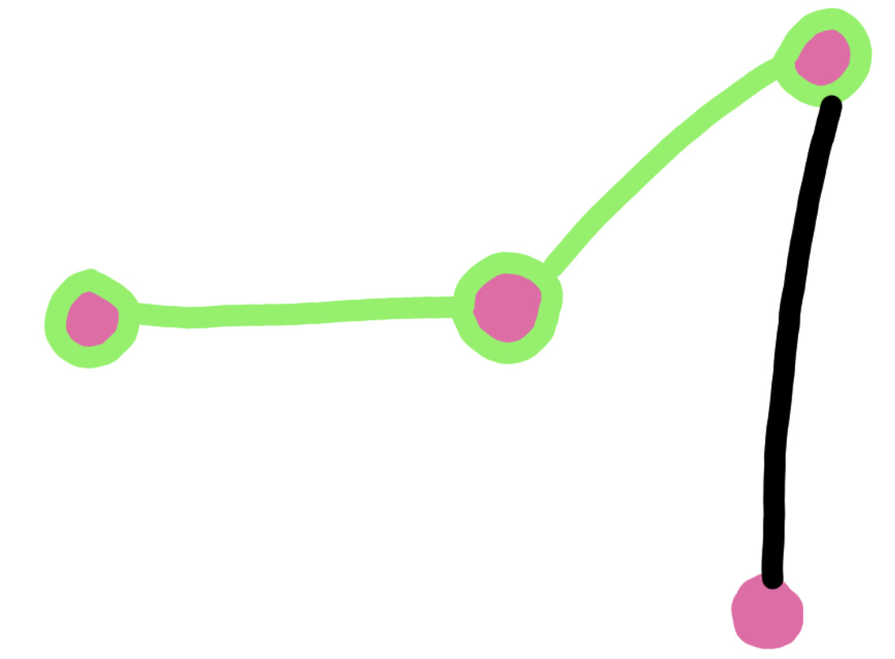
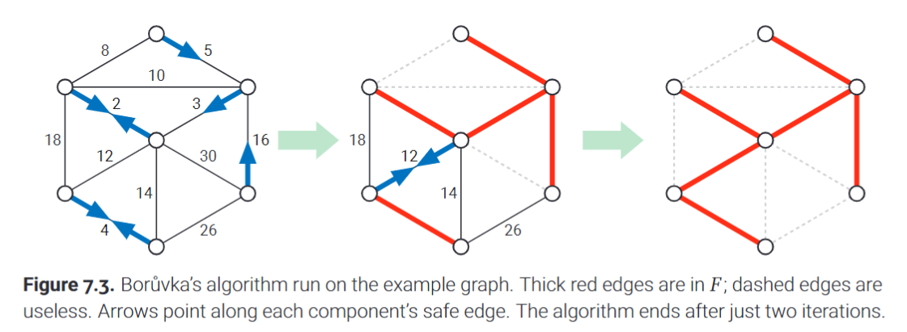
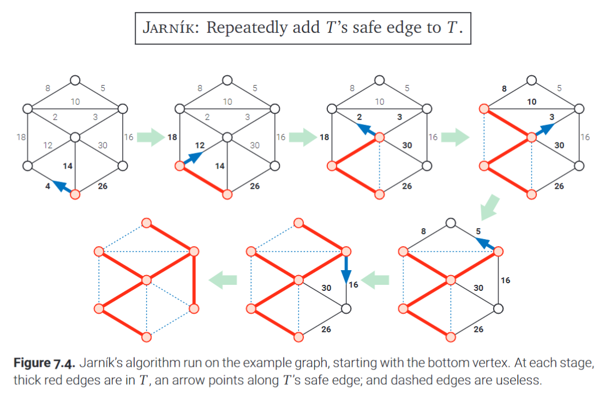
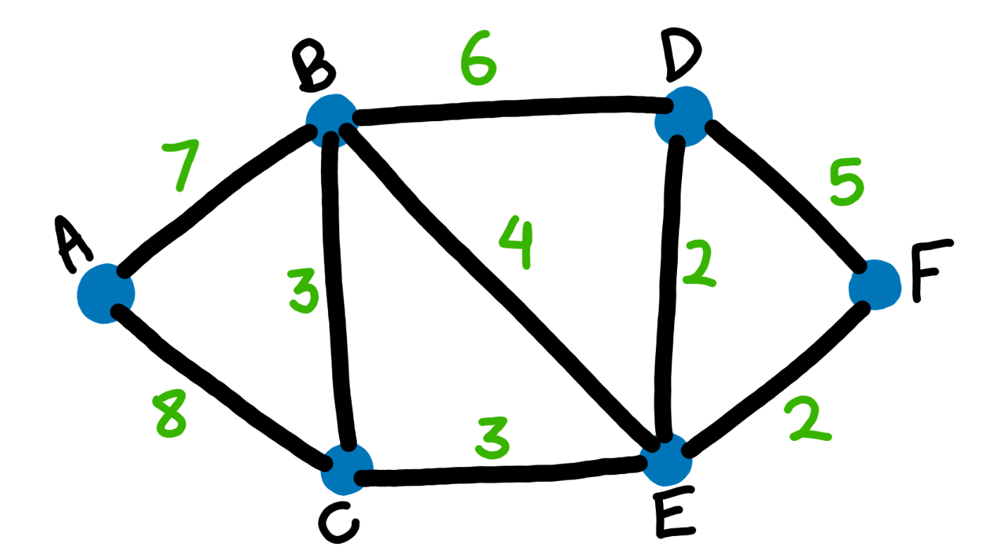

# Minimum Spanning Trees

Suppose a connected, undirected, and weighted graph.

- Some function w provides weight to any edge e, in the form $w(e)$.

The minimum spanning tree is a spanning tree which minimies the sum of weights across all of its edges. **In other words, the algorithm chooses edges such that the sum of their weights is as small as possible, but the edges still form a spanning tree.**

---

## Distinct Edge Weights

Uh wait a second, does every graph only have one minimum spanning tree?

*Note we will use MST in place of minimum blah blah from now on.

- Suppose a graph where each edge has a height of 1. This would mean that ever spanning tree is also a minimum spanning tree and the weight of each MST would be V - 1 where V is the number of vertices.

What if we assume that MSTs are unique? **Or rather how do we know that a graph has a unique, singular MST solution?**

**Lemma 7.1**: *If all edge weights in a connected graph G are distinct, then G has a unique minimum spanning tree.*

The proof is a bit tedious so I have taken the liberty of adding a links here that explains it better than the book, in my opinion.

https://www.youtube.com/watch?v=Ftkv1Ijp5Jw

https://www.youtube.com/watch?v=vNhvBrc02G4

**The bottom line is: if all edge weights in a connected graph are distinct, then the graph has a unique MST.**

- If the algorithm assumes distinct edge weights, we can run it on graphs without distinct edge weights as long as we can break ties.

We can develop a simple algorithm for weight comparisons as following:

Pseudocode:

    ShorterEdge(i, j, k, l):
        if w(i, j) < w(k, l): return (i, j)
        if w(i, j) > w(k, l): return (k, l)
        if min(i, j) < min(k, l): return (i, j)
        if min(i, j) > min(k, l): return (k, l)
        if max(i, j) < max(k, l): return (i, j)
        else: # if max(i, j) > max(k,l)
            return (k, l)
    

This ShorterEdge algorithm takes 4 integers as input representing 4 vertices. The algorithm decides which of the two edges have a smaller weight ((i,j) vs (k, l)).

- The edge (i, j) and (j, i) are identical because we are working with an undirected graph.

***Here is a verbal explanation of the ShorterEdge algorithm***:

1) If the weight of (i, j) is clearly less than the weight of (k, l), we return the shorter edge (i, j).

2) If the weight of (k, l) is clearly less than the weight of (i, j), we return the shorter edge (k, l).

If i,j is a path (an edge consisting of middle vertices), then it may be the case that there are two paths from i, j. The same applies for k, l.

The next 4 cases compare a situation in which there may be more than one path from $i$ to $j$ or from $k$ to $l$.

1) If the minimum weighted edge from i to j is shorter than the minimum weighted edge from k to l, then we return (i, j) as having the shorter edge.

2) If the minimum weighted edge from k to l is shorter than the minimum weighted edge from i to j, then we return (k, l) as having the shorter edge.

The last two cases will only be hit if and only if the two edges (i, j) and (k, l) have identically weighted minimum length edges. If this is the case we resort to comparing the max.

3) If the maximally weighted edge from i to j is shorter than the maximally weighted edge from k to l. Therefore i to j is a smaller edge and we return (i, j)

4) Else this implies that the maximally weighted edge from k to l is shorter than the maximally weighted edge from i to j. Therefore k to l is a smaller edge and we return (k , l)

**For the rest of the chapter, assume edge weights are always distinct, and MSTs are always unique.**

---

## The Only Minimum Spanning Tree Algorithm

All variations of algorithms that try to find the MST follow the same base strategy.

This is very similar to the *whatever-first search* that we discussed in chapters 5 and 6. 

The default MST algorithm creates an acyclic subgraph, F, of the original graph, G.

- **This acyclic subgraph is called the *intermeadiate spanning forest***.

**Throughout the traversal F is always a subgraph of the MST of G.**

How is F developed? Well lets examine it pictorally:

At first F starts out all individual nodes with no edges in between:

- **The nodes encircled in light green are part of F!**

The algorithm connects trees in F by adding particular edges between them.

- When the algorithm stops, F has been made into a single spanning tree which is also a MST of G.

**The core process in the algorithm is picking and choosing what edges to include in F, we obviously cannot include all of them because not all of the edges are part of the *minimum spanning tree*.**

In our algorithm, edges are classified as either *safe* or *useless*.

- **An edge is considered useless if it is not an edge of F, but both of it's endpoints are already part of F.**
- **An edge is safe if it is the minimum-weight edge with exactly one endpoint in some component of F.**

Here is an example of what a useless edge would be:

The edges and vertices in green are already part of F, should the black edge be added to F?

No! **Both vertices that correspond with that edge are already part of F.**

Here is an example of what a safe edge would be:

Can the black edge be added to F *safely*? In other words does exactly one endpoint of that edge already reside in F?

Yes! **Only one endpoint of that black edge is already part of the subgraph F.**

- **If F has two or more component graphs, the same edge could be safe for more than one component of F.**

- **Can an edge be neither safe nor useless? Yes, we call these *undecided* edges.**

All MST algorithms are based on two observations:

1) Lemma 7.2: The minimum spanning tree of G contains every safe edge. (Observation by Robert Prim in 1957)

- For any subset S, of the vertices of the graph G, the MST of G contains the minimum-weight edge using exactly one endpoint in S.

Proof:

1) Let S be some arbitrary subset of G and let e be the lightest edge with exactly one endpoint in the set S.

2) Let T be any spanning tree that does not contain e, we need to prove that for any T, T is not the MST of G.

3) T is connected, therefore there is a path between the two vertices of e.

4) This path starts at a vertex in S and ends at a vertex not in S, therefore at least one edge with exactly one endpoint in S. Suppose e' is one such edge.

5) Removing e' from T creates a spanning forest with two components each component containing a separate endpoint of e. 

6) Adding e to this forest gives us a new spanning tree: $T' = T - e' + e$. The definition of e implies w(e') > w(e), which means that T' has a smaller weight than T, and consequently T cannot be the MST of the graph!

2) Lemma 7.3: The minimum spanning tree contains no useless edge.

- Simple proof: **Adding a useless edge, means adding an edge between two edges that are already part of the spanning tree, this results in a cycle!**

The generic MST algorithm only adds *safe edges* to F over time. If F is not yet fully connected, there must be some safe edge we have yet to add.

**No matter in which order we choose to add safe edges, F eventually becomes connected and forms the MST.**

- As we continue to add new edges to F, edges change their status from undecided to useless or safe!

- If an edge becomes useless, it stays useless forever ( :( )

- **The variations on the algorithm come from choosing how and which safe edges to add each iteration and how to actually find these edges.**

---

## Boruvka's Algorithm

The simplest MST algorithm by far actually utilizes recursion. 

- This algorithm was rediscovered several times from 1926 (original discovery by Otakar Boruvka) to 1961.

The core jyst of this algorithm is: **Add all safe edges and recurse!**

Here is an example the textbook provides:

- This algorithm also utilizes the CountAndLabel algorithm from Chapter 5 to label each vertex with an integer that indicates it component.

Here is the pseudocode for the algorithm:

    Boruvka(V, E):
        F = (V , empty)
        count = CountAndLabel(F)

        while count > 1 # Algorithm stops when F is fully connected, meaning when count = 1
            AddAllSafeEdges(E, F, count)
            count = CountAndLabel(F)
        
        return F

    AddAllSafeEdges(E, F, count):

        for i = to count:
            safe[i] = null
        
        for each edge:
            if comp(u) != comp(v):
                if safe[comp(u)] = null or w(uv) < w(safe[comp(u)]):
                    safe[comp(u)] = uv
                if safe[comp(v)] = null or w(uv) <  w(safe[comp(v)]):
                    safe[comp(v)] = uv

        for i = 1 to count:
            add safe[i] to F 

**Check out boruvka_algo.py to see the code in action.**

Although this algorithm is often overlooked, there are plenty of reasons why Boruvka's algorithm can be a superior choice to more recent MST algorithms.

1) The algorithm's worst case running time is $O(E \log V)$. But the number of components in a graph can drop by more than a factor of two, **which brings the worst case to be speedier than $O(\log_{2} V)$**.

2) **For certain graphs, a slight alteration of Boruvka's algorithm runs in $O(E)$ time!** This type of specialization does not come into play in the other MST algorithms we will discuss.

3) In each iteration, each component of F can be handled in an independent thread. **In other words, the algorithm is intrinsically built for parallelism. Which in turn leads to faster performance on multicore machines.**

4) **Most recent MST algorithms (that are not mentioned in the book), which are faster than the ones in this book, are generalizations of Boruvka's algorithm.**

- If you want to make a MST, use Boruvka. If you want to prove something about a MST, then use the next two!

---

## Jarnik's ("Prim's") Algorithm

Jarnik's algorithm was written in response to Boruvka, and it was rediscovered several times.

**In this algorithm, F starts out as a single *arbitrary* vertex as opposed to a forest of unconnected single vertices.**

The core jyst of this algorithm is: **Repeatedly add F's safe edges to F until F spans the whole graph!**

Here is an example the textbook provides: 

- At each iteration we are taking the shortest safe edge to an unreached vertex!

To implement this algorithm **we utilize a priority queue!**

The top of this queue has the minimum weight edge, as we dequeue, we check if the minimum weighted edge has both vertices that are already part of F (the WIP MST). If not, we add the edge into the priority queue (we are guaranteed that the edge is adjacent to at least one vertex already in F). After adding that edge we also add its neighboring edges to the priority queue.

- The traversal ends when all vertices are accounted for (marked). 
- The queue may still contain edges even when the algorithm finishes.

---

### Improving Jarnik's Algorithm

Fibonacci heaps are a specialized priority queue based data structure that can be used to accelerate our algorithm a bit further.

- Fibonacci heaps still support standard priority queue operations.

- The main advantage comes with the fact that the time complexity of the *Insert()* and *DecreaseKey()* operations for a fibo heap are $O(1)$.

- How is that even possible?: Well the trick is that the ***amortized cost / complexity*** of the operations. Meaning that every once in a while the operation's complexity may spike, but over the long run the time complexity can be considered constant.**Amortization is statistical averaging, it is averaging the cost of an operation over the long run. This is also what allows hashing to be as efficient as it is on paper!**

- **A fibonacci heap can perform I *Insert* operations, D *DecreaseKey* operations, and X *ExtractMin* operations in $O(I + D + X \log n)$ time.**

We can make use of the fibonnaci heap by storing vertices in the priority queue instead of edges. 

- **The priority of each vertex v, is the minimum weight edge between v and the evolving graph F (priority is by default infinity if no such edge exists).**

Regarding the following pseudocode:

- JarnikInit: initializes the priority queue with all the vertices.
- JarnikLoop: main algorithm

For each vertex we maintain an incident edge and a priority!

Pseudocode for Jarnik's algorithm using a fib heap:

    Jarnik(V, E, s):
        JarnikInit(V, E, s)
        JarnikLoop(V, E, s)

    JarnikInit(V, E, s):

        for each vertex that is in V but not in {s}:
            if edge vs is in E:
                edge(v) = vs
                priority(v) = w(vs)
            else:
                edge(v) = null
                priority(v) = infinity
            Insert(v) # Insert into priority queue

    JarnikLoop(V, E, s):

        T = ({s}, None)
        for i = 1 to | V | - 1:
            v = ExtractMin
            add v and edge(v) to T
            for each neighbor u of v:
                if u is not in T and priority(u) > w(uv):
                    edge(u) = uv
                    DecreaseKey(u, w(uv))

Couple pointers to note:

1) Why add non-existent edges to the priority queue?

- **This is a misconception!** Look closely and you'll see that *we are adding vertices to the queue, not edges*. **Each vertex is added to the queue, because each vertex exists.** Our if else statement prior to adding the vertex modifies the edge property and priority property based on the fact that $v \rarr s$ does not exist!

2) Why does the loop go from i to | V | - 1?

- The Jarnik algorithm proves that the MST through any well connected graph has a length of | V | - 1. Actually all of our MST algorithms prove this! In this pseudocode we assume | V | - 1 th iteration is included (so be careful with how you actually implement this in code).

3) Why do we check each neighbor, u, of v against the priority of u?

- The priority of u is the shortest edge to u that we currently know of. If the edge from u to v is smaller in weight than the priority of u, then we know that we how found a shorter path. Otherwise we do nothing because we can reach the vertex u with a shorter edge via some other path.

4) This is so complex? Do we check the vertex we are on, or all at once, or like how does a heap fit into this?

- Well lets discuss this conceptually, without a heap, first. At each step we are checking the edges adjacent to all existing vertices in our running tree F.

Suppose the example graph below:

---

---

Pseudocode:

---

## Kruskal's Algorithm

---

---
