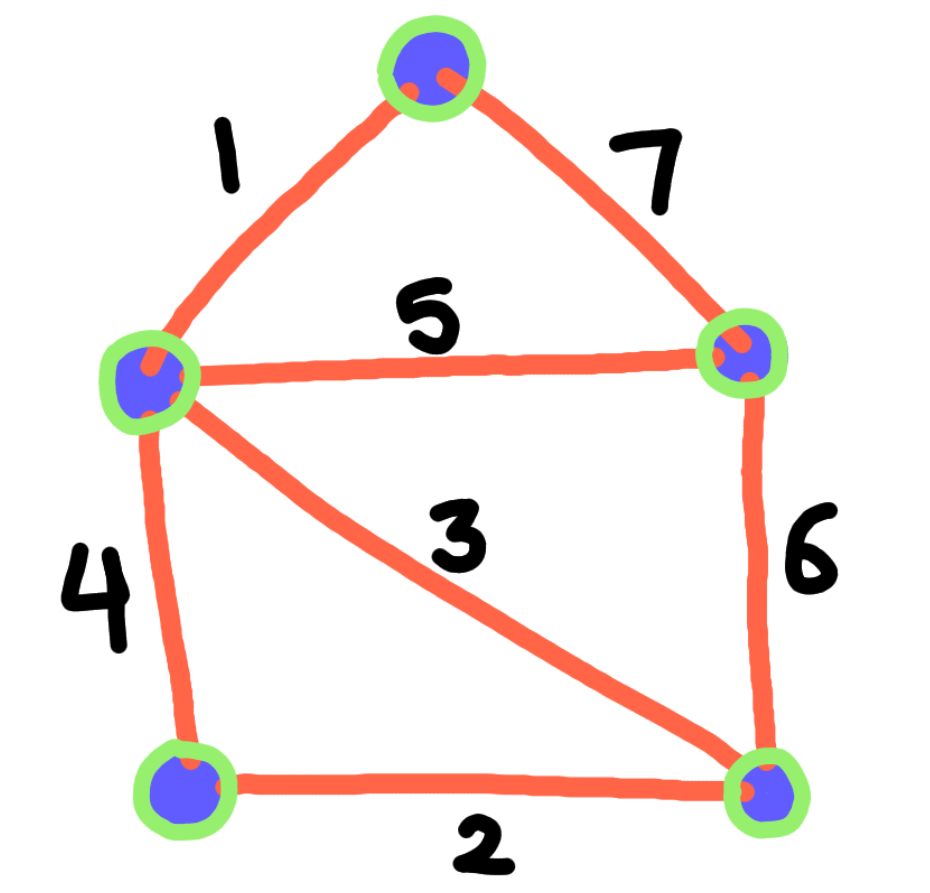

# Minimum Spanning Trees

Suppose a connected, undirected, and weighted graph.

- Some function w provides weight to any edge e, in the form $w(e)$.

The minimum spanning tree is a spanning tree which minimies the sum of weights across all of its edges. **In other words, the algorithm chooses edges such that the sum of their weights is as small as possible, but the edges still form a spanning tree.**

---

## Distinct Edge Weights

Uh wait a second, does every graph only have one minimum spanning tree?

*Note we will use MST in place of minimum blah blah from now on.

- Suppose a graph where each edge has a height of 1. This would mean that ever spanning tree is also a minimum spanning tree and the weight of each MST would be V - 1 where V is the number of vertices.

What if we assume that MSTs are unique? **Or rather how do we know that a graph has a unique, singular MST solution?**

**Lemma 7.1**: *If all edge weights in a connected graph G are distinct, then G has a unique minimum spanning tree.*

The proof is a bit tedious so I have taken the liberty of adding a links here that explains it better than the book, in my opinion.

https://www.youtube.com/watch?v=Ftkv1Ijp5Jw

https://www.youtube.com/watch?v=vNhvBrc02G4

**The bottom line is: if all edge weights in a connected graph are distinct, then the graph has a unique MST.**

- If the algorithm assumes distinct edge weights, we can run it on graphs without distinct edge weights as long as we can break ties.

We can develop a simple algorithm for weight comparisons as following:

Pseudocode:

    ShorterEdge(i, j, k, l):
        if w(i, j) < w(k, l): return (i, j)
        if w(i, j) > w(k, l): return (k, l)
        if min(i, j) < min(k, l): return (i, j)
        if min(i, j) > min(k, l): return (k, l)
        if max(i, j) < max(k, l): return (i, j)
        else: # if max(i, j) > max(k,l)
            return (k, l)
    

This ShorterEdge algorithm takes 4 integers as input representing 4 vertices. The algorithm decides which of the two edges have a smaller weight ((i,j) vs (k, l)).

- The edge (i, j) and (j, i) are identical because we are working with an undirected graph.

***Here is a verbal explanation of the ShorterEdge algorithm***:

1) If the weight of (i, j) is clearly less than the weight of (k, l), we return the shorter edge (i, j).

2) If the weight of (k, l) is clearly less than the weight of (i, j), we return the shorter edge (k, l).

If i,j is a path (an edge consisting of middle vertices), then it may be the case that there are two paths from i, j. The same applies for k, l.

The next 4 cases compare a situation in which there may be more than one path from $i$ to $j$ or from $k$ to $l$.

1) If the minimum weighted edge from i to j is shorter than the minimum weighted edge from k to l, then we return (i, j) as having the shorter edge.

2) If the minimum weighted edge from k to l is shorter than the minimum weighted edge from i to j, then we return (k, l) as having the shorter edge.

The last two cases will only be hit if and only if the two edges (i, j) and (k, l) have identically weighted minimum length edges. If this is the case we resort to comparing the max.

3) If the maximally weighted edge from i to j is shorter than the maximally weighted edge from k to l. Therefore i to j is a smaller edge and we return (i, j)

4) Else this implies that the maximally weighted edge from k to l is shorter than the maximally weighted edge from i to j. Therefore k to l is a smaller edge and we return (k , l)

**For the rest of the chapter, assume edge weights are always distinct, and MSTs are always unique.**

---

## The Only Minimum Spanning Tree Algorithm

All variations of algorithms that try to find the MST follow the same base strategy.

This is very similar to the *whatever-first search* that we discussed in chapters 5 and 6. 

The default MST algorithm creates an acyclic subgraph, F, of the original graph, G.

- **This acyclic subgraph is called the *intermeadiate spanning forest***.

**Throughout the traversal F is always a subgraph of the MST of G.**

How is F developed? Well lets examine it pictorally:

At first F starts out all individual nodes with no edges in between:

- **The nodes encircled in light green are part of F!**

The algorithm connects trees in F by adding particular edges between them.

- When the algorithm stops, F has been made into a single spanning tree which is also a MST of G.

**The core process in the algorithm is picking and choosing what edges to include in F, we obviously cannot include all of them because not all of the edges are part of the *minimum spanning tree*.**

In our algorithm, edges are classified as either *safe* or *useless*.

- **An edge is considered useless if it is not an edge of F, but both of it's endpoints are already part of F.**
- **An edge is safe if it is the minimum-weight edge with exactly one endpoint in some component of F.**

Here is an example of what a useless edge would be:

The edges and vertices in green are already part of F, should the black edge be added to F?

No! **Both vertices that correspond with that edge are already part of F.**

Here is an example of what a safe edge would be:

Can the black edge be added to F *safely*? In other words does exactly one endpoint of that edge already reside in F?

Yes! **Only one endpoint of that black edge is already part of the subgraph F.**

- **If F has two or more component graphs, the same edge could be safe for more than one component of F.**

- **Can an edge be neither safe nor useless? Yes, we call these *undecided* edges.**

All MST algorithms are based on two observations:

1) Lemma 7.2: The minimum spanning tree of G contains every safe edge. (Observation by Robert Prim in 1957)

- For any subset S, of the vertices of the graph G, the MST of G contains the minimum-weight edge using exactly one endpoint in S.

Proof:

1) Lemma 7.3: The minimum spanning tree contains no useless edge.

- Simple proof: **Adding a useless edge, means adding an edge between two edges that are already part of the spanning tree, this results in a cycle!**

---
