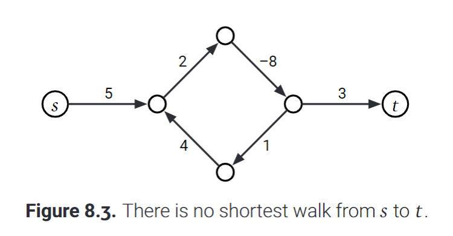
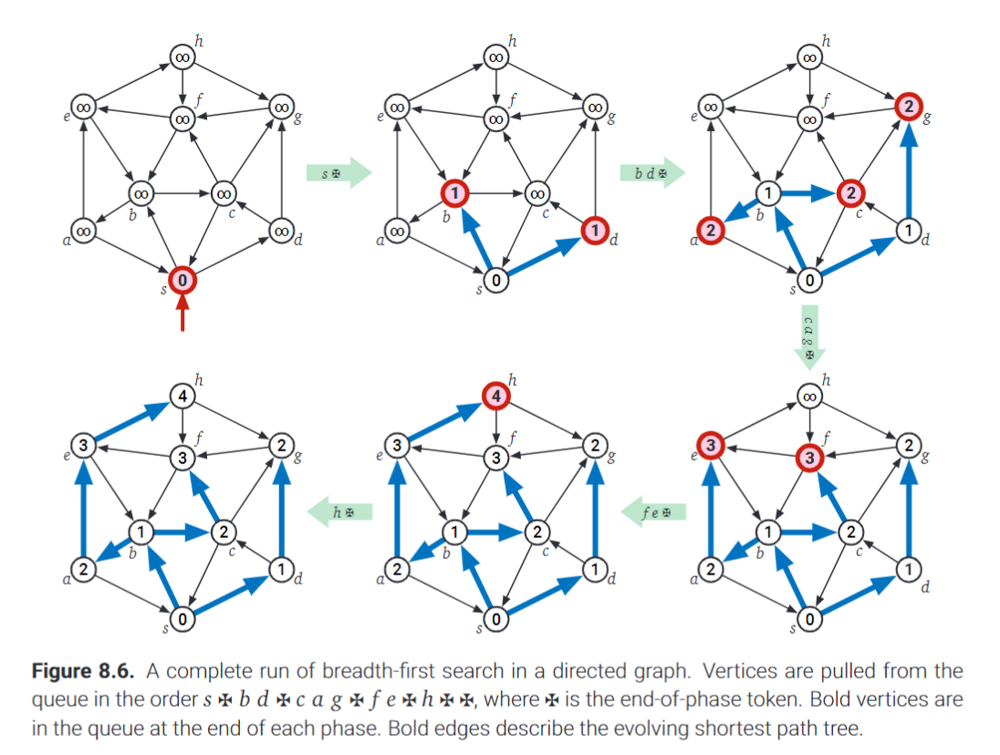
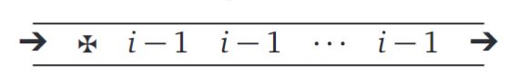
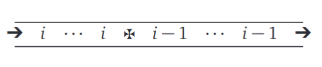
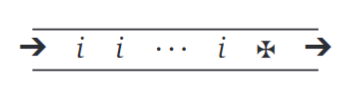
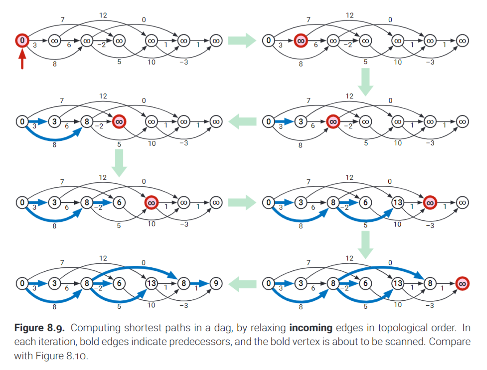
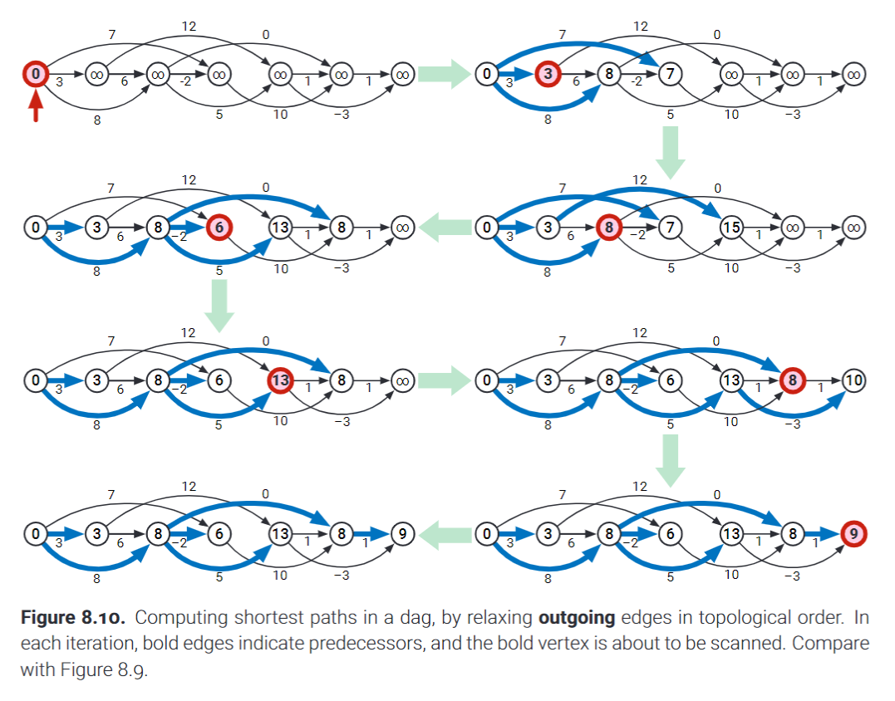
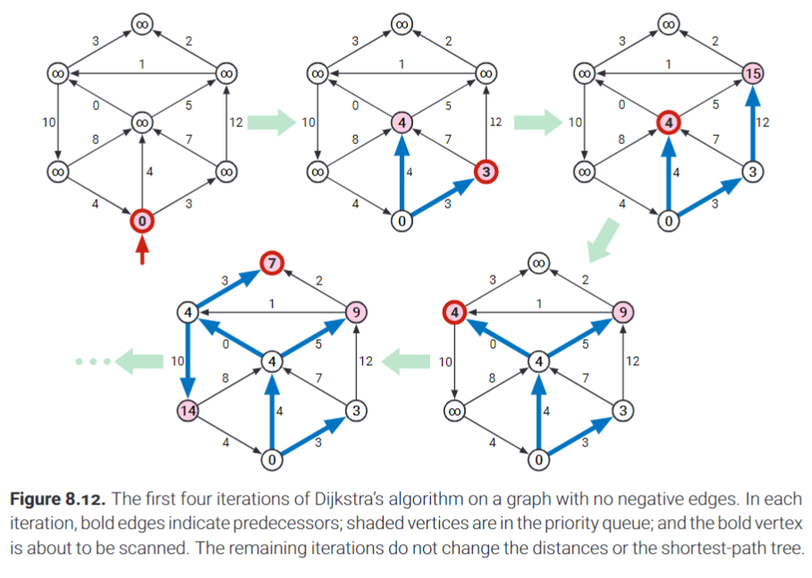

# Shortest Paths

**We want to find the directed path P which starts and at s and ends at t such that the overall weight of the path is as low as it can be!**

Mathematically this means we want to minimize $w(P)$, where:

$$w(P) := \Sigma_{u \rarr v \in P}$$

This directed path scenario has many real world use cases that all generically ask:

- ***"what is the fastest way to get from point A to point B"*?**

## Shortest Path Trees

Almost every algorithm that computes the shortest path from A to B actually computes much more than that!

These shortest path algorithms form trees which answer a more broader question:

- **Find the shortest paths to each vertex from a particular source vertex.**

This problem is often dubbed the *single source shortest path or SSSP problem*!

We can solve the problem by computing a tree rooted at the source vertex. This tree contains all of the shortest paths (as a result it is also a spanning tree since it hits every possible vertex reachable from s).

- If each shortest path is unique, then their combined graph forms a tree! 

How can we be so sure?:

- Well by definition the goal is to find the shortest path to each vertex, so that means that each path will hit its target vertex once.

- Furthermore, if a shortest path from s to B goes through some other vertex, A, then the shortest path from s to A is actually a subpath of another shortest path!

- **If for some reason there isn't a unique shortest path, we can always choose one in particular such that the union of paths still forms a tree.**

- Suppose two shortest paths both originating at s: $s \rarr u$ and $s \rarr v$. If these paths diverge and then meet and then diverge again, we can change a path (without affecting the path length) so that the divergence occurs only once.

*Shortest path trees are similar to MSTs because they are both optimal spanning trees.*

However there are some key differences between the two:

    - MSTs are unrooted and undirected whereas SPTs are naturally defined for directed graphs. 

    - For any particular graph there is only one MST. With SPTs the tree varies depending on the chosen source vertex.

    - For certain graphs it is possible for every SPT to use a different set of edges than the MST.

---

## Negative Edges

- Negative edges often hinder many shortest path problem solutions because:

***A negative cycle might imply that the shortest path problems may not be well defined.***

A shortest path from a to b exists iff there is at least one path from a to b, but no path from a to b that touches a vertex in a negative cycle.

What happens if the path does touch a negative cycle?

Textbook example:

If we go through the -8 once we get a path length of: 5 + 2 + -8 + 3 = 2

Now lets check that the cycle is overall negatively weighted:

The edges in the cycle add up to a total weight of: 2 + 4 + 1 + -8 = -1!

Now what this means is that *if we step through the cycle once, then our path length is small*,
*if we step through it twice before reaching the destination then our path length is even smaller*.
**We can step through the cycle indefinitely to continue decreasing our path length!**

- **Therefore our SSSP problem has no real solution because the minimum weighted path can never really be attained (there is no minimum if we can keep getting smaller infinitely)!**

*Can we solve this? YES with a much more complicated algorithm!*

*Are we going to cover such an algorithm: **NO, thank god.***

**We still need to consider negative edge weights but we will be operating under the assumption that these algorithms are being applied to graphs that do not contain negative cycles.**

**The graphs covered in this chapter are explicitly directed and weighted, but the algorithms we will discuss will work with undirected graphs as well as long as we apply minor and straightforward changes.**

A note: We should really be saying shortest *walk* as opposed to shortest path if we want to technically accurate.

---

## The Only SSSP Algorithm

Just like graph traversals and MSTs, the SSSP problem has a generic solution that applies to every concrete algorithm made to solve it!

This generic algorithm is also known as Ford's algorithm

The algorithm has one goal which won't make sense for now:
**Repeatedly relax tense edges until no tense edges exist! (massage the damn graph!?)**

Each vertex is given 2 properties (alternatively we can implement two arrays to store the properties for each vertex).

- **dist(v)**: This property stores the length of the shortest path we know of (currently). The value of this property changes until it eventually becomes the shortest path from some source vertex, s, to v. 

- **pred(v)**: This property stores the direct predeccesor of v based on the current minimum weighted path from some source vertex, s, to v.

Note: In my code I use arrays instead of properties, and instead of dist I called the property path (different teminology, and slightly different implementation but my code accomplishes the same thing as the pseudocode you will see).

- Similar to the parent pointers of any other tree, the pred pointers here define a changing tree that is rooted at s (s has no predecessor, it is the root).

Therefore to initialize this tree as being simple s, the source vertex, we utilize the following pseudocode:

    InitSSSP(s):
        
        dist(s) = 0
        pred(s) = null

        for all vertices, v, except s:
            dist(v) = infinity
            pred(v) = null

Each edge of the tree can be defined as *tense* or *relaxed*.

**An edge is considered tense if $dist(u) + weight(u \rarr v) < dist(v)$**

**This would imply that dist v is not the shortest value it can be, because a path from the source to u and then through to v is shorter than whatever is currently considered to be the shortest path from the source to v!**

- To fix this we simply change dist(v) to equal the smaller path's length: $dist(v) = dist(u) + weight(u \rarr v)$
- We should also update the predecessor of v to now be u, since the new shortest path goes from the source to u and then directly to v!: $pred(v) = u$

The principle of a tense edge is crucial to understanding all shortest path algorithms!

The process described in the two steps above (the bullet points) is called "relaxing" a tense
edge.

If an edge is not tense then it is relaxed!

Pseudocode:

    Relax(u, v):
        dist(v) = dist(u) + weight(u, v)
        pred(v) = u
    

With all of that in mind the pseudocode for Ford's algorithm is extremely intuitive:

    FordSSSP(s):
        InitSSSP(s)
        while there is a tense edge:
            relax ANY tense edge 
            # How we find and the order in which we pick tense edges is where our specialized algorithms differ from one another.

---

## Unweighted Graphs: Breadth-First Search

What if all edges had the same weight, lets say for argument's sake that that particular weight was 1.

- In essence this would make our weighted graph a practically an unweighted graph (it would be as if the weight didn't matter) for the purposes of finding the shortest path.

**Instead, if all edges are weighted the same, then we should focus on the minimum number of edges between two vertices.**

To solve the SSSP problem in this particular scenario we can leverage breadth-first search.

- Recall that breadth first search maintains a queue of vertices (as opposed to a stack)

**When we discover some tense edge $u \rarr v$, we first relax that edge and then enqueue the vertex v into the queue.**

We start the algorithm by pushing the source vertex onto the queue by default.

Pseudocode:

    BFS(s):

        InitSSSP(s)
        Push(s)
        while the queue is not empty:
            u = Pull()
            for all outgoing edges from u, u -> v:
                if dist(v) > dist(u) + 1:
                    dist(v) = dist(u) + 1
                    pred(v) = u
                    push(v)

- If this is hard to analyze then we can break the execution into phases by introducing a token.

- Before pulling any vertices we first push the token in directly after the source vertex.

- Phases begin when we push the token into the queue and end when we take the token out of the queue. Many phases begin and end like this.

Pseudocode:

    BFSWithToken(s):

        InitSSSP(s)
        Push(s)
        Push(token)

        while queue has at least one vertex:
            u = Pull()
            if u = token:
                push(token)
            else:
                for all outgoing edges from u, u -> v:
                    if dist(v) > dist(u) + 1
                    pred(v) = u
                    Push(v)
    
*These modifications are made simply for debugging and analysis purposes, this BFSWithToken() method is functionally identical to the previous BFS() method.*

Here is a textbook example of the BFS traversal in action:

We can prove the following lemma in regards to this algorithm:

**Lemma 8.1**: *For every integer $i \ge 0$ and every vertex v, at the end of the ith phase, either dist(v) = 0 or dist(v) \le i, and v is in the queue if and only if dist(v) = i*

*Honestly I don't need a proof for this and I can explain it best verbally, that being said the written proof helps some people, that may include you.*

**The following proof is almost word for word exactly from the textbook.**

The proof starts with induction on i. The base case i = 0 is easy enough. At the start of the first phase (or "at the end of the zeroth phase"), the queue only contains the start vertex sand the token, and InitSSSP just set dist(s) = 0 and dist(v) = infinity for every vertex, v, other than s.

So suppose an integer i, which is greater than 0.

Inductive Hypothesis: At the start of the ith phase, the queue contains every vertex u with dist(u) = i - 1 followed by the token.

The queue looks like the following:

Before pulling out the token we pull out every vertex which has a distance of i - 1. After this we pull out the token and end the ith phase.

For each such vertex, we consider every one of its outgoing edges (the vertex is u, the outgoing edges are : ) $u \rarr v$.
If any edge is tense we set the distance of v: $dist(v) = dist(u) + 1$. We know that $dist(u) = i - 1$, therefore $dist(v) = i - 1 + 1 = i$.

We then enqueue v. This means that during the ith phase the queue contains some vertices with distance i - 1, then followed by the token, and then by vertices with distance of i.

At this point the queue looks like:

Finally, before the ith phase ends, all vertices with a distance equal to i-1 are dequeued. This results in the following queue state:

The vertex v appears in this final form of the queue if and only if the distance from the source to v, $dist(v)$ was changed in the ith phase. Therefore at the end of the ith phase, the only vertices remaining in v have a distance of i!

**Proof DONE!**

Lets look over the lemma again. It implies that the distance labels are assigned in decreasing order! After being assigned, each of the distance values change at most once and dist(v) can only decrease (this makes sense because we initialize dist(v) to be positive infinity initially).

Furthermore:

- pred(v) is changed at most once, in the same phase when dist(v) is changed.

- Each vertex v is pushed into the queue at most once once again during phase dist(v).

- For each edge, the comparison: "if dist(v) > dist(u) + 1" is performed at most once, during the phase of dist(u) + 1

**All these observations support the fact that BFS runs in $O(V + E)$ time. **

The book suggests that the vertices in the queue form a metaphorical "wavefront" that expands outwards from the source vertex and passes over each vertex and edge of the graph at most once.

- What not simply check if $dist(v) = \infin$ instead of checking if $dist(v) > dist(u) + 1$?

If we do this and the algorithm still functions as intended then the distance label here is serving the same functionality as the marked property (which we discussed when we first implemented graph traversals).

- A vertex v, is unmarked if $dist(v) = \infin$ and is unmarked if the distance is finite. (In my code, the "infinity" I use is simply a really big integer... so in practice instead of checking for infinity I would be checking for a sufficiently large integer which indicates an "infinite" distance).

But we still need to prove that the finite distances we end up with are correct!

**Theorem 8.2**: *When BFS ends, dist(v) is the length of th eshortest path in g from s, the source vertex, to v, for every other vertex v.*

**Proof**: 

Suppose an arbitrary vertex v, and consideer the arbitrary path from s to v:

$$v_{0} \rarr v_{1} \rarr v_{2} \rarr ... \rarr v_{l}$$

Here, $v_{0}$ is s and $v_{l}$ is v.

Then we propose that: $dist(v_{j}) \le j$ for each index j and in particular $dist(v) \le l$. We will prove this claim using indution.

- $dist(v_{0}) = dist(s) = 0$

- For any index after 0, i.e. when $j > 0$, the inductive hypothesis implies that $dist(v_{j-1}) \le j - 1$.

- When we Pull vertex $v_{j-1}$ from the queue either $dist(v_{j}) \le dist(v_{j-1}) + 1$ already or we set $dist(v_{j}) = dist(v_{j - 1}) + 1$.

- Either case we know: $dist(v_{j}) \le dist(v_{j - 1}) + 1 \le j$

We prove that dist(v) is at most the length of an arbitrary path from s to v, and it follows that dist(v) is at most the length of the shortest path from s to v (by the end of the algorithm).

*If the proof flew straight over your head, don't worry.*

- The goal of a proof is to rigorously evaluate a phenomenon that you have already seen. But you should first focus on being able to identify and reach the observation through practice first! If the proof stuff is uncomfortable I highly reccommend finding some YT vids as written proofs rarely inspire any image of the proof in your head.

---

## Directed Acyclic Graphs: Depth-First Search

We can also easily find shortest paths in dags, even with weighted edges!

**We can ignore the possibility of negative cycles, because dags have no cycles by definition (acyclic).**

Suppose a starting source vertex s and for any vertex v, let dist(v) represent the shortest path from s to v.

**Then the function of dist(v) can be written as a recurrence:**

$$dist(v) = 0$$ 

if v = s

$$dist(v) = min_{u \rarr v}(dist(u) + weight(u \rarr v))$$
otherwise

**This is an identity for all directed graphs, but in graphs with a cycle we cannot call this a recurrence!**

*Why?*: Well if we apply this property to a cyclic graph, then we actually fall into an infinite loop of calculating and recalculating the minimum. We never end up with a "shortest" path.

**This identity is a *recurrence* for dags in particular.**

Each recursive call here visits vertexes based on topological order. Deeper calls will visit earlier vertices in the order.

- **The dependency graph of this recurrence is the reversal of the input graph G**

*Why?*: dist(v) depends on dist(u) if there is an edge $u \rarr v$ in the graph.

The complexity of this solution to the SSSP problem is once again $O(V + E)$ because we performa a depth first search on the reversal of G and consider the vertices in postorder (postorder of the reversed graph is an alternative to using the topological order on the original graph, both are equally viable).

Here is the pseudocode for this algorithm:

    DagSSSP(s):
        for all vertices v in topological order:
            if v = s:
                dist(v) = 0
            else:
                dist(v) = infinity
                for all outgoing edges from u, u -> v:
                    if dist(v) > dist(u) + weight(u, v):
                        dist(v) = dist(u) + weight(u, v)

What we are doing here is literally the same as a generalization of the Ford algorithm! Here is some more abstracted code (keep in mind this is the same algorithm) to make this clearer.

Psuedocode:

    DagSSSP(s):
        InitSSSP(s)
        for all vertices v in topological order:
            for all outgoing edges from u, u -> v:
                if u -> v is tense:
                    Relax(u, v)

Here is a textbook representation of what is going on in terms of the dependency diagram (topological ordering):

*How does this approach differ from any other?*:

If we go back to the analogy of the wavefront mentioned earlier in this chapter, **other algorithms attempt to "push" the wavefront forward**. Or more importantly **whenever these algorithms consider a vertex v, they attempt to relax its outgoing edges.** On the other hand, **the DagSSSP solution "pulls" in the wavefront forward, which is to say that for each vertex v, the algorithm attempts to relax its incoming edges.**

In theory we could slightly modify the algorithm to push the wavefront instead!:

Pseudocode:

    PushDagSSSP(s):
        InitSSSP(s)
        for all vertices u in topological order:
            for all outgoing edges from u, u -> v:
                if u -> v is tense:
                    Relax(u, v)

The key difference here being that we are considering outgoing edges instead of incoming edges.

Here is a textbook illustration of what is going on in this algorithm in terms of the dependency diagram (topological ordering):

---

## Best-First: Dijkstra's Algorithm

Do not get it twisted. **There is a simple modification that turns breadth-first search into best first search: we use a priority queue as opposed to a traditional queue!**

- At any time during this algorithm, an edge $u \rArr v$ is tense if and only if u is in the priority queue or was the vertex that was most recently extracted from it.

Pseudocode:

    Dijkstra(s):

        InitSSSP(s)
        Insert(s, 0)
        while the priority queue is not empty:
            u = ExtractMin()
            for all edges outgoing edges from u, u -> v:
                if u -> v is tense:
                    Relax(u, v)

                    if v is in the priority queue:
                        DecreaseKey(v, dist(v))
                    else:
                        Insert(v, dist(v))

This algorithm works warranted that there are no negative cycles in the graph.

### No Negative Edges

Dijkstra's algorithm is very optimal for graphs that have non-negative edges! 

- If there are no negative edges then the "wavefront" expands outwards intuitively (similar to BFS) from the source vertex and passing over vertices based on their distance from s.

Here is a textbook example that aptly shows how the algorithm expands over the graph:

Can we prove correctness of this algorithm?: Of course.

Suppose that for each integer i, $u_{i}$ denotes the vertex returned by the ith call to ExtractMin(). Let $d_{i}$ be the value of $dist(u_{i})$ right after the extraction. 

As the base case we know $u_1 = s$ and $d_1 = 0$

Keep in mind that for the vertices (u), the same vertex may be extracted more than once.

Lemme at the lemma:

**Lemma 8.3**: *If G has no negative-weight edges, then for all i < j, whe have $d_i \le d_j$*

**Proof**: Assume G has no negative weight edges.

Suppose some arbitrary index i. If we want to prove the lemma we can simply prove: $d_{i+1} \ge d_i$

**Case 1 ---**

G contains the edge $u_i \rarr u_{i + 1}$ and the edge is relaxed in the ith iteration. At the end of this iteration we know that:

$$dist(u_{i+1}) = dist(u_i) + weight(u_i \rarr u_{i + 1}) \ge dist(u_i)$$

*Why can we conclude this?*: Well we know that $s \rarr u_i$ is a subpath of $s \rarr u_{i + 1}$ and we know that each edge weight is 0 or positive. Therefore $dist(u_{i+1})$ includes the weight of the path $s \rarr u_i$ which is $dist(u_i)$ and another value, the weight, which is **at least** 0. We can conclude then that dist(u_{i + 1}) is at least the value of $dist(u_i)$ if not more!

**Case 2 ---**

Otherwise, when the ith iteration begins, $u_{i + 1}$ is already in the priority queue and it must have a priority such that: $dist(u_{i + 1}) \ge dist(u_i)$ (because $u_i$ is returned by ExtractMin, which means it has a highest priority and lowest distance of all the nodes on the queue).

Regardless of the case, we determine: $d_{i + 1} \ge d_i$.

**LEMMA DONE**

We can build on the conclusion of this lemma with another lemma!

**Lemma 8.4**: *If G has no negative-weight edges, each vertex of G is extracted from the priority queue at most once.*

**Proof**: I claim that v is extracted more than once. Suppose v is extracted at the ith iteration and reinserted at the jth iteration and then re-extracted during the kth iteration.

Based on the previous lemma we can say: $v = u_i = u_k$.

Since the distance of any vertex, including v, can only decreases during the jth iteration (before reinsertion) it must be the case that $d_k < d_i$. This entails that G must have at least one negatively weighted edge.

By opposition if G had no negative weighted edges, then the vertex would not be inserted more than once.

**LEMMA DONE**

The prior lemma shows that each vertex is scanned at most once in a graph with no negatively weighted edges. 

- **However in general the algorithm may change the distance label of each vertex, dist(v) multiple times throughout the runtime!**

- The first time we insert any vertex v into the priority queue, it's distance changes from infinity to something finite.

- Then the vertex's **dist() property can change from within the queue when we call DecreaseKey().**

- **Once a vertex is extracted from the queue, it's distance value has been finalized, meaning that after extraction the distance label of a vertex never changes.**

**Theorem 8.5**: *If G has no negative weight edges, then when Dijkstra ends, dist(v) is the length of the shortest path in G from s to v, for every vertex v*.

**Proof**: Suppose some vertex v and consider an arbitrary path from the source to v: $v_0 \rarr v_1 \rarr ... \rarr v_l$ where $v_0 = s$ and $v_l = v$.

- For any index j, let $L_j$ equal the length of the subpath $v_0 \rarr v_1 \rarr ... \rarr v_j$.

Lets prove that 

$$dist(v_j) \le L_j$$
for all j

Trivial case: $dist(v_0) = dist(s) = 0 = L_0$

For any index where j > 0, the inductive hypothesis implies: $dist(v_{j-1}) \le L_{j-1}$. When we pull $v_{j-1}$ from the queue, either $dist(v_i) \le dist(v_{j-1}) + weight(v_{j-1} \rarr v_j)$ already or we set $dist(v_i) = dist(v_{j-1}) + weight(v_{j - 1} \rarr v_j)$.

Regardless we can say that the following statement holds:

$$dist(v_j) \le dist(v_{j-1}) + weight(v_{j - 1} \rarr v_j) \le L_{j - 1} + weight(v_{j-1} \rarr v_j) = L_j$$

The preceding statement proves that $dist(v)$ is at most the length of every path from s to v, this means that $dist(v)$ is also at most the length of the shortest path from s to v.

- Another analagous proof shows that dist(v) is the length of the predecessor path: $s \rarr ... \rarr pred(pred(v)) \rarr pred(v) \rarr v$

Dijkstra's algorithm performs at most E DecreaseKey() operations and at most V Insert and ExtractMin operations.

- If we implement the priority queue using a standard binary heap the complexity breaks down as follows:

$$O(E * DK(n) + V * I(n) + V * EM(n))$$

DK(n) represents the complexity of a single DecreaseKey() operation, I(n) represents the complexity of a single Insert() operation, and EM(n) represents the complexity of a single ExtractMin() operation.

**Each of these operations occur in $O(log V)$ time when we utilize a standard binary heap!**

$$O(E * O(\log V) + V * O(\log V) + V * O(\log V))$$

recall that E is actually at most $V^2$! Therefore the dominant term is $E\log V$.

**Therefore Dijkstra's algorithm runs in $O(E \log V)$ time**.

If its guaranteed that the input graph will not have negative edges, we can insert every vertex into the queue during the initialization phase (because we anticipate that each vertex will be used at most once). This way the only thing left to do in the main loop is to relax edges and then apply the DecreaseKey() operation.

NonNegativeDijkstra(s):
    InitSSSP(s)
    for all vertices v:
        Insert(v, dist(v))
    while priority queue is not empty:
        u = ExtractMin()
        for all outgoing edges from u, u -> v:
            if u -> v is tense:
                Relax(u, v)
                DecreaseKey(v, dist(v))

**This is the version of the algorithm that you see in most textbooks, in videos, on wikipedia, and even in Dijkstra's original paper!**

### Negative Edges

The NonNegativeDijkstra() algorithm may be the most commonly seen version of Dijkstra's algorithm but clearly it fails if the graph has negative edges.

- **When all edge weights are positive, NonNegativeDijkstra() is no faster than the previously seen Dijkstra() algorithm**.

If a graph has negative edges, the "wavefront" heuristic is no longer accurate or redeemable.

- *The same vertex may be extracted multiple times and distances may not be found in increasing order (when the graph has negative edge weights)*.

- The same edge may be relaxed twice! (when the graph has negative edge weights)

**For all the reasons stated above, even though NonnegativeDijkstra is faster in some cases, it's inaccuracy in some cases is a major flaw. Therefore when we say "Dijkstra's Algorithm" we are referring to the originally covered algorithm which may be a bit slower in practice but works with all cases!**

**Dijkstra's algorithm surprisingly works with negative cycles as long as there are no other restrictions on edge weights.**

- **With negative cycles the worst case complexity is made slower (becomes exponential)**.

---

## Relax ALL the Edges: Bellman-Ford

The Bellman-Ford algorithm is sometimes referred to as the Bellman-Kalaba or Bellman-Shimbel algorithms.

The algorithm is by far one of the most straightforward takes on Ford's generic algorithm (it is derieved directly from it, hence the name)!

The core idea of the algorithm is: **Relax ALL the tense edges, and then recurse**.

Pseudocode:

    BellmanFord(s):
        InitSSSP(s)
        while there is at least one tense edge:
            for every outgoing edge from u, u-> v:
                if u -> v is tense:
                    relax(u, v)

We can prove correctness and efficiency of the algorithm via the following lemma. 

-*If you have not paid attention to the lemmas too much I highly advise that you try to understand this one at least!*

**Lemma 8.6**: *For every vertex v and non-negative integer i, after i iterations of the main loop of BellmanFord, we have $dist(v) \le dist_{\le i}(v)$*

**Proof**: Once again we use induction on i. The base case (i = 0) is trivial, so we focus on the inductive cases where $i > 0$.

Suppose some vertex v and let W be the minimum weighted walk from s to v consisting of at most i edges (tie break any way you deem fit).

- **By definition W has length = $dist_{\le i}(v)$.**

**Case 1 ---**

The trivial case is that W has no edges, meaning that it is a walk from s to s. This means $v = s$ and $dist_{\le i}(s) = 0$.

- The initial value for $dist(s)$ was set to 0 and $dist(s)$ can never increase. Therefore the identity $dist(s) \le 0$ always holds true!

**Case 2 ---**

Otherwise let the edge $u \rarr v$ be the last edge of the walk W. The inductive hypothesis implies that after the i-1th iteration of the inner loop $dist(u) \le  dist_{\le i-1}(u)$.

- When we hit the ith iteration of the outer loop we consider the edge $u \rarr v$ in the inner loop and there are two possible scenarios

1) $dist(v) < dist(u) + weight(u \rarr v)$ already
2) $dist(v) >= dist(u) + weight(u \rarr v)$ in which case we have to set dist(v): $dist(v) = dist(u) + weight(u \rarr v)$.

In either case we can say:

$$dist(v) \le  dist_{\le i - 1}(u) + weight(u \rarr v) = dist_{\le i}(v)$$

dist(v) cannot increase further, but it may decrease more before the ith iteration of the outer loop fully ends. Regardless the identity still holds!

In both Case 1 and Case 2, we conclude that $dist(v) \le dist_{\le i}(v)$ by the end of the ith iteration.

**PROOF DONE**

If the graph has no negative cycles then the shortest walk from s to any other vertex always has a length that is at most V - 1 edges long. Bellman Ford should always halt with the correct SSSP solution after V - 1 iterations.

- If the Bellman-Ford algorithm runs for V - 1 iterations and then after the fact some tense edge still remain, this indicates the presence of a negative cycle.

Here is some more concrete pseudocode that puts these observations into practice:

    BellmanFord(s):
        InitSSSP(s)
        repeat V - 1 times:
            for every outgoing edge from u, u -> v:
                if u -> v is tense:
                    Relax(u, v)
        for every edge u -> v:
            if u -> v is tense:
                return "ROGUE NEGATIVE CYCLE DETECTED!!!"

**The Bellman-Ford algorithm is always efficient, even if the graph has negative cycles or negative edges because of this halting condition!**

**Time complexity of Bellman-Ford algorithm: $O(VE)$**

- *Dijkstra's algorithm is a tad faster than Bellman-Ford in practice*

### Moore's Improvement

Moore's algorithm was proposed in the same paper that published the idea of a BFS for the traversal of an unweighted (or equally weighted) graph. 

- *This algorithm is in fact very similar to the BFS approach.*

- **The worst case time complexity is $O(VE)$, but the algorithm is faster than the Bellman-Ford algorithm in practice.**

*How is it faster?*: **It checks for and ignores "obviously" not tense edges.**

We can derieve Moore's algorithm by making two minor adjustments to the original BFS traversal based algorithm.

1) Replace "+1" with $+weight(u \rarr v)$

2) Check if a vertex is already in a queue before inserting it so that the queue never contains duplicate copies of a vertex. This check could is not needed for correctness, *but it is part of what enables the efficient O(VE) time complexity*!

We can do analyze a tokenized version of this algorithm similar to how we approached BFS:

    Moore(s):
        InitSSSP(s)
        Push(s)
        Push(token)

        while the queue contains at least one vertex:
            u = Pull()

            if u = token:
                push(token)
            
            else:
                for all outgoing edges from u, u -> v:
                    if u -> v is tense:
                        Relax(u, v)
                        if v is not in the queue:
                            Push(v)

Each vertex is pulled from the queue at most once and therefore it is checked for "tenseness" at most once in each phase.

- *Every edge that is tense when a phase begins becomes relaxed during that phase.*

- **This does not necessarily mean that all tensed edges end up as relaxed after the phase ends. Instead, some edges may become relaxed and then tense again within the same phase.**

**We can think of Moore's algorithm as a refined version of the Bellman-Ford algorithm that uses a queue to maintain tense edges instead of testing every single tense edge.**

The following lemma is analgous of Lemma 8.6

**Lemma 8.7**: *For every vertex v and non-negative integer i, after i phases of Moore(), we have $dist(v) \le dist_{\le i}(v)$*

- We won't prove this one but the steps are very similar to the steps taken in Lemma 8.6

If the input graph has no negative cycles, the algorithm stops after, at most, V - 1 phases. Each phase scans each vertex at most once.

- The worst case running time of a single phase is determined by the most number of edges that could be analyzed in that phase: $O(E)$.

- **There are V -1 phases at most, therefore the overall complexity of Moore's algorithm is: $O(VE)$.**

However in practice edges that were changed in the previous phase are not revisited in the current phase. 

- **Mathematically we only scan edge $u \rarr v$ if $dist(u)$ was changed in the prior phase.**

*If the graph has a negative cycle then Moore's algorithm breaks and keeps running!*

We can fix this easily by maintaining an actual token and determining how often the token is pulled out from the queue. 

- If the token is pulled out for the V - 1th time and there are still vertices left in the queue we can confirm the existence of a negative cycle.

### Dynamic Programming Formulation

To develop a dynamic programming approach to the Bellman-Ford algorithm we should have a recursive definition of the shortest path distances.

- Recall that this algorithm works on more than just dags, therefore we cannot fall back on the recurrence we have been using up to this point.

Bellman's recurrence relation utilizes the maximum number of edges as an addition parameter that decreases at each recursive call to ensure a trivial base case.

- Let $dist_{\le i}(v)$ represent the length of the shortest walk from s to v consisting of at most i edges

This function follows a recurrence:

$$dist_{\le i}(v) = 0$$

if i = 0 and v = s

$$dist_{\le i}(v)  = \infin$$

if i = 0 and v != s

$$dist_{\le i}(v) = min \{ dist_{\le i}(v-1), \space \space min_{u \rarr v}(dist_{\le i - 1}(u) + weight(u \rarr v)) \}$$

Here is how Bellman presented his shortest path algorithm:

Pseudocode:

    BellmanFordDP(s):
        dist[0, s] = 0
        for every vertex v that isn't s:
            dist[0, v] = infinity
        for i = 1 to V - 1:
            for every vertex v:
                dist[i, v] = dist[i - 1, v]
                for every incoming edge to v, u-> v:
                    if dist[i, v] > dist[i - 1, u] + weight(u, v):
                        dist[i, v] = dist[i - 1, u] + weight(u, v)

The outermost loop does consider every vertex once, but the order in which they are considered does not matter!

- If this is the case then the inner for loop can be unindented.

Pseudocode:

    BellmanFordDP2(s):
        dist[0, s] = 0
        for every vertex v that isn't s:
            dist[0, v] = infinity
        for i = 1 to V - 1:
            for every vertex v:
                dist[i, v] = dist[i - 1, v]
            for every incoming edge to v, u-> v:
                if dist[i, v] > dist[i - 1, u] + weight(u, v):
                    dist[i, v] = dist[i - 1, u] + weight(u, v)

Now we can change the indices in the last two lines of i - 1 to i.

*Why can or should we do this?*: This change still allows the algorithm to correctly comput the shortest path distances. This change also allows us to replicate the behavior described in Lemmas 8.6 and 8.7 one to one.

Pseudocode:

    BellmanFordDP3(s):
        dist[0, s] = 0

        for every vertex v other than s:
            dist[0, v] = infinity
        for i = 1 to V -1:
            for every vertex v:
                dist[i, v] = dist[i - 1, v]
            for every incoming edge to v, u -> v:
                if dist[i, v] > dist[i, u] + weight(u, v):
                    dist[i, v] = dist[i, u] + weight(u, v)

Lets examine the operations here clearly.

In the ith iteration of the outer loop we are copying the i-1th row of the array into the ith row and then modifying the elements of the ith row.

- What this means is that we really do not need a 2D array since the iteration index is only useful if we want to see the process. If we merely want the end goal, it appears in the last row of our 2D array. Therefore we ultimately need only a single row and a simple 1D array.

Pseudocode:

    BellmanFordFinal(s):
        dist[s] = 0
        for every vertex v other than s:
            dist[v] = infinity
        for i = 1 to V - 1:
            for every incoming edge to v, u -> v:
                if dist[v] > dist[u] + weight(u, v):
                    dist[v] = dist[u] + weight(u, v)

This finalized formulation is practically identical to our inital Bellman Ford algorithm.

Only two simple (easy to implement) features are missing:
- **There are no predecessor pointers and the program does not detect or account for negative cycles.**

---

