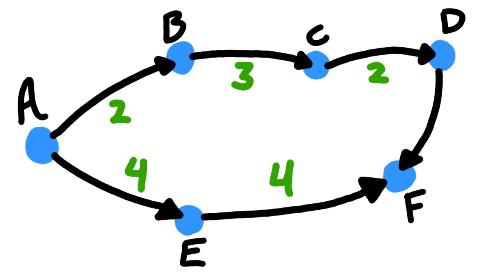
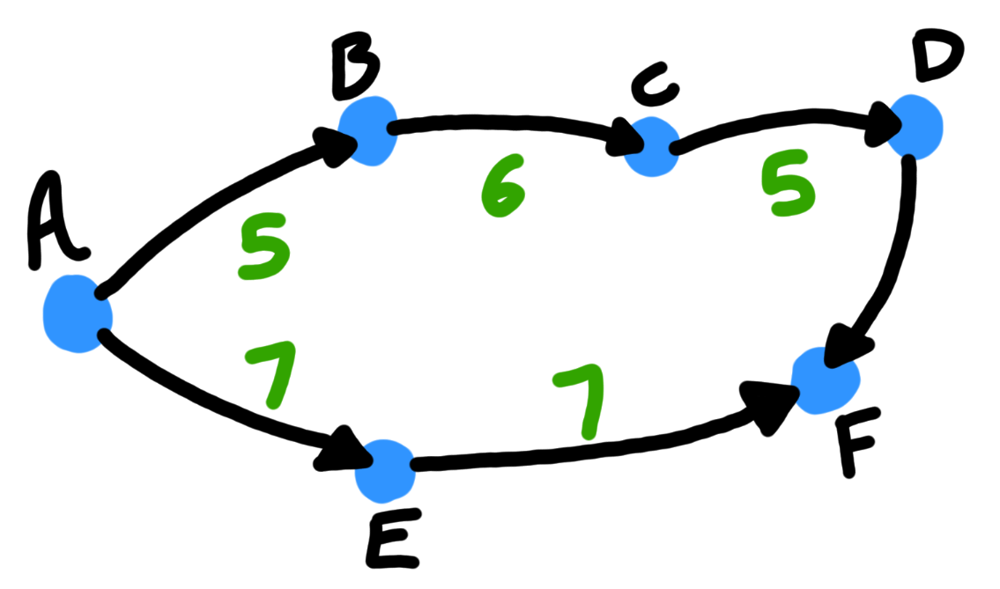

# All Pairs Shortest Paths

## Introduction

The shortest path tree specifies two nuggets of information for each node:

- dist(v) is the length of the shortest path from s to v.
- pred(v) is the second to last vertex in shortest path from s to v.

The all pairs shortest path problem (APSPP) **asks for the shortest path from every possible source to every possible destination (pairs).**

For every pair of vertices we want to calculate:

- dist(u, v): the length of the shortest path from u to v.
- pred(u, v): the second to last vertex on the shortest path from u to v.

*Here are the edge (no pun intended) cases:*

- **If there is no path from u to v, then there is no shortest path from u to v. We indicate this by defining $dist(u, v) = \infin$ and $pred(u, v) = NULL$.**

- **If there is a negative cycle between u and v then we indicate this by defining $dist(u, v) = - \infin$ and $pred(u, v) = NULL$**

- **If u does not lie on a negative cycle, then the shortest path from u to itself does not have any edges and therefore there is no last edge. In this case $dist(u, u) = 0$ and $pred(u, u) = NULL$.**

The output of the APSPP is a pair V by V arrays. One of these 2d arrays stores the shortest path distances and the other 2d array stores all V^2 predecessors.

---

## Lots of Single Sources

One obvious solution to this problem is to solve the SSSP problem V times (once for each vertex).

Pseudocode:

    ObviousAPSP(V, E, w):
        for every vertex s:
            dist[s, ] = SSSP(V, e, w, s)

The running time of this algorithm is dependent on algorithm we use for the underlying SSSP problem. 

- If the edges of the graph are unweighted, breadth-first search gives us an overall running time of $O(VE) = O(V^3)$.

- If the graph is acyclic we can use scan the vertices in topological order to get a running time pf $O(VE) = O(V^3)$

- If all edge weights are non-negative, Dijkstra's algorithm gives us a running time of $O(VE \log V) = O(V^3 \log V)$.

- Finally, in the most general algorithm, the Bellman-Ford algorithm results in a worst case running time of $O(V^2E) = O(V^4)$

---

## 9.3 Reweighting

How can we get rid of the negative edges that slow us down?

One simple solution that we might try is increasing all edge weights by the same amount (apply a bias) so that all weights become positive.

Why do we not do this then?: Length in a graph is not simply defined by the number of edges in a path but also the weight of each edge. If we increase all edge weights by a constant factor, paths with more edges recieve a greater benefit ( a boost to path length) than paths with fewer edges.

Here is an example to illustrate this, consider this graph:

The shortest path from A to F in this graph is:

$$A \rarr B \rarr C \rarr D \rarr F$$

But now if I add 3 to each weight, the resulting graph looks like:

Now the shortest path from A to F in this graph is:

$$A \rarr E \rarr F$$

When we increase the edge weights by a constant amount the properties of the graph not guaranteed to remain the same!

- There is a reweighting method that preserves the shortest path distances between two vertices.

This method treats the weighting process as if it were tax paid for traversal. In simpler terms we could define a new weight $w'$ as:

$$w'(u \rarr v) = \pi(u) + w(u) - \pi(v)$$

The entrance tax is $\pi(v)$ and the exit tax is $\pi(u)$

The shortest path with the new weight function is the same as what it would be without the new weight. We can apply this entrance tax and exit tax to each vertex in the graph.

**The entrance gift is given to us so that we can pay it back right after we exit the vertex. Since all paths from u to v change length by the exactly the same amount (constant factor), the shortest path from u to v does not change.**

---

## Johnson's Algorithm

This algorithm computes the entrance gift for each vertex such that weight of each and every edge is non-negative. After we do this, **we use Dijkstra's algorithm on the new weights to calculate the shortest path.**

Here is the exact process:

1) The Bellman-Ford algorithm is used to find the shortest paths between s and other vertices. Recall that the Bellman-Ford algorithm does not care about negative weighted edges.

2) We then reweight the edges of the graph according to the following formula:

$$w'(u \rarr v) = dist(s, u) + w(u \rarr v) - dist(s, v)$$

We need to take this approach because this ensures that the new weights are non-negative, and also because the Bellman-Ford algorithm may have halted if it encountered a negative cycle.

3) We reweight all edges in this way because an edge $u \rarr v$ is tense if $dist(s, u) + w(u \rarr v) < dist(s, v)$. SSSP algorithms seek to eliminate all tense edges. We need to reweight each edge to accomplish this goal.

4) If there is no vertex that can reach everything then regardless of how we start Bellman-Ford there will be some vertices with infinite $dist$ values

To solve the issue mentioned above,  we can add a vertex that has 0 weighted paths to all other vertices but no edges going back to itself (a source vertex if you will). **This does not affect the shortest paths algorithm because there is no way to get to S (the new vertex).**

The algorithm's pseudocode is here:

    JohnsonAPSP(V, E, w):

        # Adding an artificial source vertex
        add a new vertex s
        for every vertex v:
            add a new outgoing edge from s, edge s -> v
            w(s -> v) = 0
        
        # Compute the vertex prices
        dist[s, * ] = BellmanFord(V, E, w, s)
        if BellmanFord found a negative cycle:
            fail gracefully # whatever that means

        # Reweight EVERY single EDGE
        for every edge u -> v:
            w'(u, v) = dist[s, u] + w(u, v) - dist[s, v]

        # Compute reweighted shortest path distances
        for every vertex u:
            dist'[u, *] = Dijkstra(V, E, w', u)
        
        # Compute original shortest-path distances
        for every vertex u:
            for every vertex v:
                dist[u, v] = dist'[u, v] - dist[s, u] + dist[s, v]
            
The running time of this algorithm is dominated by Dijkstra's algorithm.

- **Dijkstra's algorithm is called at most V times. In total this takes up $O(VE \log V)$ time**

- **We spend $O(VE)$ time running the Bellman-Ford algorithm (once).**

- **Lastly we speend $O(V + E)$ time doing other parts of the algorithm.**

Therefore the overall time complexity is:

$$O(VE \log V)$$

$$O(V^3 \log V)$$

**Negative edges don't adversely affect the time complexity at all!**

---

## Dynamic Programming

The APSPP using dynamic programming instead of using a SSSP algorithm!

**Going onward, including for the rest of the sections, we will assume that the input graph contains no cycles.**

- With very dense graphs where the number of edges approaches the square of the number of vertices this approach is slightly faster and simpler than Johnson's algorithm.

**Lets start with the recursive definition:**

$$dist(u, v) = 0$$

if u = v

$$dist(u, v) = min_{x \rarr v}(dist(u, x) + w(x \rarr v))$$

otherwise

This is a recursive definition and *not* a reccurrence.

*Why?*: This recursive definition only works for dags, because a directed cycle would turn this recurrence into an infinite loop.

We can break the loop by introducing an additional parameter (similar to how we cracked the Bellman-Ford algorithm).

Suppose: $dist(u, v, l)$ is the length of the shortest path from u to v that also uses at most l edges.

**We know that the shortest path between two vertices in a graph can have AT MOST V - 1 edges.**

So for the shortest path from u to v, we can say that l = V - 1.

$$l = V - 1$$
$$dist(u, v, V - 1)$$

$dist(u, v, l) = 0$ if $l = 0$ and $u = v$

$\infin$ if $l = 0$ if $l = 0$ and $u \ne v$

$min\{ dist(u, v, l), \space \space min_{x \rarr v}(dist(u, x, l-1) + w(x \rarr v))\}$ otherwise

---

## Divide and Conquer

---

## Funny Matrix Multiplication

---

## (Kleene-Roy-) Floyd-Warshall (-Ingerman)

---
